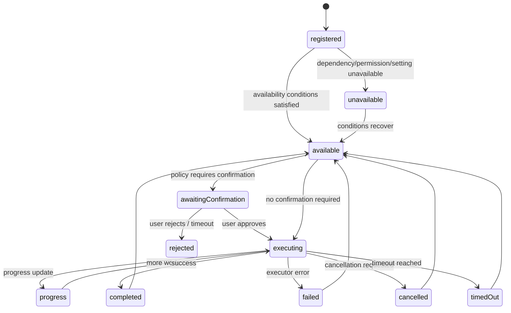
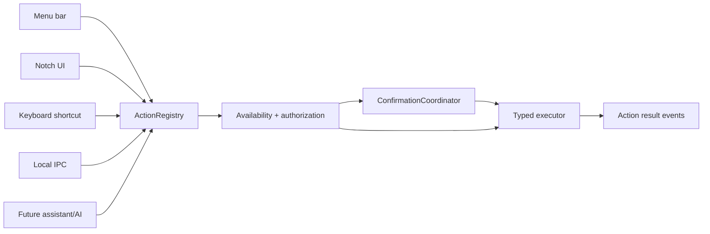

# Action Platform
## NotchHub — Typed Actions, Shortcuts, Authorization, and Execution

**Status:** Draft v0.1  
**Owner:** Architecture / Security  
**Last updated:** 2026-09-13  
**Related documents:** [Architecture Overview](overview.md), [Module System](module-system.md), [Event Protocol](event-protocol.md), [IPC](ipc.md), [State Management](state-management.md), [Requirements §5.5](../product/requirements.md#55-actions-and-shortcuts), [Threat Model](../security/threat-model.md)

---

## 1. Purpose

The Action Platform is the single, typed command boundary for NotchHub.

Menu-bar items, Notch buttons, keyboard shortcuts, local IPC, and future assistant/AI integrations must invoke actions through the same `ActionRegistry`. This prevents duplicated behavior and establishes a hard security boundary between an external request and a side effect.

The central rule is:

```text
External request ≠ executable command
External request = ActionID + validated structured input
```

The foundation does not provide arbitrary shell/script execution. It provides safe internal actions, URL/app-opening actions, module-defined typed actions, and a reviewed path for any future executor that has a legitimate macOS desktop use case.


---

## 2. Action architecture goals

1. **One action model** — every entry point invokes the same `ActionID` and input contract.
2. **Typed input** — action arguments are decoded and validated before execution.
3. **Explicit availability** — actions declare whether they are currently usable and why they may be unavailable.
4. **Authorization and confirmation** — side effects require an appropriate policy; source and user settings are considered.
5. **Cancellation and timeout** — long-running actions cannot silently live forever.
6. **Observable results** — start, progress, success, failure, cancellation, timeout, and confirmation events are traceable.
7. **Module isolation** — disabling a module makes its actions unavailable and cleans up running work.
8. **No arbitrary execution** — external input cannot provide executable text or reconfigure an executor.
9. **Accessibility and keyboard support** — registered actions can expose menu titles, shortcuts, labels, and disabled explanations.

---

## 3. Action lifecycle



An action definition is usually registered for the lifetime of the owning module/runtime. A single invocation has its own execution state and `correlationID`.

---

## 4. Action contracts

### 4.1 Identifiers

```swift
public struct ActionID: RawRepresentable, Codable, Hashable, Sendable {
    public let rawValue: String
}

public struct ActionInvocationID: RawRepresentable, Codable, Hashable, Sendable {
    public let rawValue: UUID
}
```

Action IDs are stable namespaced strings:

```text

app.openSettings
app.openDiagnostics
surface.showDemoStatus
surface.toggleDebugOverlay
settings.reset
demo.ping
xiaozhi.reconnect                  # future module
media.playPause                    # future module
clipboard.copyItem                 # future module
```

Invalid/out-of-scope names must not be accepted:

```text
shell.executeRaw
```

### 4.2 Action definition

```swift
public struct ActionDefinition: Codable, Sendable, Identifiable {
    public let id: ActionID
    public let title: String
    public let subtitle: String?
    public let iconName: String
    public let category: ActionCategory
    public let inputSchema: ActionInputSchema
    public let confirmationPolicy: ConfirmationPolicy
    public let availability: AvailabilityRule
    public let executorKind: ExecutorKind
    public let timeout: Duration
    public let supportedEntryPoints: Set<ActionEntryPoint>
}
```

| Field | Purpose |
|---|---|
| `id` | Stable unique action name |
| `title` | User-visible label |
| `subtitle` | Optional explanation/context |
| `iconName` | UI representation |
| `category` | Grouping in menu/Settings/action grid |
| `inputSchema` | Typed allowed input fields/constraints |
| `confirmationPolicy` | Whether and when user approval is required |
| `availability` | Current capability/permission/module/setting requirements |
| `executorKind` | Internal implementation category, not external user input |
| `timeout` | Maximum execution duration unless a reviewed action needs another value |
| `supportedEntryPoints` | Menu, Notch, shortcut, IPC, future assistant, etc. |

### 4.3 Input schema

Action inputs must be structured and constrained:

```swift
public enum ActionInputSchema: Codable, Sendable {
    case none
    case object(fields: [String: FieldSchema])
    case enumValue(values: [String])
}

public struct FieldSchema: Codable, Sendable {
    public let type: FieldType
    public let required: Bool
    public let maxLength: Int?
    public let allowedValues: [String]?
}
```

Do not use a single `String` field named `command`, `script`, `shell`, `url` (without host/scheme constraints), or `executablePath` as an escape hatch.

### 4.4 Confirmation policy

```swift
public enum ConfirmationPolicy: Codable, Sendable {
    case never
    case firstUse
    case always
    case destructive
}
```

Recommended behavior:

| Policy | Meaning |
|---|---|
| `never` | Safe read-only/UI action; no confirmation |
| `firstUse` | Confirm once, then follow user setting if supported |
| `always` | Confirm every invocation; appropriate for significant side effects |
| `destructive` | Always confirm with explicit target and consequence summary |

A future assistant/AI source is not a substitute for user confirmation. Source policy may make a normally safe action require confirmation when invoked by an external or automated source.

---

## 5. Action entry points

All entry points route through the registry:



The entry point provides source context and typed input; it does not implement the action's business behavior.

### Entry point source policy

| Source | Default capability |
|---|---|
| User through Notch/Menu | Normal available actions, confirmation policy applies |
| Configured keyboard shortcut | Same as user action, subject to availability |
| `notchctl` | Health/status/test events and explicitly allowed actions |
| Future Xiaozhi relay | Only actions explicitly allowed for the relay source; side effects require confirmation policy |
| Unknown IPC client | No actions |

---

## 6. Registry and authorization

### 6.1 Registry responsibilities

`ActionRegistry` must:

- Register definitions from core and enabled modules.
- Reject duplicate `ActionID`s.
- Enforce namespace ownership (`app.*`, `surface.*`, `demo.*`, `media.*`, etc.).
- Expose read-only action metadata to Settings/Menu/Notch.
- Validate input against the definition schema.
- Check module enabled/health state.
- Check permission and setting availability.
- Invoke `ActionAuthorizer` before execution.
- Create an invocation ID/correlation ID.
- Publish lifecycle/result events.
- Remove or mark actions unavailable when their module stops.

### 6.2 Authorization checks

Before execution, evaluate:

```text
Action exists?
        ↓
Source allowed to invoke this action?
        ↓
Module enabled/healthy?
        ↓
Input conforms to schema?
        ↓
Required permission available?
        ↓
User setting allows action?
        ↓
Confirmation required?
        ↓
Execute with timeout/cancellation
```

Any failed check returns a typed error and a sanitized diagnostics event. It does not attempt a fallback arbitrary action.

### 6.3 Namespace ownership

| Namespace | Owner |
|---|---|
| `app.*` | Application shell/core |
| `surface.*` | Notch surface/core |
| `settings.*` | Settings subsystem |
| `diagnostics.*` | Diagnostics subsystem |
| `demo.*` | DemoModule |
| `xiaozhi.*` | Future Xiaozhi module |
| `media.*` | Future Media module |
| `clipboard.*` | Future Clipboard module |
| `calendar.*` | Future Calendar module |


---

## 7. Executor model

### 7.1 Foundation executors

```swift
public enum ExecutorKind: String, Codable, Sendable {
    case internalAction
    case openURL
    case launchApplication
    case moduleCommand
}
```

| Executor | Use | Safety requirements |
|---|---|---|
| Internal action | Change Notch/settings/runtime state | Typed internal implementation |
| Open URL | Open a fixed/validated URL | Scheme/host allow-list where appropriate; no arbitrary unreviewed URL input |
| Launch application | Open a known application | Bundle ID allow-list or user-configured explicit app selection |
| Module command | Ask the owning module to perform a typed operation | Module enabled/healthy; module contract and confirmation policy |

### 7.2 Deferred executor types

A general process/shell executor is **not part of the foundation**. If a future macOS desktop module requires launching an external process for a legitimate, in-scope feature, it must provide:

- A new requirements entry.
- A threat-model update.
- Explicit command/profile storage model.
- No raw external command input.
- User confirmation and target disclosure.
- Timeout/cancellation/output limits.
- Resource and privacy review.
- A dedicated ADR.


---

## 8. Execution and result model

### 8.1 Invocation

```swift
public struct ActionInvocation: Codable, Sendable {
    public let invocationID: ActionInvocationID
    public let actionID: ActionID
    public let source: ActionSource
    public let input: ActionInput
    public let createdAt: Date
    public let correlationID: UUID?
}
```

### 8.2 Result

```swift
public enum ActionResult: Codable, Sendable {
    case accepted(invocationID: ActionInvocationID)
    case completed(invocationID: ActionInvocationID, output: ActionOutput?)
    case rejected(invocationID: ActionInvocationID, error: ActionError)
    case failed(invocationID: ActionInvocationID, error: ActionError)
    case cancelled(invocationID: ActionInvocationID)
    case timedOut(invocationID: ActionInvocationID)
}
```

### 8.3 Progress

Progress is optional and bounded:

```swift
public struct ActionProgress: Codable, Sendable {
    public let invocationID: ActionInvocationID
    public let fraction: Double?
    public let title: String?
    public let detail: String?
}
```

Progress updates must be throttled/coalesced. They must not stream unlimited log output into the Notch.

### 8.4 Events

Actions publish:

```text
action.confirmation.required
action.started
action.progress
action.completed
action.failed
action.cancelled
action.timed_out
```

See [`event-protocol.md`](event-protocol.md) for envelope and event rules.

---

## 9. Confirmation UX

A confirmation dialog/surface must show enough information for the user to make an informed decision:

- Action title.
- Source: user, shortcut, local tool, or future assistant.
- Target/resource, if applicable.
- Structured input summary.
- Consequence or side effect.
- Cancel and confirm controls.
- Optional “remember for this action” only where policy allows and never for destructive actions.

Examples:

```text
Allow “Open Calendar” requested by a shortcut?

Allow “Delete clipboard item” requested by the Notch?

Allow “Run assistant action: …” requested by Xiaozhi relay?
```

The Notch is suitable for short confirmation; complex details should open a dedicated confirmation/application scene.

---

## 10. Shortcut integration

### 10.1 Shortcut model

```swift
public struct ShortcutBinding: Codable, Sendable {
    public let actionID: ActionID
    public let keyEquivalent: String
    public let modifiers: ShortcutModifiers
    public let isEnabled: Bool
}
```

### 10.2 Requirements

- A shortcut binds to an `ActionID`, never directly to a module method.
- F6 provides the binding, validation, persistence, and dispatch framework; it does not register
  a concrete Action catalogue or invent actions merely to populate the recorder.
- F6 reserves app-active recognition for a future Action owner; it installs no key capture or
  dispatch without an Action. Global shortcut registration is a future, opt-in capability and is
  not implied by a stored binding.
- Shortcut recorder validates syntax and basic conflicts.
- A conflicting binding is rejected before persistence; the existing binding remains unchanged.
- A shortcut is unavailable when its action is unavailable.
- A persisted binding whose `ActionID` is not currently registered is retained as an unavailable
  binding. It is not dispatched and the user may clear it.
- The user can clear or disable a binding.
- Menu and Notch UI display shortcut hints where useful.
- The implementation must document any Accessibility/system permission requirement.
- Repeated global event monitoring is avoided where a narrower API is sufficient.

### 10.3 Initial catalogue state

F6 starts with no default bindings and no shortcut-specific foundation Action. The Settings UI
shows a clear empty state until an owning feature registers a shortcut-capable Action. No
user-facing shortcut toggles Surface visibility. Later owners may explicitly expose a registered
application-scene or expansion/collapse Action through the same framework.

---

## 11. Module integration

Modules register actions through a scoped registrar:

```swift
public protocol ActionRegistrar: Sendable {
    func register(_ definition: ActionDefinition,
                  handler: @escaping @Sendable (ActionInvocation) async throws -> ActionOutput) async throws
}
```

Rules:

- The registrar automatically prefixes/enforces the module namespace.
- A module cannot register an action in `app.*` or another module's namespace.
- When the module stops, its actions are removed or marked unavailable.
- The action registry owns source authorization, confirmation, cancellation, timeout, and audit.
- Module handlers receive typed invocations, not raw HTTP/JSON or arbitrary strings.

---

## 12. IPC integration

IPC action requests must contain an Action ID and structured input:

```json
{
  "actionID": "app.openSettings",
  "input": {},
  "requestID": "7c08f5d4-5c46-4be0-9549-a875c37e1ed3"
}
```

Forbidden request shape:

```json
{
  "command": "some arbitrary shell command"
}
```

IPC source policy is checked before registry lookup. Unknown clients cannot invoke actions, even if they can reach a local socket path. See [`ipc.md`](ipc.md).

---

## 13. Privacy and audit

- Action audit records include action ID, source category, result, duration, confirmation outcome, and sanitized error code.
- Do not log raw secrets, tokens, authorization headers, full user-content input, or sensitive output.
- User-content-sensitive actions such as future clipboard/file/calendar operations need module-specific retention and redaction policy.
- The action system does not persist full invocation history indefinitely; use a bounded recent-result buffer.

---

## 14. Performance and cancellation

- Action handlers must run off the main actor unless they only update a small presentation state.
- Every potentially asynchronous action has a timeout.
- Every running invocation has a cancellation path where meaningful.
- Progress updates are coalesced and bounded.
- A disabled/stopped module cancels its in-flight actions or transitions them to a typed `cancelled`/`moduleUnavailable` result.
- Action history and output buffers are bounded.
- No action may create an untracked detached task.

---

## 15. Testing requirements

### Unit tests

- Action ID validation and namespace ownership.
- Duplicate registration rejection.
- Input schema validation.
- Availability rules for module/permission/settings states.
- Confirmation policy decisions by source/action.
- Unknown source/action rejection.
- Executor result mapping.
- Timeout/cancellation behavior.
- Progress throttling/coalescing.
- Audit redaction.
- Module action removal/unavailability on stop.

### Integration tests

- Menu, Notch, shortcut, and IPC invoke the same action behavior.
- Invalid IPC action cannot reach an executor.
- A future/fixture assistant source can invoke only explicitly allowed actions.
- User rejection produces no executor call.
- Module failure cancels/invalidates its actions without affecting core actions.
- Event/result correlation IDs are preserved.

### Security tests

- Raw command/script fields are rejected.
- Unknown executor kinds are rejected.
- External input cannot set timeout/resource limits to unsafe values.
- URLs are validated against action policy.
- Audit output redacts sensitive input/output.

---

## 16. Planned foundation action catalogue

This is a future ownership catalogue, not an F6 registration list. F6 deliberately registers no
concrete Action merely to demonstrate shortcuts; an Action appears only when its owner is ready to
provide its executor, availability, confirmation, and audit behavior.

| Action ID | Category | Confirmation | Purpose |
|---|---|---|---|
| `app.openSettings` | App | Never | Open Settings |
| `app.openDiagnostics` | App | Never | Diagnostics |
| `app.restartRuntime` | Runtime | First use/always by setting | Deferred until F9 diagnostics/recovery owns a user-facing runtime restart |
| `surface.showDemoStatus` | Surface | Never | Inject deterministic demo status |
| `surface.toggleDebugOverlay` | Development | Never | Toggle development overlay |
| `settings.reset` | Settings | Destructive | Reset non-secret settings |
| `demo.ping` | Demo | Never | Exercise module action path |

No future foundation Action starts a shell process or controls hardware/network devices.

---

## 17. Summary

The Action Platform is NotchHub's safety-critical command boundary. It gives every entry point a single typed path, separates intent from execution, makes confirmation and authorization explicit, and ensures results are observable and cancellable.

By making `ActionID + validated structured input` the only accepted command shape, the platform can later support Xiaozhi, Media, Clipboard, Files, Calendar, and other macOS modules without turning voice, IPC, or imported data into an arbitrary command-execution mechanism.
