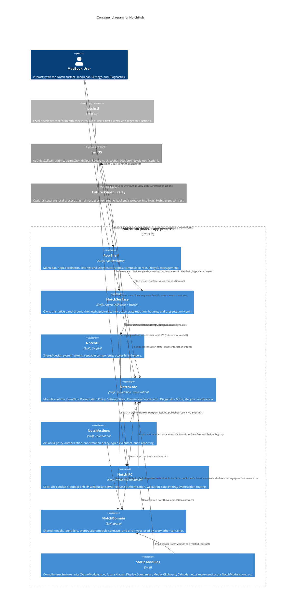
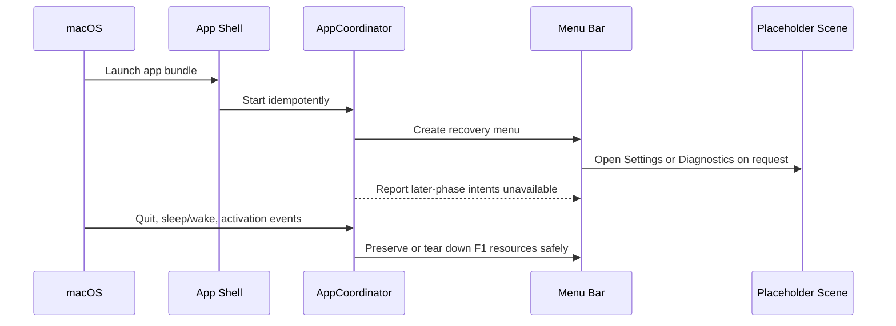
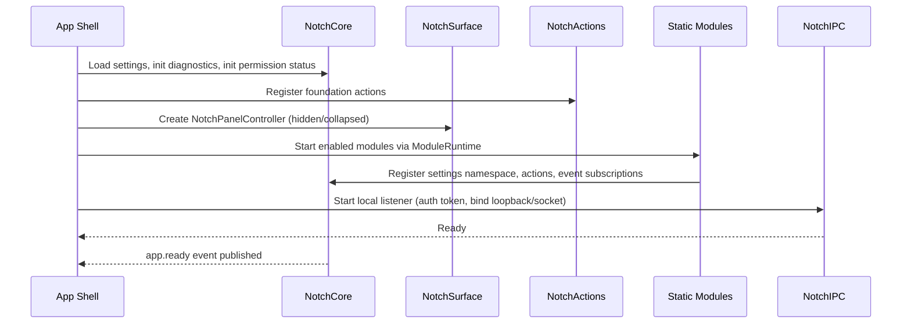
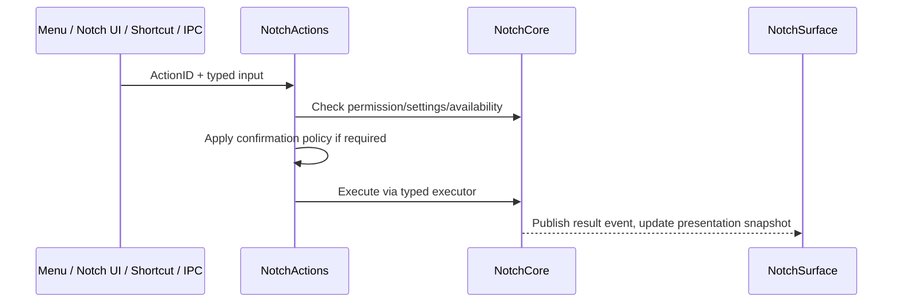

# C4 Model — Level 2: Container Diagram
## NotchHub — Modular macOS Notch Platform

**Status:** Draft v0.1  
**Owner:** Architecture  
**Last updated:** 2026-09-14
**Related documents:** [Architecture Overview](overview.md), [C4 Context](c4-context.md), [Module System](module-system.md), [Notch Surface](notch-surface.md), [Event Protocol](event-protocol.md), [Action Platform](action-platform.md), [IPC](ipc.md), [Performance](performance.md)

---

## 1. Purpose

This document provides the **Container** view of NotchHub using the C4 model. A container, in C4 terms, is a separately runnable/deployable unit or a clearly separated internal boundary that executes code or stores data — for example a native application process, a command-line tool, or a Swift package with a distinct responsibility. This is a zoom-in from the [System Context](c4-context.md), showing the high-level technology choices and how responsibilities are distributed, without descending to individual classes or files.

NotchHub runs as a **single macOS application process** at deployment time. Internally, that process is composed of well-defined Swift package "containers" with strict dependency direction. This document treats both the deployable process and its major internal packages as containers, since the internal boundaries are architecturally significant even though they share one OS process.

---

## 2. Deployment context

| Aspect | Value |
|---|---|
| Deployment unit | One macOS application bundle (`NotchHub.app`) |
| Runtime | Single process, menu-bar-first (`LSUIElement`-style behavior), no Dock icon required |
| Companion binary | `notchctl` command-line tool, invoked locally by the user or scripts |
| Persistent storage | Local settings store (typed, versioned) and macOS Keychain for secrets |
| Network exposure | None by default; optional loopback-only IPC listener |
| External processes | None required for the foundation phase; a future Xiaozhi relay process is optional and separate |

---

## 3. Container diagram



---

## 4. Container catalogue

### 4.1 App Shell

| Attribute | Description |
|---|---|
| Technology | Swift, AppKit + SwiftUI |
| Responsibility | Menu-bar entry point, `AppCoordinator` startup/shutdown ordering, composition root wiring, and independent Settings/Diagnostics scenes |
| Depends on | F1: `NotchDomain` and ServiceManagement only; later phases compose `NotchSurface` and `NotchCore` |
| Must not do | Contain module-specific business logic, parse external protocols, persist Settings, or instantiate later-phase containers early |
| Delivered in phase | F1 |

In F1, Settings and Diagnostics are labelled placeholder scenes. Menu intents targeting the surface,
demo state, or module runtime return an explicit unavailable outcome; they do not create an
`NSPanel`, `ModuleRuntime`, IPC listener, Settings store, or Diagnostics store.

### 4.2 NotchSurface

| Attribute | Description |
|---|---|
| Technology | Swift, AppKit (`NSPanel`) hosting SwiftUI content |
| Responsibility | Sole owner of the native Notch panel; screen/notch geometry; interaction state machine (`hidden`, `collapsed`, `compact`, `expanded`, `suppressed`, `recovering`); hover/click/Escape/click-outside/hotkey handling |
| Depends on | `NotchCore` (presentation state), `NotchUI` (components), `NotchDomain` (contracts) |
| Must not do | Parse Xiaozhi/media/clipboard protocols directly, or let modules call its APIs directly |
| Delivered in phase | F2 |

### 4.3 NotchUI

| Attribute | Description |
|---|---|
| Technology | Swift, SwiftUI |
| Responsibility | Design tokens (color, typography, spacing, corner radius, animation), reusable components (buttons, status pills, rows), accessibility helpers, reduced-motion policy |
| Depends on | `NotchDomain` (for typed display models where needed) |
| Must not do | Own side effects, timers, permissions, or external state |
| Delivered in phase | F3 |

### 4.4 NotchCore

| Attribute | Description |
|---|---|
| Technology | Swift, Foundation, Observation |
| Responsibility | `ModuleRuntime`, `EventBus`, `PresentationPolicy`, `SettingsStore`, `PermissionCoordinator`, `LifecycleCoordinator`, `DiagnosticsStore`, `ResourcePolicyEvaluator` |
| Depends on | `NotchDomain` |
| Must not do | Directly manipulate `NSPanel`, or implement concrete module/feature logic |
| Delivered in phase | F4 (settings), F5 (permissions), F7 (module runtime), F8 (events), F9 (diagnostics) |

### 4.5 NotchActions

| Attribute | Description |
|---|---|
| Technology | Swift, Foundation |
| Responsibility | `ActionRegistry`, `ActionAuthorizer`, `ConfirmationCoordinator`, typed `ActionExecutor` implementations, cancellation/timeout handling, audit reporting |
| Depends on | `NotchCore`, `NotchDomain` |
| Must not do | Accept unvalidated raw commands from IPC, or expose a general-purpose shell executor |
| Delivered in phase | F6 |

### 4.6 NotchIPC

| Attribute | Description |
|---|---|
| Technology | Swift, Foundation/Network |
| Responsibility | Local Unix domain socket and/or loopback-only HTTP/WebSocket server; request authentication; schema validation; rate limiting; routing to `EventRouter` and `ActionRegistry`; health/status endpoints |
| Depends on | `NotchCore`, `NotchDomain` |
| Must not do | Bind beyond `127.0.0.1`/local socket by default, or accept arbitrary executable commands |
| Delivered in phase | F8 |

### 4.7 NotchDomain

| Attribute | Description |
|---|---|
| Technology | Pure Swift (Foundation types only where unavoidable) |
| Responsibility | `ModuleID`, `ActionID`, `SessionID`, `SurfaceState`, `EventEnvelope`, `NotchModule` protocol, error types |
| Depends on | Nothing internal to the project |
| Must not do | Import SwiftUI, AppKit, or perform I/O |
| Delivered in phase | F0 |

### 4.8 Static Modules

| Attribute | Description |
|---|---|
| Technology | Swift, implementing `NotchModule` |
| Responsibility | Feature-specific state, settings namespace, declared permissions, registered actions, event subscriptions/publications, UI slot contributions |
| Depends on | `NotchCore`, `NotchDomain`, and platform contracts only |
| Must not do | Access `NSPanel` directly, access another module's internals, or bypass the Action Registry/Permission Coordinator |
| Delivered in phase | F7 (`DemoModule`), M0–M6 (future real modules) |

### 4.9 `notchctl` (companion CLI)

| Attribute | Description |
|---|---|
| Technology | Swift CLI, separate executable target |
| Responsibility | Local developer utility: health checks, status queries, sending test events, invoking registered actions |
| Depends on | `NotchIPC` client contract (via HTTP/WebSocket/socket protocol, not internal imports) |
| Must not do | Access NotchHub's internal Swift types directly; it is a separate process communicating only via IPC |
| Delivered in phase | F8 |

### 4.10 Future Xiaozhi Relay (external, optional)

| Attribute | Description |
|---|---|
| Technology | Undetermined; a separate local process/script |
| Responsibility | Translates Xiaozhi's own wire protocol (for example WebSocket JSON control + audio) into NotchHub's versioned `EventEnvelope` format; may call a small set of registered actions (reconnect/stop/mute) |
| Depends on | `NotchIPC` public contract only |
| Must not do | Be imported into or coupled with `NotchSurface`/`NotchCore` internals |
| Delivered in phase | M1 |

---

## 5. Container interaction patterns

### 5.1 Startup sequence across containers

#### F1 implemented sequence



#### Full foundation target (F4–F9)



### 5.2 External event reaching the surface

```mermaid
sequenceDiagram
    participant Client as notchctl / Future Xiaozhi Relay
    participant IPC as NotchIPC
    participant Core as NotchCore (EventBus + Policy)
    participant Modules as Static Modules
    participant Surface as NotchSurface

    Client->>IPC: Authenticated POST /v1/events
    IPC->>Core: Validate + publish EventEnvelope
    Core->>Modules: Deliver subscribed event
    Core->>Surface: Presentation Policy decision (compact/expanded/none)
    Surface-->>Client: (no direct response; UI updates locally)
```

### 5.3 Action invocation across containers



---

## 6. Technology decisions reflected in this view

| Decision | Rationale | Related ADR |
|---|---|---|
| Single macOS app process, no separate backend service | NotchHub is a local, single-user tool; no need for distributed deployment | ADR-0001, ADR-0005 |
| SwiftUI for UI, AppKit for native panel/window | SwiftUI accelerates UI development; AppKit is required for `NSPanel`-level window control | ADR-0002 |
| Static compile-time modules, not dynamic plugins | Simpler build/sign/test story; avoids arbitrary code execution risk during early architecture | ADR-0003 |
| Local IPC (Unix socket / loopback HTTP-WebSocket) before any LAN API | Keeps the trust boundary local-only until a network API is explicitly designed and reviewed | ADR-0005, ADR-0009 (security) |
| `notchctl` as a separate executable, not embedded | Keeps developer tooling decoupled from the app's internal Swift types; forces a clean IPC contract | Supports ADR-0005 |
| Xiaozhi relay modeled as an external container | Avoids coupling `NotchSurface`/`NotchCore` to any one AI backend's protocol | Supports ADR-0002, ADR-0003, and the M1 module boundary in the roadmap |

---

## 7. What this view intentionally omits

Per the C4 model's level separation, this Container diagram does not show:

- Individual classes, structs, or protocols inside each container (see `notch-surface.md`, `module-system.md`, `event-protocol.md`, `action-platform.md`, `ipc.md` for Component-level detail).
- The internal state machine transitions of `NotchSurface` (see [`notch-surface.md`](notch-surface.md)).
- The exact JSON schema of `EventEnvelope` (see [`event-protocol.md`](event-protocol.md)).
- The specific list of foundation actions and their executors (see [`action-platform.md`](action-platform.md)).
- Endpoint-level detail of the local IPC API (see [`ipc.md`](ipc.md)).
- Module-specific internals for any individual module (see `docs/modules/*.md`, to be created alongside each module).

---

## 8. Change control

This diagram must be updated whenever:

- A new container is introduced (for example, a privileged helper process, which would also require a dedicated ADR and security review per [Architecture Overview §14](overview.md#14-architecture-decision-records)).
- A container's core responsibility changes (for example, if `NotchIPC` were to gain LAN-facing capability — this requires a security design review and ADR first).
- The technology choice for a container changes (for example, replacing AppKit `NSPanel` with a different windowing approach).
- `notchctl` or a future relay process changes its communication protocol with `NotchIPC`.

Until such a change occurs, this Level 2 view should remain the authoritative map of NotchHub's runtime containers and their responsibilities.
