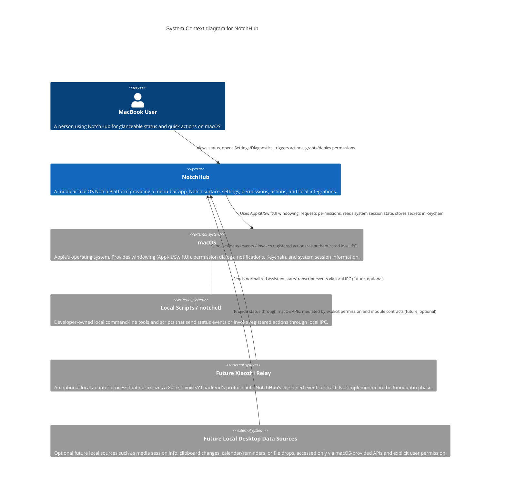

# C4 Model — Level 1: System Context
## NotchHub — Modular macOS Notch Platform

**Status:** Draft v0.1  
**Owner:** Architecture  
**Last updated:** 2026-09-13  
**Related documents:** [Architecture Overview](overview.md), [C4 Container](c4-container.md), [Vision](../product/vision.md), [Requirements](../product/requirements.md), [Threat Model](../security/threat-model.md)

---

## 1. Purpose

This document provides the **System Context** view of NotchHub using the C4 model. The System Context diagram shows the software system as a single box, together with the people who use it and the other systems it interacts with, without exposing internal structure. It is the most abstract of the C4 diagrams and is intended to be understandable by both technical and non-technical audiences.

The goal of this document is to answer: *who uses NotchHub, and what other systems does it talk to, without describing how NotchHub is built internally.*

---

## 2. Scope statement

NotchHub is a **macOS menu-bar and Notch-surface application**. It runs entirely as a local application on a single Mac. It does not have a backend service, does not manage other users' data, and is not a distributed system.

### In scope for context

- The primary human user.
- macOS itself, as the operating system providing windowing, permissions, and system services.
- Local developer/automation tooling that interacts with NotchHub through local IPC.
- A future optional external assistant system (Xiaozhi) reached only through a normalized local relay/adapter.
- Future optional local data sources for desktop productivity modules (media session info, clipboard, calendar/reminders, files), all mediated through macOS APIs.

### Explicitly out of scope for context

- Cloud backend services owned by this project.
- Multi-tenant or multi-user server-side concerns.

NotchHub does not have a "back end" in the traditional sense; the operating system and local integrations are its only external dependencies.

---

## 3. System Context diagram

---

## 4. Actors

### 4.1 Primary actor: MacBook User

| Attribute | Description |
|---|---|
| Type | Human |
| Role | Uses NotchHub daily on a single Mac |
| Goals | Glanceable status, quick actions, minimal distraction, trustworthy background behavior |
| Interactions | Hover/click the Notch, use keyboard shortcuts, configure Settings, grant/deny permissions, inspect Diagnostics |
| Trust level | Fully trusted; owns the device and the data |

This is the only human actor in the system context. NotchHub does not currently define secondary human roles such as administrators or remote operators, because it is a single-user local application.

### 4.2 External system: macOS

| Attribute | Description |
|---|---|
| Type | Operating system / platform APIs |
| Role | Provides windowing primitives, permission dialogs, secure storage, and session/environment information |
| Interactions | AppKit `NSPanel` and window server, SwiftUI rendering, permission prompts (Notifications, Accessibility, Microphone, Calendar, Camera, Screen Recording, Automation), Keychain, `os.Logger`, sleep/wake and Space/full-screen notifications |
| Trust level | Trusted platform; NotchHub follows Apple's documented permission and sandboxing behavior |

macOS is modeled as a single external system in this context diagram, even though internally it is composed of many frameworks, because at this level of abstraction the relevant fact is simply that NotchHub depends on the OS for windowing and privacy-sensitive capabilities.

### 4.3 External system: Local Scripts / `notchctl`

| Attribute | Description |
|---|---|
| Type | Local software tool, same machine |
| Role | Lets the user or their own automation trigger test events or registered actions from the command line |
| Interactions | Authenticated requests over local IPC (Unix domain socket and/or loopback HTTP/WebSocket) |
| Trust level | Conditionally trusted; requests are still authenticated, validated, and rate-limited by NotchHub |

This actor exists from the F8 phase of the foundation roadmap onward and is primarily a developer/power-user tool, not an end-user-facing product component.

### 4.4 External system (future, optional): Xiaozhi Relay

| Attribute | Description |
|---|---|
| Type | Local adapter process, not part of NotchHub's core codebase |
| Role | Translates a Xiaozhi voice/AI backend's own protocol (for example WebSocket-based control/audio messages) into NotchHub's versioned `EventEnvelope` format |
| Interactions | Sends normalized events (assistant state, transcript deltas, tool progress) to NotchHub over local IPC; may receive registered action calls such as reconnect/stop/mute |
| Trust level | Conditionally trusted local process; NotchHub still validates and authenticates all inbound data |
| Status | Planned for module phase M1; does not exist in the foundation phase |

The relay is modeled as external because NotchHub's core does not implement or depend on the Xiaozhi wire protocol directly. This keeps the platform independent of any single AI backend.

### 4.5 External system (future, optional): Local Desktop Data Sources

| Attribute | Description |
|---|---|
| Type | macOS-provided data/session APIs |
| Role | Supplies information for future productivity modules: now-playing media session, clipboard change notifications, calendar/reminders items, or dropped files |
| Interactions | Read through macOS frameworks (for example media remote APIs, `NSPasteboard`, EventKit), always mediated by the Permission Center and module contracts |
| Trust level | Trusted platform data, but access is permission-gated and module-scoped |
| Status | Planned for module phases M2–M4; not present in the foundation phase |

---

## 5. Relationships summary

| From | To | Description | Phase |
|---|---|---|---|
| MacBook User | NotchHub | Views status, triggers actions, configures settings, manages permissions | Foundation (F0–F10) |
| NotchHub | macOS | Uses windowing, permission, Keychain, and logging APIs | Foundation (F0–F10) |
| Local Scripts / `notchctl` | NotchHub | Sends authenticated local events/actions | Foundation (F8 onward) |
| Xiaozhi Relay | NotchHub | Sends normalized assistant events; receives registered actions | Module M1 |
| Local Desktop Data Sources | NotchHub | Provide media/clipboard/calendar/file data through permissioned modules | Modules M2–M4 |

All external relationships terminate at the local-machine boundary by default.

---

## 6. Trust and data boundary notes

- NotchHub is a **single-machine, single-user** system. There is no multi-user account model or remote administration surface in scope.
- All external system relationships terminate at the local machine boundary; NotchHub does not, by default, expose a network-reachable endpoint beyond `127.0.0.1` or a local Unix domain socket.
- The Xiaozhi Relay and any future external data source are treated as **untrusted until validated** at the IPC boundary, even though they run locally, per the security principles in the [Architecture Overview](overview.md#11-security-architecture).
- macOS itself is the only system context participant that NotchHub inherently trusts for platform-level guarantees (windowing, permission enforcement, Keychain security).

---

## 7. Relationship to other C4 levels

This System Context view intentionally omits:

- Internal packages (`NotchDomain`, `NotchCore`, `NotchSurface`, `NotchUI`, `NotchActions`, `NotchIPC`).
- The module runtime and specific modules (DemoModule, future Xiaozhi Display Companion, Media, Clipboard, Calendar).
- Local IPC transport details (Unix socket vs. HTTP vs. WebSocket).
- Action/event contract schemas.

These details belong in the [Container diagram](c4-container.md) and subsequent component-level documentation (`notch-surface.md`, `module-system.md`, `event-protocol.md`, `action-platform.md`, `ipc.md`).

---

## 8. Change control

This document should be revisited whenever:

- A new external system or actor is introduced (for example, a second AI backend, a companion iOS app, or a cloud sync service).
- Any relationship crosses the local-machine boundary (for example, if a future network or cloud API were proposed — this would also require a dedicated ADR and threat-model update per [Requirements §12](../product/requirements.md#12-change-control)).

Until then, this Level 1 view should remain small and stable, reflecting the project's local-first, single-user design.
