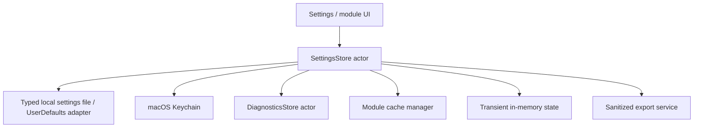
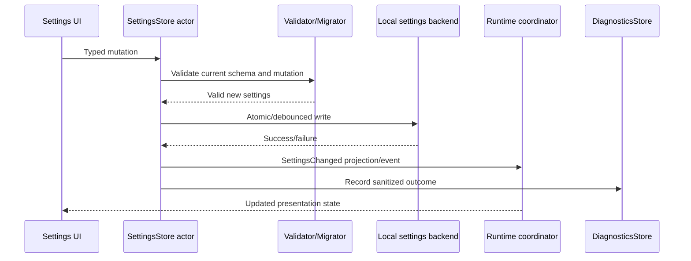

# Data Persistence
## NotchHub — Settings, Keychain, Caches, Logs, and Retention

**Status:** Draft v0.1  
**Owner:** Architecture / Security  
**Last updated:** 2026-09-13  
**Related documents:** [Architecture Overview](overview.md), [State Management](state-management.md), [Module System](module-system.md), [Event Protocol](event-protocol.md), [IPC](ipc.md), [Performance](performance.md), Privacy policy (planned for `docs/operations/privacy.md`), [Requirements §8](../product/requirements.md#8-data-requirements)

---

## 1. Purpose

This document defines how NotchHub stores, reads, migrates, caches, rotates, exports, resets, and deletes application data.

NotchHub is a local-first, single-user macOS app. Persistence is deliberately split by sensitivity and lifetime:

- **Settings** for durable non-secret preferences.
- **Keychain** for credentials, tokens, and other secrets.
- **Operational diagnostics** for bounded, sanitized troubleshooting data.
- **Module data** for feature-specific state with explicit retention policy.
- **Caches** for rebuildable data with explicit byte/count budgets.
- **Transient state** kept only in memory and never persisted unless the user enables retention.

The design must prevent secret leakage, settings corruption, unbounded memory/disk growth, accidental persistence of user content, and cross-module data access.

---

## 2. Persistence principles

1. **Data minimization** — do not persist data merely because it is available.
2. **Classify before storing** — every data type has a sensitivity, owner, lifetime, and deletion rule.
3. **Secrets never enter ordinary settings/logs.**
4. **Module ownership** — a module owns its schema and retention policy inside its namespace; the platform owns the storage boundary.
5. **Typed and versioned settings** — no scattered raw preference keys.
6. **Atomic recovery** — incomplete/corrupt writes fall back to the last valid state or safe defaults.
7. **Bounded operational data** — logs, event history, transcript buffers, and caches have explicit count/byte limits.
8. **Sanitized export** — diagnostic/config export excludes secrets and sensitive raw content.
9. **Explicit deletion** — reset/delete behavior is documented and user-visible.
10. **No excluded-domain data** — NotchHub does not persist ESP32, IoT, LAN device, or hardware-control data because those domains are out of scope.

---

## 3. Data classification

| Class | Examples | Default persistence | Sensitivity | Owner |
|---|---|---|---|---|
| A — Public app metadata | App version, theme choice, surface timeout | Yes | Low | Core settings |
| B — Operational settings | Shortcut bindings, module enablement, UI policy | Yes | Low/medium | Core/module settings |
| C — Secrets | IPC token, future relay credential, API key | Yes, secure storage only | High | Keychain/secret service |
| D — Diagnostics | Sanitized error code, timestamps, counters | Bounded local retention | Medium | DiagnosticsStore |
| E — User content | Future transcript, clipboard text, file metadata, calendar text | Memory only by default; opt-in retention | High | Owning module |
| F — Rebuildable cache | Artwork, thumbnails, formatted summaries | Optional bounded cache | Medium/high depending on content | Owning module/cache manager |
| G — Temporary execution data | In-flight action input/output, IPC request body | Memory only | Depends on input | Action/IPC owner |

### Classification rules

- Data is classified at the schema/design stage, not after implementation.
- A lower-sensitivity container must not silently receive a higher-sensitivity payload.
- Diagnostics receives summaries/IDs/error codes, not raw user content by default.
- A module that handles Class E/F data must provide a module-specific privacy/retention document before implementation.

---

## 4. Storage architecture



### Storage components

| Component | Technology direction | Stores | Does not store |
|---|---|---|---|
| `SettingsStore` | Actor/service with typed Codable model | Non-secret app/module settings | Tokens, raw transcripts, arbitrary module data |
| `SettingsBackend` | Versioned file or `UserDefaults` adapter | Serialized `AppSettings` | Secrets and unbounded history |
| `KeychainStore` | Security framework Keychain | Tokens, credentials, IPC secret | General settings, logs, bulk user content |
| `DiagnosticsStore` | Actor + bounded ring buffer/file sink | Sanitized errors, counters, recent summaries | Raw secrets, unlimited logs, full private content |
| `CacheManager` | Module-owned bounded LRU/cache directory | Rebuildable thumbnails/artwork/summaries | Authoritative settings or credentials |
| `SessionStore` | Memory first, optional module-owned persistence | Future assistant session/transcript if opt-in | Data by default without retention setting |

---

## 5. Typed settings model

### 5.1 App settings

```swift
public struct AppSettings: Codable, Sendable {
    public var schemaVersion: Int
    public var general: GeneralSettings
    public var appearance: AppearanceSettings
    public var notchBehavior: NotchBehaviorSettings
    public var shortcuts: ShortcutSettings
    public var diagnostics: DiagnosticsSettings
    public var modules: [ModuleID: ModuleSettingsEnvelope]
}
```

### 5.2 Module settings envelope

```swift
public struct ModuleSettingsEnvelope: Codable, Sendable {
    public let moduleSchemaVersion: Int
    public let isEnabled: Bool
    public let payload: Data
}
```

The platform owns envelope versioning and module namespace. The module owns its payload schema, defaults, migration, and validation logic through a module settings adapter.

### 5.3 Settings store interface

```swift
public protocol SettingsStore: Sendable {
    func load() async throws -> AppSettings
    func update(_ mutation: @Sendable (inout AppSettings) throws -> Void) async throws
    func save(_ settings: AppSettings) async throws
    func reset(scope: SettingsResetScope) async throws
    func exportSanitized() async throws -> Data
    func importSanitized(_ data: Data, mode: ImportMode) async throws -> ImportReport
}
```

Views must use a view model/projection over this interface; they must not manipulate raw persistence APIs directly.

---

## 6. Settings persistence lifecycle



### Rules

- Mutations are applied to a copy/current valid state and validated before replacement.
- If persistence fails, retain the last known-good state and show a recoverable Settings/Diagnostics error.
- User-visible runtime changes may apply before disk persistence completes, but failure must be observable.
- High-frequency controls use debounced writes; reset/import operations use explicit completion.
- Writes should be atomic: write temporary data, validate/flush as appropriate, then replace the target.

---

## 7. Schema versioning and migration

### 7.1 Migration sequence

```text
Read stored bytes
      ↓
Decode envelope/schema version
      ↓
If old → apply ordered migrations
      ↓
Validate final AppSettings
      ↓
If valid → expose to runtime
If invalid → safe defaults + diagnostics warning
      ↓
Persist migrated form when safe
```

### 7.2 Migration requirements

- Migrations are deterministic and ordered.
- Each migration has unit tests with before/after fixtures.
- A failed migration never partially mutates the active settings object.
- Unknown future schema versions fail closed to safe defaults or a read-only recovery mode; they must not be silently reinterpreted.
- Migrations must not require network access.
- Secret migration is separate from ordinary settings migration.
- Removing a module does not automatically delete its settings unless the user explicitly confirms cleanup or a documented retention policy applies.

### 7.3 Example versions

```text
AppSettings v1: appearance + notchBehavior
AppSettings v2: adds shortcuts
AppSettings v3: adds module enablement namespace
AppSettings v4: adds diagnostics policy
```

The exact schema starts at v1 when implementation begins and is recorded in an ADR or settings document.

---

## 8. Keychain and secret storage

### 8.1 Secret examples

- IPC bearer token.
- Future Xiaozhi relay credential.
- Future API credentials for an explicitly approved desktop module.

### 8.2 Keychain rules

- Use service/account identifiers that include app environment and purpose.
- Do not store secrets in `UserDefaults`, settings export, source code, crash logs, or normal `os.Logger` messages.
- Diagnostics should report `credentialPresent: true/false`, never the value.
- Secret access is exposed through a narrow `SecretStore` protocol.
- Module secrets are namespaced and owned by that module.
- Reset settings does not delete secrets unless the user selects an explicit “Remove credentials” action.
- Export never includes secret values.
- Import cannot overwrite secrets without an explicit credential-specific flow and confirmation.

```swift
public protocol SecretStore: Sendable {
    func read(_ key: SecretKey) async throws -> Data?
    func write(_ value: Data, for key: SecretKey) async throws
    func delete(_ key: SecretKey) async throws
    func exists(_ key: SecretKey) async -> Bool
}
```

---

## 9. Diagnostics persistence

### 9.1 What to retain

Diagnostics may retain bounded sanitized metadata:

- Timestamp.
- Category.
- Severity.
- Source/module ID.
- Event/action/request ID.
- Error code.
- Duration/latency.
- Redacted summary.
- Counter/metric snapshot.

### 9.2 What not to retain by default

- Bearer tokens, credentials, authorization headers.
- Raw IPC bodies.
- Full transcript or clipboard content.
- Full file content or sensitive calendar text.
- Raw audio/binary frames.
- Arbitrary external payload dumps.
- Personal absolute paths where a relative/hashed identifier is sufficient.

### 9.3 Retention

- In-memory ring buffer: initial target 500–2,000 records.
- Optional file diagnostics: small rotating files with configured size/count cap.
- No indefinite append-only log.
- Export uses a sanitized snapshot, not the raw backing store.

---

## 10. Cache architecture

Caches contain rebuildable data only.

### Cache requirements

- Each cache has an owner module and a named directory/namespace.
- Every cache has a count and/or byte budget.
- Use LRU or equivalent eviction where applicable.
- Cache misses must be safe and trigger rebuild/fetch, not a crash.
- Cache data is never authoritative for settings or credentials.
- Clear cache is separate from reset settings.
- Disable/stop module trims or releases its cache according to module policy.
- Sensitive cache data has a documented retention policy and is not copied to diagnostics.

### Future examples

| Module | Possible cache | Required policy |
|---|---|---|
| Media | Artwork | Byte cap, LRU, clear action |
| Files | Thumbnails | Byte cap, no raw file copy, purge on module disable if configured |
| Calendar | Formatted event summaries | Short TTL, no unnecessary event body persistence |
| Xiaozhi | UI transcript snapshot | Memory cap; persistent history opt-in only |

---

## 11. User actions: reset, export, import, delete

### 11.1 Reset scopes

```swift
public enum SettingsResetScope: Sendable {
    case appearanceAndBehavior
    case shortcuts
    case module(ModuleID)
    case allNonSecrets
    case allIncludingCredentials
}
```

The UI must explain the scope and consequences. `allIncludingCredentials` is a separate destructive flow and never part of a normal reset button.

### 11.2 Export

Sanitized export may include:

- Schema versions.
- Non-secret settings.
- Enabled modules.
- Shortcut definitions.
- Appearance/Notch behavior.
- Non-sensitive diagnostic configuration.

It must exclude:

- Keychain values.
- Tokens/passwords.
- Full user-content histories.
- Raw payloads and sensitive paths.

### 11.3 Import

- Decode and validate before applying.
- Show schema/version and a summary of changes where practical.
- Never overwrite secrets automatically.
- Allow partial import by scope where practical.
- Preserve the last known-good configuration if import fails.
- Record a sanitized import result in Diagnostics.

### 11.4 Deletion

Modules that store user content must provide explicit deletion controls and document whether deletion is immediate, bounded by cache cleanup, or requires app restart.

---

## 12. Module persistence contract

Every module document must declare:

```text
Data item
├── Classification (A–G)
├── Owner
├── Storage backend
├── Schema/version
├── Maximum size/count
├── Retention period
├── User control (clear/export/delete)
├── Privacy sensitivity
├── Diagnostics treatment
└── Migration behavior
```

A module may not silently add a persistent database, file cache, transcript history, clipboard history, or user-content store without updating its module document and privacy/threat-model review.

---

## 13. Performance and reliability

- Settings load/migration must not block the main actor.
- Large imports/exports run in a background actor/task with progress and cancellation where appropriate.
- Diagnostics writes are batched/rotated.
- Cache cleanup is bounded and cancellable.
- Persistence failures are recoverable and observable.
- Every in-memory store has a limit; memory-only data is cleared on app restart unless retention is explicitly enabled.
- No persistent data feature may create a high-frequency write loop.

---

## 14. Testing requirements

### Settings tests

- Default settings.
- Valid mutation.
- Invalid mutation rejection.
- Encode/decode round trip.
- Every schema migration fixture.
- Unknown future schema.
- Corrupt/truncated file.
- Atomic write failure simulation.
- Debounced write behavior.
- Reset scopes.
- Sanitized export excludes secrets.
- Import validation and rollback.

### Keychain tests

- Read/write/delete through a test secret store.
- Missing credential behavior.
- Key namespacing by purpose/module.
- Diagnostics never contain secret bytes.
- Reset non-secrets does not delete credentials.

### Diagnostics/cache tests

- Ring buffer rotation.
- Byte/count limits.
- Redaction.
- Cache eviction and clear.
- Module disable cleanup.
- Disk-full/permission failure behavior where testable.

---

## 15. Explicit scope boundary

NotchHub persistence does not include schemas or storage for:

- ESP-IDF projects/build logs/firmware artifacts.
- ESP32 gateway/device lists/telemetry/OTA state.
- IoT/MQTT/smart-home state.
- LAN device-control history or hardware commands.

These domains are permanently excluded from the product and must not be added as module persistence merely because the generic storage layer could technically support them.

---

## 16. Summary

NotchHub separates non-secret settings, secure credentials, diagnostics, module data, caches, and transient UI state. Every persistent item has an owner, schema, sensitivity, retention rule, size budget, and deletion path.

The result is a storage layer that survives upgrades and corruption without silently leaking secrets or growing indefinitely, while allowing future Xiaozhi, media, clipboard, files, and calendar modules to manage their own data through a controlled platform boundary.
