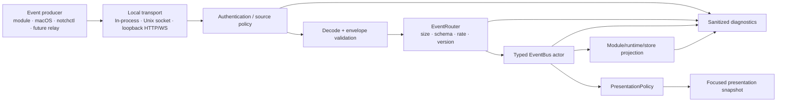

# Event Protocol
## NotchHub — Versioned Events and Local Integration Contract

**Status:** Draft v0.1  
**Owner:** Architecture / Integration  
**Last updated:** 2026-09-13  
**Related documents:** [Architecture Overview](overview.md), [State Management](state-management.md), [Module System](module-system.md), [Action Platform](action-platform.md), [IPC](ipc.md), [Security](../security/threat-model.md), [Requirements §5.7](../product/requirements.md#57-event-system-and-presentation-policy)

---

## 1. Purpose

This document defines how NotchHub represents, validates, routes, versions, observes, coalesces, and diagnoses events.

Events are the integration boundary between:

- macOS/application lifecycle sources.
- User actions and action results.
- Static modules.
- Local scripts and `notchctl`.
- Future external adapters such as a Xiaozhi relay.

The protocol separates **what happened** from **how the Notch presents it**. A producer publishes an event; `EventRouter`, `EventBus`, and `PresentationPolicy` decide whether that event changes a module state, a compact status, a notification, or nothing visible. A separate detail view opens only after an explicit user-navigation action.


---

## 2. Design goals

1. **Versioned** — external producers can evolve without silently breaking the app.
2. **Typed after validation** — raw JSON/bytes are converted into safe internal event types at the boundary.
3. **Traceable** — every event has an ID, source, timestamp, and optional correlation ID.
4. **Bounded** — payload size, event rate, history, and buffers have explicit limits.
5. **Order-aware** — streams can use sequence numbers; stale/duplicate events can be ignored where appropriate.
6. **Privacy-conscious** — events and diagnostics are sanitized; secrets and sensitive raw payloads are not logged by default.
7. **Transport-independent** — the same envelope works over Unix socket, loopback HTTP, WebSocket, or in-process test injection.
8. **Presentation-independent** — events do not directly control `NSPanel` or SwiftUI views.

---

## 3. Event lifecycle



### Processing stages

1. **Produce** — a source constructs an event using a known event type and payload schema.
2. **Transport** — the event is delivered in-process or through authenticated local IPC.
3. **Authenticate/source policy** — the app checks client credentials and whether the source is allowed to publish that event family.
4. **Decode** — serialized data becomes an envelope candidate.
5. **Validate** — version, required fields, payload size, timestamp, event type, and payload schema are checked.
6. **Route** — valid events go to the typed EventBus; invalid events are rejected and recorded in sanitized diagnostics.
7. **Project** — subscribed modules/stores update their domain/presentation projections.
8. **Present** — `PresentationPolicy` decides whether the user sees a badge, compact status, expanded panel, notification, or nothing. It may expose a detail-navigation affordance, but cannot automatically open the detail window.
9. **Observe** — counters, latency, drops, coalescing, and errors are recorded with bounded retention.

---

## 4. Envelope schema

### 4.1 Generic envelope

```json
{
  "id": "f3c61e35-245a-4c7d-8f9f-a967a1e52bd4",
  "version": 1,
  "source": "demo.module",
  "type": "demo.status.changed",
  "timestamp": "2026-09-13T01:00:00.000Z",
  "correlationID": "27b581d6-8af4-4c65-a450-dcbca40bb26c",
  "sequence": 12,
  "priority": "normal",
  "payload": {}
}
```

### 4.2 Field definitions

| Field | Type | Required | Rules |
|---|---|---:|---|
| `id` | UUID string | Yes | Unique event identifier; used for tracing/deduplication |
| `version` | Positive integer | Yes | Envelope schema version; unsupported versions are rejected or explicitly downgraded |
| `source` | String | Yes | Stable source/module identifier, e.g. `demo.module`, `xiaozhi.relay` |
| `type` | String | Yes | Lowercase dot-separated event type, e.g. `assistant.transcript.delta` |
| `timestamp` | RFC 3339/ISO-8601 string | Yes | Producer timestamp; app records receive time separately |
| `correlationID` | UUID string/null | No | Links related events: action, session, request, or operation |
| `sequence` | Non-negative integer | No | Monotonic sequence within a source/session stream where ordering matters |
| `priority` | `low`, `normal`, `high`, `critical` | No | Presentation policy hint; never bypasses user suppression/security |
| `payload` | JSON object/value constrained by type | Yes | Validated against event-type schema and size limits |

### 4.3 Swift model

```swift
public struct EventEnvelope<Payload: Codable & Sendable>: Codable, Sendable {
    public let id: UUID
    public let version: Int
    public let source: String
    public let type: String
    public let timestamp: Date
    public let correlationID: UUID?
    public let sequence: UInt64?
    public let priority: EventPriority
    public let payload: Payload
}

public enum EventPriority: String, Codable, Sendable {
    case low
    case normal
    case high
    case critical
}
```

The wire representation may use a type-erased payload during decode, but internal module code must receive a typed event enum or typed payload after validation.

---

## 5. Event naming and registry

### 5.1 Naming convention

```text
<domain>.<entity>.<verb>
```

Examples:

```text
app.lifecycle.started
surface.state.changed
module.lifecycle.changed
permission.status.changed
action.started
action.progress
action.completed
action.failed
demo.status.changed
assistant.state.changed                 # future Xiaozhi module
assistant.transcript.delta              # future Xiaozhi module
assistant.transcript.final              # future Xiaozhi module
media.playback.changed                  # future Media module
clipboard.item.captured                 # future Clipboard module
calendar.event.upcoming                 # future Calendar module
```

### 5.2 Rules

- Event types are stable public/internal contracts once released.
- Use singular entity names and past-tense/changed verbs where possible.
- Do not encode implementation details such as class names, transport names, or private database table names.
- Every event type has a documented payload schema, producer, consumers, rate expectation, privacy classification, and presentation policy.

### 5.3 Registry entry template

```markdown
## <event.type>

- Version:
- Producer(s):
- Consumers:
- Payload schema:
- Required fields:
- Optional fields:
- Maximum payload size:
- Expected rate:
- Ordering/sequence rule:
- Correlation rule:
- Privacy classification:
- Presentation default:
- Coalescing policy:
- Error/unknown-field behavior:
- Tests:
```

---

## 6. Foundation event types

### 6.1 Application lifecycle

```text
app.lifecycle.starting
app.lifecycle.ready
app.lifecycle.suspending
app.lifecycle.resumed
app.lifecycle.stopping
app.lifecycle.stopped
```

Example:

```json
{
  "version": 1,
  "source": "app.core",
  "type": "app.lifecycle.ready",
  "timestamp": "2026-09-13T01:00:00Z",
  "payload": {
    "appVersion": "0.1.0",
    "build": "100",
    "startupDurationMs": 428
  }
}
```

### 6.2 Surface

```text
surface.state.changed
surface.suppression.changed
surface.recovery.started
surface.recovery.completed
surface.recovery.failed
```

Surface events are generally produced by core, not external clients. External clients cannot directly request a native panel transition; they may invoke registered actions or publish a status event subject to Presentation Policy.

### 6.3 Module lifecycle

```text
module.registered
module.starting
module.started
module.suspended
module.stopping
module.stopped
module.failed
module.enabled.changed
```

Payload example:

```json
{
  "version": 1,
  "source": "runtime.modules",
  "type": "module.failed",
  "timestamp": "2026-09-13T01:00:00Z",
  "payload": {
    "moduleID": "demo",
    "reasonCode": "start_failed",
    "message": "Sanitized failure description",
    "restartCount": 1
  }
}
```

### 6.4 Permissions

```text
permission.status.changed
permission.request.started
permission.request.completed
```

Permission events must not include sensitive system data or unnecessary path/user information.

### 6.5 Actions

```text
action.available.changed
action.started
action.progress
action.completed
action.failed
action.cancelled
action.timed_out
action.confirmation.required
```

Action events use `correlationID` to link start/progress/result and must include the `ActionID`, not raw executor details.

### 6.6 Diagnostics/performance

```text
diagnostics.warning
diagnostics.error
performance.snapshot
performance.buffer.pressure
performance.event.coalesced
performance.event.dropped
```

These events are primarily diagnostic and should not normally expand the Notch.

### 6.7 Demo module

```text
demo.status.changed
demo.tick
demo.failure.simulated
```

`DemoModule` is the reference for testing event contracts before real modules exist.

---

## 7. Future Xiaozhi event family

Xiaozhi is a future display companion module, not part of the foundation protocol implementation. Its adapter must normalize raw external protocol messages into these stable events:

```text
assistant.session.started
assistant.session.ended
assistant.state.changed
assistant.transcript.delta
assistant.transcript.final
assistant.audio.level
assistant.tool.started
assistant.tool.progress
assistant.tool.completed
assistant.tool.failed
```

Example state event:

```json
{
  "id": "f3c61e35-245a-4c7d-8f9f-a967a1e52bd4",
  "version": 1,
  "source": "xiaozhi.relay",
  "type": "assistant.state.changed",
  "timestamp": "2026-09-13T01:00:00Z",
  "correlationID": "27b581d6-8af4-4c65-a450-dcbca40bb26c",
  "sequence": 8,
  "priority": "normal",
  "payload": {
    "sessionID": "27b581d6-8af4-4c65-a450-dcbca40bb26c",
    "state": "thinking",
    "sourceDevice": "xiaozhi-device",
    "isFinal": false
  }
}
```

Example transcript delta:

```json
{
  "id": "8f759edc-9c5f-4e96-a5ca-0314eac67cd9",
  "version": 1,
  "source": "xiaozhi.relay",
  "type": "assistant.transcript.delta",
  "timestamp": "2026-09-13T01:00:00Z",
  "correlationID": "27b581d6-8af4-4c65-a450-dcbca40bb26c",
  "sequence": 31,
  "priority": "normal",
  "payload": {
    "sessionID": "27b581d6-8af4-4c65-a450-dcbca40bb26c",
    "role": "assistant",
    "text": "Xin chào, tôi có thể giúp gì cho bạn?",
    "isFinal": false
  }
}
```

### Xiaozhi-specific rules

- `source` is the relay/module, not the physical device's arbitrary user-provided name.
- `sessionID` is required for session-scoped state/transcript/tool events.
- `sequence` is required for transcript deltas and recommended for state/tool streams.
- The relay must not forward raw authorization headers, tokens, binary audio frames, or unbounded protocol dumps as event payloads.
- Transcript assembler/coalescer runs outside the main actor.
- UI receives a bounded, coalesced presentation snapshot; it does not render every raw delta.
- Tool events represent safe, registered NotchHub actions only.

---

## 8. Validation rules

### 8.1 Envelope validation

Reject an event when:

- `version` is missing, zero, negative, unsupported, or not explicitly compatible.
- `id`, `source`, or `type` is missing/invalid.
- Timestamp is malformed or outside configured clock-skew limits when the transport requires it.
- Payload exceeds maximum size.
- Event type is not registered or allowed for the authenticated source.
- Required payload fields are missing or have the wrong type.
- `sequence` regresses within a stream where monotonic ordering is required (handle according to stream policy; usually drop and diagnose).
- Correlation ID is malformed or references an invalid format.

### 8.2 Source policy

Each IPC client/source has an allow-list:

```text
notchctl
  → health/status/test events/foundation actions

xiaozhi.relay (future)
  → assistant.* events + explicitly approved assistant actions

demo.injector (development only)
  → demo.* and test lifecycle events
```

A source cannot publish arbitrary event types merely because it is authenticated.

### 8.3 Payload limits

Initial planning limits:

| Item | Limit/policy |
|---|---|
| Maximum serialized event | 256 KB default; smaller limits for high-rate event families |
| Maximum string field | Defined per event type; truncate/reject with schema error |
| Event history | 500–2,000 sanitized events |
| Transcript buffer (future) | 50–200 messages or 1–5 MB |
| High-rate event input | Per-source/per-type rate limit and coalescing policy |
| Nested depth | Limited to prevent pathological payloads |

Exact values are implementation/configuration details but must be explicit, tested, and visible in diagnostics.

---

## 9. Ordering, deduplication, and correlation

### 9.1 Event ID deduplication

- Maintain a bounded recent-ID set for sources/types that may retry requests.
- A duplicate event ID is ignored or returns an idempotent acknowledgment according to transport semantics.
- Deduplication state is bounded and may expire after a configured TTL.

### 9.2 Sequence ordering

- A sequence is scoped to `source + correlationID + event type` unless the event registry declares another scope.
- For transcript deltas, a lower-than-last sequence is stale and dropped; a gap is recorded as a diagnostic warning but does not automatically fail the session.
- Events without sequence are not assumed to be ordered across transports.

### 9.3 Correlation IDs

Use `correlationID` to associate:

- Action start/progress/result.
- Assistant session/state/transcript/tool events.
- IPC request and resulting event.
- Permission request and completion.
- Recovery attempts.

Correlation IDs are diagnostic/routing metadata; they must not contain secrets or user-controlled arbitrary path data.

---

## 10. Rate limiting and coalescing

### 10.1 Rate policy

The EventRouter applies limits by source and event type. A high-rate source must not monopolize the EventBus or main-actor presentation.

Suggested starting policies:

| Event family | Input handling | UI presentation |
|---|---|---:|
| Lifecycle/permission/action result | Preserve each valid event within reasonable bounds | On event |
| Compact status | Debounce/coalesce equivalent updates | 5–10 updates/s maximum |
| Future transcript delta | Buffer/assemble | 20–30 snapshots/s maximum |
| Future audio level | Keep latest/sample window | 15–30 updates/s while active |
| Diagnostics/performance | Aggregate counters | 1–2 updates/s or on demand |
| Demo tick | Low-rate test event | At most once per configured interval |

### 10.2 Coalescing rules

- Equivalent status events may replace the previous pending event.
- Progress events may keep the newest progress value while preserving start/completed/error events.
- Transcript deltas are assembled by session/sequence and emitted as snapshots.
- Audio levels keep a small rolling window or latest smoothed value; raw samples are not placed in the UI store.
- Coalesced/dropped counts are recorded in Diagnostics.

---

## 11. Presentation policy mapping

Events do not directly select a UI state. `PresentationPolicy` considers:

```text
Event priority/type
+ Current surface state
+ User settings
+ Full-screen/suppression state
+ Module visibility/health
+ Recent interaction
+ Event frequency
          ↓
Presentation decision
```

| Event condition | Default presentation |
|---|---|
| Low-priority informational | Store only; no interruption |
| User-triggered action result | Compact or expanded result |
| High-priority recoverable error | Badge/compact plus Diagnostics route |
| Critical app/runtime error | Menu-bar badge/notification; avoid force-expanding over active work |
| Future assistant state | Compact while allowed; store while suppressed |
| Future transcript delta | Update existing compact/expanded session only; do not repeatedly force-expand |
| Detail navigation event | Open detail only after explicit user action |
| Diagnostic/performance event | Diagnostics only by default |

A module cannot bypass this policy by publishing `priority: critical`; priority is a hint subject to validation, authorization, and user suppression settings.

---

## 12. Error model

### 12.1 Validation errors

```json
{
  "error": {
    "code": "event.invalid_payload",
    "message": "Sanitized human-readable description",
    "eventID": "f3c61e35-245a-4c7d-8f9f-a967a1e52bd4",
    "source": "demo.injector",
    "type": "demo.status.changed"
  }
}
```

Do not return internal stack traces, tokens, file paths containing personal information, or raw payloads to external clients by default.

### 12.2 Runtime event errors

An event handler failure is associated with the subscribing module/source:

```text
Event handler throws
        ↓
ModuleRuntime catches/report
        ↓
Module health/error projection updates
        ↓
Other subscribers continue
```

One module's event-handler failure must not cancel the entire EventBus or drop unrelated subscribers.

---

## 13. Transport mapping

The envelope is transport-independent.

| Transport | Use | Requirements |
|---|---|---|
| In-process `AppEvent` | Core/module communication and tests | Typed, actor-isolated, no serialization required |
| Unix domain socket | Local CLI/automation | File/socket permissions, framing, authenticated client policy |
| Loopback HTTP | Simple local tools | `127.0.0.1`, token auth, body size limit, rate limit |
| Loopback WebSocket | Streaming future relay/status | Authentication during handshake, bounded message size/rate, reconnect policy |

The foundation may implement Unix socket first and add HTTP/WebSocket when a concrete local integration needs them. Adding a LAN bind is a separate security design and is not part of this protocol.

---

## 14. Privacy and diagnostics

- Events are classified as public-local, operational-sensitive, or user-content-sensitive.
- Diagnostics default to retaining metadata and sanitized summaries, not full raw user content.
- Future assistant transcript events are user-content-sensitive; raw transcript retention is opt-in and bounded.
- Clipboard/file/calendar payloads are sensitive by default and must not enter generic diagnostics without explicit redaction/retention policy.
- Authorization headers, tokens, credentials, raw binary audio, and arbitrary external payload dumps are never written to standard event history.

---

## 15. Versioning and compatibility

### 15.1 Envelope version

- `version: 1` is the initial envelope contract.
- Additive optional fields may be added without changing the major envelope version if unknown fields are ignored safely.
- Changes to required field meaning, type semantics, authentication, or ordering require a version change or ADR-defined compatibility layer.
- Unknown versions must fail closed at the external boundary with a clear diagnostics entry.

### 15.2 Event type versioning

If a payload needs an incompatible change:

```text
assistant.transcript.delta       # v1
assistant.transcript.delta.v2    # only if schema cannot remain compatible
```

Prefer additive optional fields and explicit migration over silently changing the meaning of an existing field.

### 15.3 Deprecation

- Mark event types as active, deprecated, or removed in the registry.
- Keep a compatibility decoder for at least one planned release cycle where practical.
- Document producer migration and test old/new fixtures.

---

## 16. Testing requirements

### 16.1 Unit tests

- Envelope encode/decode.
- Missing/invalid field rejection.
- Unknown version/type behavior.
- Payload size/depth/string limits.
- Source allow-list policy.
- Timestamp/skew validation.
- Event ID deduplication.
- Sequence ordering/stale event handling.
- Correlation ID propagation.
- Rate limiting and coalescing.
- Presentation policy mapping.
- Redaction of sensitive fields.

### 16.2 Integration tests

```text
notchctl/event fixture
        → local transport
        → auth
        → EventRouter
        → EventBus
        → module/store projection
        → PresentationPolicy
        → focused UI snapshot
```

Test:

- Valid event reaches intended consumer.
- Invalid event never reaches a module.
- One subscriber throwing does not affect another subscriber.
- Event flood preserves app responsiveness and produces metrics.
- Reconnect/retry duplicates are deduplicated where policy requires.
- Future Xiaozhi fixtures with Vietnamese Unicode transcript sequence correctly.

### 16.3 Fixtures

Store sanitized fixtures in `Tests/Fixtures/Events/`:

```text
app-lifecycle-ready.json
module-failed.json
action-completed.json
demo-status-changed.json
assistant-state-changed.json       # future module fixture
assistant-transcript-delta.json     # future module fixture
invalid-unknown-version.json
invalid-oversized-payload.json
invalid-unauthorized-source.json
```

No fixture may contain real credentials, authorization headers, personal transcript, or unredacted sensitive data.

---

## 17. Event registry template

Every event type added to the project must include a registry entry:

```markdown
# <event.type>

## Status

Active | Deprecated | Removed

## Version

1

## Producer


## Consumers


## Payload

```json
{}
```

## Required fields

## Optional fields

## Maximum size

## Expected rate

## Ordering and sequence

## Correlation ID

## Privacy classification

## Presentation policy

## Coalescing policy

## Error behavior

## Tests/fixtures
```

---

## 18. Summary

The Event Protocol gives NotchHub one stable, validated, observable integration boundary. Producers report facts through versioned envelopes; the core validates and routes them; modules project domain state; Presentation Policy decides how much attention the user should receive; focused stores update the UI.

This separation allows a future Xiaozhi relay to stream assistant state/text into NotchHub without coupling the Notch surface to raw protocol details, while preserving local security, bounded performance, diagnostics, and a clear macOS-only product scope.
