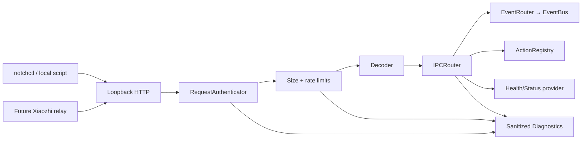

# Local IPC
## NotchHub — Loopback HTTP, Authentication, and Routing

**Status:** Draft v0.1  
**Owner:** Architecture / Security  
**Last updated:** 2026-09-15
**Related documents:** [Architecture Overview](overview.md), [C4 Container](c4-container.md), [Event Protocol](event-protocol.md), [Action Platform](action-platform.md), [State Management](state-management.md), [Threat Model](../security/threat-model.md), [Requirements §5.8](../product/requirements.md#58-local-ipc)

---

## 1. Purpose

NotchHub provides a local integration boundary so that `notchctl`, local automation, tests, and future adapters—such as a Xiaozhi relay—can send validated events or invoke registered actions without importing the app's internal Swift packages.

The IPC design is **local-first and deny-by-default**:

- Prefer a Unix domain socket for same-user local tooling.
- Use loopback-only HTTP/WebSocket when a language-neutral or streaming interface is needed.
- Authenticate requests where the selected transport requires it.
- Validate every envelope/action before it reaches `EventBus` or `ActionRegistry`.
- Rate-limit, size-limit, and diagnose invalid requests.
- Never accept arbitrary shell commands, executable paths, or executor configuration.

---

## 2. IPC goals and non-goals

### Goals

1. Give local scripts/tools a stable public contract.
2. Keep the app's Swift package internals private from companion tools.
3. Support health/status queries, test event injection, and registered actions.
4. Support future streaming events without moving protocol parsing into Notch UI.
5. Provide authentication, request validation, source allow-lists, rate limiting, and audit records.
6. Make IPC testable with fixtures and an in-memory transport.
7. Keep the default attack surface local to the user's own Mac.

### Non-goals

- No LAN-accessible server in the foundation.
- No cloud relay or public internet endpoint.
- No remote administration or multi-user access model.
- No arbitrary script/shell execution endpoint.
- No direct UI/window manipulation endpoint.
- No endpoint that accepts raw Xiaozhi protocol; a future relay must normalize it first.

---

## 3. Transport decision

### 3.1 F8 decision

F8 exposes one authenticated HTTP server bound only to `127.0.0.1`. It deliberately ships neither
a Unix domain socket nor a WebSocket stream. This keeps `notchctl`, tests, and future local
language clients on one inspectable request/response contract while avoiding premature stream
lifecycle and slow-consumer policy. See [ADR-0005](decisions/0005-local-ipc-before-lan-api.md).

### 3.2 Transport comparison

| Transport | Strength | Weakness | Recommendation |
|---|---|---|---|
| Unix domain socket | Local-only, efficient, good same-user boundary, no TCP port | Less convenient from some tools/languages; needs framing | Deferred beyond F8 |
| Loopback HTTP | Easy to inspect/use from Python, Node, shell, and tests | Requires token/auth and port management | F8 transport |
| Loopback WebSocket | Full-duplex stream for future assistant/status relay | More lifecycle/reconnect complexity | Deferred until a concrete stream consumer exists |
| LAN HTTP/WS | Remote access | Larger attack surface, authentication/TLS complexity, conflicts with product scope | Not supported in current product |

### 3.3 Default binding

- Bind HTTP only to `127.0.0.1`.
- Never bind to `0.0.0.0`, wildcard IPv6, or a LAN interface by default.
- The bound address and transport state must be shown in Diagnostics.

---

## 4. IPC architecture



### Components

| Component | Responsibility |
|---|---|
| `IPCServer` | Owns listener lifecycle and accepted client sessions |
| `RequestAuthenticator` | Validates transport/client credentials and source identity |
| `RequestRateLimiter` | Tracks per-client/source/type rate and rejects or coalesces excess requests |
| `PayloadValidator` | Enforces message size, JSON/decode, schema, version, and field constraints |
| `IPCRouter` | Dispatches validated requests to health, event, or action route |
| `EventRouter` | Converts event requests to typed `AppEvent` and publishes to EventBus |
| `ActionRoute` | Converts action request to typed `ActionInvocation` and calls ActionRegistry |
| `HealthRoute` | Returns sanitized app/runtime/surface/IPC status |
| `DiagnosticsReporter` | Records intake outcomes, rejection reason, latency, and bounded client metrics |

No component in this chain directly calls an `NSPanel` or SwiftUI view.

---

## 5. Authentication and client identity

### 5.1 HTTP policy

F8 HTTP:

- Generate a random token during first secure initialization.
- Store the token in Keychain or a protected local credential store.
- Require an authorization header for HTTP:

```http
Authorization: Bearer <token>
```

- Never print the token in logs, diagnostics, shell output, or error responses.
- Rotate/revoke the token only through an explicit Settings recovery action. Rotation atomically
  replaces the Keychain value and invalidates the previous token immediately. Already accepted
  requests may finish only within their ordinary timeout; every subsequent request with the old
  token receives `401`.
- Use constant-time token comparison where applicable.

The server must map the authenticated request's source to an allow-list. A valid token alone does not allow every event family or action.

### 5.2 Client source allow-list

| Client/source | Allowed operations |
|---|---|
| `notchctl` | Header `X-NotchHub-Source: notchctl`; authenticated health/status; `system.testMessage`; `app.openSettings` |
| `demo.injector` | Development-only DemoModule/test events |
| `xiaozhi.relay` (future) | Not accepted in F8; requires its own approved source policy |
| Unknown client | No route access |

The allow-list is application policy, not client self-declaration. F8 requires the
`X-NotchHub-Source: notchctl` header on release requests; the server accepts no other release
source. The header cannot create privilege: the Keychain token and server-side allow-list must
also pass. The DEBUG injector has separate development-only credential/policy.

---

## 6. Message framing and request envelope

### 6.1 Request envelope

```json
{
  "requestID": "7c08f5d4-5c46-4be0-9549-a875c37e1ed3",
  "protocolVersion": 1,
  "clientID": "notchctl",
  "operation": "event",
  "body": {}
}
```

| Field | Type | Required | Rule |
|---|---|---:|---|
| `requestID` | UUID string | Yes | Used for tracing/idempotent response correlation |
| `protocolVersion` | Positive integer | Yes | Unsupported versions fail closed |
| `clientID` | Registered string | Yes | Checked against authenticated client/source policy |
| `operation` | `health`, `status`, `event`, `action`, `stream` | Yes | Route allow-list |
| `body` | JSON value | Depends | Validated by operation schema |

For line/socket transports, use explicit message framing and maximum frame length. Do not read until EOF for a request that may keep the connection open.

### 6.2 Event body

```json
{
  "event": {
    "id": "f3c61e35-245a-4c7d-8f9f-a967a1e52bd4",
    "version": 1,
    "source": "demo.injector",
    "type": "demo.status.changed",
    "timestamp": "2026-09-13T01:00:00Z",
    "correlationID": null,
    "sequence": 1,
    "priority": "normal",
    "payload": {
      "title": "Foundation test",
      "message": "IPC is working"
    }
  }
}
```

The event is validated by `EventRouter` according to [`event-protocol.md`](event-protocol.md), not trusted merely because it arrived over an authenticated channel.

### 6.3 Action body

```json
{
  "actionID": "app.openSettings",
  "input": {}
}
```

Forbidden:

```json
{
  "command": "arbitrary shell text"
}
```

No IPC request can define a new Action ID, executor kind, executable path, script, shell string, external target, or timeout outside registered action policy.

---

## 7. Response model

### 7.1 Success response

```json
{
  "requestID": "7c08f5d4-5c46-4be0-9549-a875c37e1ed3",
  "protocolVersion": 1,
  "ok": true,
  "body": {
    "accepted": true
  }
}
```

### 7.2 Error response

```json
{
  "requestID": "7c08f5d4-5c46-4be0-9549-a875c37e1ed3",
  "protocolVersion": 1,
  "ok": false,
  "error": {
    "code": "ipc.action_not_allowed",
    "message": "This client is not allowed to invoke the requested action."
  }
}
```

Error messages must be safe for clients and must not include stack traces, tokens, internal file paths, raw payloads, or secret data.

### 7.3 Error codes

```text
ipc.invalid_frame
ipc.unsupported_protocol_version
ipc.authentication_required
ipc.authentication_failed
ipc.client_not_allowed
ipc.request_too_large
ipc.rate_limited
ipc.invalid_json
ipc.invalid_request
ipc.unknown_operation
ipc.invalid_event
ipc.event_not_allowed
ipc.unknown_action
ipc.action_not_allowed
ipc.action_invalid_input
ipc.server_unavailable
ipc.internal_error
```

---

## 8. Routes

### 8.1 Health

```text
GET /v1/health
```

Returns minimal process/service status, for example:

```json
{
  "ok": true,
  "protocolVersion": 1,
  "app": {
    "version": "0.1.0",
    "build": "100",
    "uptimeSeconds": 1234
  },
  "ipc": {
    "transport": "loopbackHTTP",
    "ready": true
  }
}
```

Health output must not include secrets, full settings, personal data, or raw event history.
It contains only protocol version, listener readiness, and uptime.

### 8.2 Status

```text
GET /v1/status
```

Returns a sanitized snapshot:

- Surface state.
- Runtime/module health summary.
- IPC counters.

It must not include event text/history, authorization headers, tokens, settings, raw payloads, or
user content. F8 does not expose a general diagnostics export through this route.

### 8.3 Events

```text
POST /v1/events
```

- Requires client/source allow-list.
- Requires valid `EventEnvelope`.
- Returns accepted/rejected result and `requestID`.
- The route accepts only `system.testMessage`; it does not accept core-owned surface/lifecycle event types or a requested presentation level.
- Asynchronous presentation results are observable through a bounded sanitized status/diagnostics projection, not by blocking the request indefinitely.

### 8.4 Actions

```text
POST /v1/actions/{actionID}
```

- Requires source authorization.
- F8 permits only `app.openSettings` in release builds. `surface.toggleDebugOverlay` is DEBUG-only.
- Input is validated against registered action schema.
- Confirmation-required actions must surface a user confirmation flow; the request returns a pending/confirmation-required result rather than bypassing user approval.
- Results are correlated by `requestID` and `ActionInvocationID`.

### 8.5 Stream

No stream route exists in F8. A future WebSocket proposal must define a concrete consumer,
handshake authentication, subscription allow-list, bounded queue, slow-consumer disconnect, and
privacy-safe projection before adding `/v1/stream`.

---

## 9. Validation and limits

### 9.1 Request validation

Reject requests when:

- Frame/body exceeds configured limit.
- JSON is malformed or nesting is too deep.
- Protocol version is unsupported.
- Authentication/client identity is invalid.
- Operation is unknown or not allowed for the client.
- Event/action schema is invalid.
- Action is unknown/unavailable or input fails validation.
- Timestamp/sequence policy fails for an event.

### 9.2 Initial limits

Exact values are implementation choices but must be explicit and tested:

| Limit | Initial target |
|---|---:|
| Maximum request/frame | 16 KiB |
| Maximum `system.testMessage` payload | 4 KiB message plus a 160-byte title |
| Maximum nested JSON depth | 16 levels |
| `system.testMessage` rate | 10 accepted events per minute per source; overflow is rejected with `429` |
| Concurrent requests | At most 2 in-flight requests per source |
| Event stream queue | No stream route in F8 |
| Response size | Bounded; use async event/result for large output |
| Authentication failure burst | Small threshold then temporary backoff |

### 9.3 Rate limiting

Maintain buckets by:

```text
clientID + operation
clientID + event type
clientID + actionID
```

Recommended behavior:

- Health/status requests: moderate burst, low cost.
- `system.testMessage`: at most 10 accepted events per minute per source; excess requests receive `429`.
- High-rate stream events: strict per-type limits and coalescing.
- Actions: stricter limit to prevent repeated side effects.
- Authentication failures: backoff and diagnostic counter.

Rate-limit state is bounded and must not become an unbounded client map.

---

## 10. IPC lifecycle

### 10.1 Startup

```text
AppCoordinator starts
        ↓
Load secure IPC credential/policy
        ↓
Resolve the loopback endpoint descriptor
        ↓
Create the `127.0.0.1` listener
        ↓
Start accept loop
        ↓
Publish ipc.ready
```

IPC should start only after core stores, Action Registry, EventRouter, and Diagnostics are ready. This prevents requests from reaching a partially initialized application.

The listener chooses an ephemeral loopback port and writes a non-secret endpoint descriptor under
Application Support with user-only permissions. The descriptor contains only protocol version,
host, port, and readiness metadata; it never contains the token. It is atomically replaced once
the listener is ready and removed during shutdown.

### 10.2 Shutdown

```text
Stop accepting new clients
        ↓
Send/allow bounded graceful close
        ↓
Cancel/finish safe request tasks
        ↓
Publish ipc.stopped
```

A hung or malicious client must not block app shutdown indefinitely.

### 10.3 Reconnect

Clients should use bounded exponential backoff. The server does not create a tight reconnect loop on behalf of clients.

For future Xiaozhi relay:

- Relay connection retry is owned by the relay/adapter, not Notch UI.
- NotchHub receives normalized connection state events.
- Duplicate/replayed events are handled according to event ID/sequence policy.

---

## 11. `notchctl` CLI

### 11.1 Purpose

`notchctl` is a small separate executable used to inspect and exercise the public local IPC contract.

### 11.2 Planned commands

```bash
notchctl health
notchctl status
notchctl emit system.testMessage --title "Foundation test" --message "IPC is working"
notchctl action app.openSettings
```

### 11.3 CLI security

- In a release build, read the token from the Keychain item shared only by the signed NotchHub app
  and the `notchctl` tool distributed with it. A user-approved protected configuration path is a
  development fallback, never a normal release credential channel.
- Never expose raw token with normal `--verbose` output.
- Use the same schema validator/fixture contract as other clients.
- Do not add an `exec`, `shell`, or `script` command.

---

## 12. Error handling and diagnostics

Every rejected request should produce:

- Safe client error code/message.
- Request ID.
- Sanitized diagnostics record with source/client, operation, reason code, timestamp, and latency.
- Bounded rejection counter.

Do not store:

- Bearer tokens.
- Authorization headers.
- Full raw request bodies for sensitive requests.
- Arbitrary external payloads without redaction.
- Internal stack traces in client responses.

Diagnostics should show:

```text
IPC transport and bind mode
Listener ready/not ready
Active client count (bounded/aggregated)
Accepted/rejected request counts
Rate-limit count
Authentication failure count
Event/action route latency
Active stream count
Queue/buffer utilization
Last server error
```

---

## 13. Security threat scenarios

| Scenario | Required control |
|---|---|
| Another local process sends a fake event | Auth/source allow-list, schema validation, diagnostics |
| Client floods events | Per-client/type rate limit, bounded queues, coalescing, disconnect/backoff |
| Client sends oversized/nested payload | Frame/body/depth limits and early rejection |
| Client invokes unknown action | Registry lookup and source policy rejection |
| Client sends raw shell/executor config | Schema has no such field; reject/ignore unknown or prohibited fields |
| Token appears in logs | Redaction policy and logger review tests |
| Stale socket is hijacked | Restrictive path/permissions, ownership check, safe stale-socket handling |
| Client never consumes WebSocket data | Bounded queue, backpressure, disconnect policy |
| App shuts down with malicious client | Bounded graceful shutdown and cancellation |
| Future relay forwards raw protocol dump | Adapter schema only accepts normalized events; payload limits |

---

## 14. Testing requirements

### Unit tests

- Request envelope encode/decode.
- Authentication success/failure.
- Client/source allow-list.
- Protocol version compatibility.
- Invalid JSON/frame/nesting/size.
- Event schema and source/type policy.
- Action schema and source authorization.
- Rate-limit buckets and expiry.
- WebSocket subscription allow-list if enabled.
- Response/error redaction.
- Stale socket path handling.

### Integration tests

```text
notchctl/fixture client
        → transport
        → auth
        → IPC router
        → EventRouter/ActionRegistry
        → EventBus/action result
        → diagnostics
```

Verify:

- Valid event reaches the intended module/store.
- Invalid event never reaches EventBus subscribers.
- Valid foundation action reaches the executor.
- Unknown/raw-command action is rejected.
- User confirmation is not bypassed through IPC.
- Event flood keeps app responsive and records coalesced/dropped counters.
- Shutdown completes with clients connected.
- Reconnect and duplicate request behavior is bounded/idempotent as specified.

### Manual tests

- Start app with no socket, stale socket, and expected socket.
- Run CLI before/after app startup.
- Invalid token and revoked token.
- Multiple clients.
- Payload flood.
- WebSocket client disconnect/reconnect if implemented.
- App sleep/wake and lock/unlock with client connected.
- Diagnostics export after rejected requests confirms redaction.

---

## 15. Versioning and compatibility

- `protocolVersion: 1` is the initial IPC contract.
- Additive optional fields may be ignored safely.
- Changes to authentication, operation semantics, required fields, or security behavior require a new protocol version or ADR-defined compatibility layer.
- Unknown protocol versions fail closed.
- Endpoint versioning uses `/v1/...`; incompatible API changes use `/v2/...` or a documented migration layer.
- Maintain fixture tests for supported versions.

---

## 16. Privacy and data handling

- IPC is local by default, but local does not mean automatically trusted.
- Do not expose full settings, transcript, clipboard, file, calendar, or diagnostics data through `status` unless explicitly requested and permissioned.
- Sensitive event bodies are not copied into generic diagnostics.
- Future Xiaozhi transcript content is user-content-sensitive and must have explicit retention settings.

---

## 17. Summary

NotchHub's IPC is a local, authenticated, validated, bounded boundary—not a general remote-control server. It gives `notchctl`, local automation, and a future Xiaozhi relay a stable way to publish normalized events and invoke explicitly registered actions while keeping the core app, panel, permissions, and security model protected.

The transport can evolve from Unix socket to loopback HTTP/WebSocket as real use cases require, but the core guarantees remain: local-only by default, source allow-list, typed event/action contracts, no arbitrary execution, bounded resources, and observable failures.
