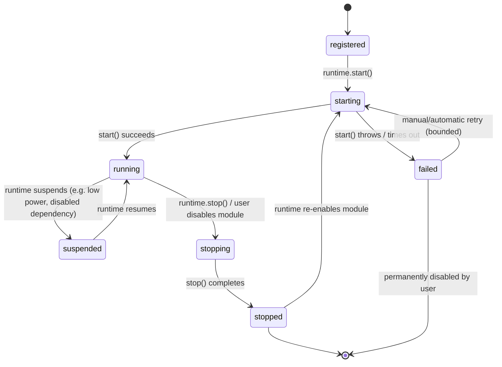

# Module System
## NotchHub — Component Architecture

**Status:** Draft v0.1  
**Owner:** Architecture  
**Last updated:** 2026-09-13  
**Related documents:** [Architecture Overview](overview.md), [C4 Container](c4-container.md), [Notch Surface](notch-surface.md), [Event Protocol](event-protocol.md), [Action Platform](action-platform.md), [Permissions](../platform/permissions.md), [Performance](performance.md), [Requirements §5.6](../product/requirements.md#56-module-runtime), [Roadmap Phase F7](../product/roadmap.md#f7--module-runtime-and-demomodule)

---

## 1. Purpose

This document defines the **module system**: the contract, lifecycle, runtime, and boundaries that let NotchHub add capabilities such as a future Xiaozhi Display Companion, Media, Clipboard, Files, Calendar, or System Controls module without modifying the core platform.

A module is the *only* sanctioned way to add a feature to NotchHub. Feature code must not bypass this system by directly touching `NSPanel`, requesting permissions, writing raw settings keys, or registering ad hoc global state.

This document is written before any real business module exists. It must be implemented and validated using `DemoModule` (phase F7) before Module M0 (Sample Status Module) or M1 (Xiaozhi Display Companion) begins.

---

## 2. Design goals

1. **Isolation** — a module can fail, hang on start, or misbehave without crashing the core app or other modules.
2. **Declarative capability** — a module declares what it needs (permissions, settings, UI slots, actions, events, resources); the platform decides how and when those needs are fulfilled.
3. **No direct platform access** — a module never touches `NSPanel`, issues permission prompts, or opens its own IPC listener.
4. **Compile-time first** — the initial architecture uses statically linked Swift modules, not dynamically loaded plugins, to avoid unnecessary code-execution risk and ABI complexity while the contract is still evolving.
5. **Resource accountability** — every module declares and is held to a resource/performance policy; disabled modules release 100% of their owned resources.
6. **Testability** — module lifecycle, settings, actions, and events must be unit- and integration-testable without a running UI.

---

## 3. Module contract

### 3.0 Package ownership

`NotchDomain` owns pure declarations: `ModuleID`, `ModuleMetadata`, lifecycle
states, and health DTOs. `NotchCore` owns `NotchModule`, `ModuleContext`,
`ModuleLifetime`, `ModuleRuntime`, and `ModuleEventPublisher`, because their
capability handles are Core contracts. `NotchDemoModule` is a static target that
depends on Core and Domain; only the composition root registers it. This avoids
a Domain-to-Core dependency cycle and keeps concrete feature logic out of Core.

### 3.1 Core protocol

```swift
public protocol NotchModule: Sendable {
    var id: ModuleID { get }
    var metadata: ModuleMetadata { get }

    func start(context: ModuleContext) async throws
    func stop() async
    func handle(_ command: ModuleCommand) async throws -> ModuleCommandResult
}
```

- `id` — a stable, unique `ModuleID` (for example `"demo"`, `"xiaozhi.display"`, `"media"`).
- `metadata` — static declaration of capabilities (see §3.2).
- `start(context:)` — asynchronous initialization; may throw if the module cannot start (missing dependency, invalid configuration).
- `stop()` — must release *all* owned resources (tasks, timers, observers, sockets, subscriptions, caches) before returning.
- `handle(_:)` — a typed command entry point used by the runtime to deliver lifecycle or diagnostic commands (for example "simulate failure" in debug builds); it is not the primary path for user actions, which go through `NotchActions` instead.

### 3.2 Module metadata

```swift
public struct ModuleMetadata: Codable, Sendable {
    public let displayName: String
    public let version: String
    public let supportedSurfaceSlots: Set<SurfaceSlot>
    public let requiredCapabilities: Set<Capability>
    public let optionalCapabilities: Set<Capability>
    public let runtimePolicy: ModuleRuntimePolicy
}
```

| Field | Purpose |
|---|---|
| `displayName` | Human-readable name shown in Settings → Modules |
| `version` | Module-owned version shown in health and future compatibility checks |
| `supportedSurfaceSlots` | Which `SurfaceSlot`s this module may contribute to (see §5) |
| `requiredCapabilities` | Capabilities without which the module cannot function; the module should degrade gracefully or refuse to start if denied |
| `optionalCapabilities` | Capabilities that enhance the module but are not mandatory |
| `runtimePolicy` | Declared resource/performance policy (see [`performance.md`](performance.md)) |

F7 deliberately omits icon, Settings route, priority, and arbitration metadata.
They are added only by a future module that demonstrates a concrete need.

### 3.3 Module context

The runtime passes a narrow, capability-scoped context to each module at `start(context:)`. Modules must not receive raw access to `NSApplication`, `NSPanel`, the file system root, or an unrestricted process executor.

```swift
public struct ModuleContext: Sendable {
    public let eventBus: EventBusHandle
    public let actionRegistrar: ActionRegistrar
    public let settings: ModuleSettingsStore
    public let permissions: PermissionCoordinatorHandle
    public let diagnostics: DiagnosticsReporter
    public let surfaceContribution: SurfaceContributionRegistrar
}
```

| Capability handle | What it allows | What it forbids |
|---|---|---|
| `EventBusHandle` | Publish typed events; subscribe to event streams matching declared types | Publishing arbitrary/unversioned payloads, subscribing to another module's private events |
| `ActionRegistrar` | Register `ActionDefinition`s under a module-namespaced `ActionID` | Executing another module's actions directly, bypassing `ActionAuthorizer` |
| `ModuleSettingsStore` | Read/write settings under the module's own namespace | Reading/writing another module's namespace or global app settings |
| `PermissionCoordinatorHandle` | Query current permission status; request a permission for a declared capability | Silently requesting a permission not declared in `metadata.requiredPermissions`/`optionalPermissions` |
| `DiagnosticsReporter` | Emit structured, categorized log entries and health snapshots | Writing unredacted secrets or unbounded log volume |
| `SurfaceContributionRegistrar` | Register a `SurfaceContribution` descriptor for a declared `SurfaceSlot` | Direct `NSPanel` manipulation or forcing surface expansion |

F7 checks capability declarations only; `DemoModule` declares neither required nor
optional capability.

---

## 4. Module lifecycle

### 4.1 State machine



### 4.2 Lifecycle rules

- **Registration** happens once, at the composition root, before the app finishes launching. Only statically known modules are registered; there is no runtime discovery of arbitrary code in the foundation architecture.
- **Starting** must be idempotent from the runtime's perspective: calling `start` on an already-`running` module is a runtime error, not a module concern.
- **A `start` timeout** of five seconds is enforced by the runtime; a module that hangs is marked `failed` and cannot block application launch indefinitely.
- **Lifecycle serialization** belongs exclusively to the `ModuleRuntime` actor. A disable received while `starting` cancels startup, calls `stop()` exactly once, and finishes in `stopped`. Restart is valid from `running`, `suspended`, or `failed`, and always follows `stop → starting`.
- **Stopping** must release every task, timer, observer, subscription, socket, and cache the module created. The runtime should treat a module that leaves detectable dangling resources as a defect, verified in tests (see §9).
- **Suspension** is a runtime-driven state (not module-initiated) used for scenarios such as low-power mode, a denied required permission, or a disabled dependency. A suspended module keeps its configuration but performs no background work.
- **Failure isolation**: if `start()` throws or `handle()` throws unexpectedly, the runtime must catch the error, transition only that module to `failed`, log/report it, and leave all other modules and the core app unaffected.
- **Retry policy**: F7 does not retry automatically. A failure remains `failed` until a user explicitly restarts the module or the runtime. A future automatic retry policy needs an owning module requirement and bounded backoff.
- **Disable is user-controlled**: a module in `stopped` state due to explicit user action in Settings → Modules must not restart itself; only an explicit user action or app relaunch may re-enable it.

### 4.3 Module runtime responsibilities

```swift
public protocol ModuleRuntime: Sendable {
    func register(_ module: any NotchModule) 
    func start(_ id: ModuleID) async
    func stop(_ id: ModuleID) async
    func setEnabled(_ enabled: Bool, for id: ModuleID) async
    func health(for id: ModuleID) async -> ModuleHealth
    func healthSnapshot() async -> [ModuleHealth]
}
```

`ModuleRuntime` is an actor. `stop()` is bounded to two seconds and complete runtime shutdown to five seconds. On timeout, it cancels known work, records a sanitized timeout failure, and lets the App shell continue termination; it does not claim that uncooperative code was cleaned up.

### 4.4 Runtime restart boundary

F7 exposes `restartRuntime()` only to the composition root and tests. It stops
enabled Modules in reverse registration order, creates fresh Module lifetimes,
and starts enabled Modules in registration order. It is not a menu item, an
ActionID, or a user-facing recovery path in F7. Settings exposes only
per-Module restart.

```swift
public struct ModuleHealth: Codable, Sendable {
    public let id: ModuleID
    public let state: ModuleLifecycleState
    public let isEnabled: Bool
    public let lastStartedAt: Date?
    public let lastError: String?
    public let restartCount: Int
}
```

`ModuleHealth` must be visible in Settings → Modules and in Diagnostics, per [Requirements FR-MOD-006](../product/requirements.md#56-module-runtime).

---

## 5. UI contribution model

### 5.1 Surface slots

Modules never render directly into `NotchSurface`'s window. Instead, they register a `SurfaceContribution` for one or more declared slots; `NotchSurface` and `PresentationPolicy` decide layout, ordering, and visibility.

```swift
public enum SurfaceSlot: String, Codable, Sendable {
    case indicator        // Tiny always-visible badge/dot when collapsed
    case compactStatus    // 1–3 line transient status
    case expandedPrimary  // Main content area when expanded
    case expandedSecondary // Secondary/auxiliary content when expanded
    case detail           // Separate application scene content; never rendered in the Notch panel
    case menuBar          // Contribution to the app's menu bar menu
}
```

### 5.2 Surface contribution descriptor

```swift
public struct SurfaceContribution: Sendable {
    public let moduleID: ModuleID
    public let slot: SurfaceSlot
    public let priority: Int
    public let content: AnySurfaceContentDescriptor
}
```

`AnySurfaceContentDescriptor` is a lightweight, serializable-where-possible description (for example, a small view-model snapshot) rather than a raw `some View`, so that:

- The platform can enforce content-size/complexity limits per slot (see [`notch-surface.md` §6](notch-surface.md#6-content-constraints-per-state)).
- Multiple modules contributing to the same slot can be arbitrated by `priority` and `PresentationPolicy` without each module needing to know about the others.
- Contributions can be tested without instantiating SwiftUI views.

### 5.3 Slot arbitration rules

| Rule | Description |
|---|---|
| One `indicator` at a time | If multiple modules want the indicator slot, the highest-priority active one wins; others are suppressed, not hidden-and-retried aggressively |
| `compactStatus` queueing | Compact status messages from different modules are queued and shown briefly in sequence rather than overlapping |
| `expandedPrimary` exclusivity | Only one module's `expandedPrimary` content is shown per user-triggered expansion; module selection follows the action/event that triggered expansion |
| `detail` is on-demand and separate | A module's `detail` contribution is routed to a separate application scene only when the user explicitly navigates to it (for example, "Open full transcript"); it never becomes a Notch `SurfaceState` |
| `menuBar` items are additive | Multiple modules may each contribute a menu item; the platform sorts them under a "Modules" submenu or similar convention |

---

## 6. Settings integration

- Each module's settings live under `AppSettings.modules[ModuleID]` as an opaque, module-owned `Codable` envelope (see [Architecture Overview §10.1](overview.md#101-settings)).
- F7 introduces settings schema v3. `modules["demo"].isEnabled` defaults to `true` and is durable **Module enablement intent**, distinct from transient `ModuleHealth`.
- The module declares its settings schema and default values; `NotchCore` handles versioning/migration plumbing generically, but the module owns its own internal schema version if its settings evolve independently.
- A module's Settings UI page is registered via `metadata.settingsRoute` and rendered using `NotchUI` components — a module should not introduce a bespoke settings visual style.
- Resetting a module's settings must not silently delete secrets stored in Keychain on the module's behalf; if a module uses Keychain-backed credentials (for example, a future relay auth token), it must expose an explicit, separate "Remove credentials" control.

---

## 7. Permissions integration

- A module declares `requiredPermissions` and `optionalPermissions` in `ModuleMetadata`. It does not call system permission APIs directly.
- At `start()`, the module may query current status via `PermissionCoordinatorHandle` to decide how to degrade (for example, a hypothetical future Calendar module starts in a "permission needed" UI state rather than failing outright if Calendar access has not yet been granted).
- The module requests a permission only in direct response to an explicit user action (for example, tapping "Enable Calendar" inside that module's own settings page or a contextual prompt in its UI) — never automatically at `start()` or app launch, per [Requirements FR-PERM-005](../product/requirements.md#54-permissions).
- If a required permission is denied or becomes revoked while running, the runtime should transition the module to `suspended` (not `failed`) and the module's UI contribution should clearly communicate the degraded state.

---

## 8. Events and actions integration

### 8.1 Events

F7 proves only an internal `ModuleEventPublisher` seam and a recording test implementation. It records declared lifecycle and `demo.tick` events without introducing the F8 EventBus, external `EventEnvelope` routing, buffering, inter-module delivery, or IPC transport.

- A module may **publish** events onto the `EventBus` describing its own state changes (for example, a future Xiaozhi module publishing `assistant.state` transitions).
- A module may **subscribe** to event types relevant to it, declared ahead of time; the `EventBusHandle` should not offer a raw "subscribe to everything" capability by default.
- All externally sourced events (arriving via `NotchIPC`) are already validated and versioned by the time a module receives them — modules never parse raw external payloads themselves. See [`event-protocol.md`](event-protocol.md).
- Publishing an event does **not** directly cause a surface transition; that decision belongs to `PresentationPolicy`, per [Architecture Overview §3.3](overview.md#33-modules-declare-capability-platform-provides-policy).

### 8.2 Actions

- A module registers its actions (for example `demo.ping`, or a future `media.playPause`) through `ActionRegistrar`, using the same `ActionDefinition` contract as foundation actions. See [`action-platform.md`](action-platform.md).
- A module's actions are automatically available (subject to authorization/confirmation policy) from the menu bar, Notch UI, shortcuts, and local IPC — the module does not need to wire each entry point itself.
- A module must not expose a general-purpose "run arbitrary command" action; every action must have a specific, named, typed purpose.

---

## 9. Resource ownership and cleanup

### 9.1 Declared runtime policy

Every module declares a `ModuleRuntimePolicy` (defined fully in [`performance.md`](performance.md)):

```swift
public struct ModuleRuntimePolicy: Sendable {
    public let idleMode: IdleMode
    public let hiddenRefreshInterval: Duration?
    public let visibleRefreshInterval: Duration?
    public let maximumEventRate: Int
    public let memoryBudgetBytes: Int
}
```

### 9.2 Ownership rules

- Any `Task`, `Timer`, `NSObject` observer, socket, or subscription a module creates in `start()` must be stored so it can be cancelled/invalidated in `stop()`.
- The runtime should provide a lightweight `CancellationBag`-style helper so modules have an idiomatic way to register cleanup work without hand-rolling bookkeeping.
- The supplied helper is the Module lifetime scope. It owns registered tasks, observers, subscriptions, action registrations, and surface contributions, which the runtime revokes on stop or failure.
- A module must not schedule work that continues to fire after `stop()` returns. This is verified via the resource-cleanup tests in §11.
- Caches (for example, a future Media module's artwork cache) must have an explicit byte/count budget and must be released or trimmed when the module is stopped or disabled, not just when memory pressure occurs.

### 9.3 Failure containment boundary

```text
Module.start() throws
        ↓
ModuleRuntime catches error
        ↓
Module state → failed
        ↓
DiagnosticsReporter records error (sanitized)
        ↓
Core app, other modules, Settings, Diagnostics remain fully functional
```

No exception, fatal error, or unhandled `Task` failure inside a module's code may propagate to crash the host process. Where Swift's structured concurrency cannot fully guarantee this (for example, a genuine Swift runtime trap from force-unwrapping), module code must be reviewed to avoid such patterns; this is a coding-standard requirement enforced in code review, not just a runtime mechanism.

---

## 10. Static modules vs. dynamic plugins

| Aspect | Static modules (current architecture) | Dynamic plugins (explicitly deferred) |
|---|---|---|
| Loading | Compiled into the app binary, registered at composition root | Loaded at runtime from `.dylib`/`.bundle` or similar |
| Security | Reviewed and signed as part of the app | Requires a separate trust/signing/sandboxing model |
| Build/test | Simple, uses standard Swift Package Manager and Xcode tooling | Requires ABI stability strategy and additional tooling |
| Update cadence | Ships with app releases | Could update independently, but with added risk |
| Current status | **Adopted** for the foundation and all planned modules (M0–M6) | **Not implemented.** May be reconsidered only after the module contract has proven stable across multiple real modules, and only via a dedicated ADR and security review |

This decision is recorded as ADR-0003 (see [Architecture Overview §14](overview.md#14-architecture-decision-records)) and must not be silently reversed by adding a plugin-loading mechanism without that review.

---

## 11. Testing requirements

### 11.1 Unit tests (per module and for the runtime itself)

| Area | Required coverage |
|---|---|
| Lifecycle | `start` success, `start` failure/throw, `start` timeout, `stop` while running, `stop` while starting, double-start rejection |
| Enable/disable | Disabling a running module transitions to `stopped` and releases resources; disabling a stopped module is a no-op |
| Failure isolation | A module throwing inside `start()` or `handle()` does not affect other registered modules |
| Settings | Namespaced read/write, default values, no cross-module leakage |
| Permissions | Module correctly reflects `PermissionStatus` changes without requesting on its own initiative |
| Events | Module receives only subscribed event types; publishing includes correct `ModuleID` as source |
| Actions | Registered actions appear in `ActionRegistry`; disabling the module removes/marks them unavailable |
| Resource cleanup | No `Task`, `Timer`, observer, or socket remains active after `stop()` (verified via test doubles/spies) |

### 11.2 Integration tests

- Enable/disable a module 100 times in a loop; assert no growth in active task/timer/subscription counts (see [`performance.md`](performance.md) module-toggle-loop scenario).
- Simulate a module failing during `start()`; assert the app remains fully interactive (Settings, Diagnostics, other modules, Notch surface).
- Verify `ModuleHealth` accurately reflects state transitions end-to-end, including `lastError` and `restartCount`.

### 11.3 `DemoModule` as the reference implementation

`DemoModule` (delivered in Phase F7) exists specifically to exercise every rule in this document before any real module is built:

- Contributes to `indicator` and `compactStatus` slots.
- Registers a `demo.ping` action.
- Uses a namespaced settings toggle for enable/disable.
- Emits `demo.tick` only when manually triggered; it has no production periodic timer.
- Includes a debug-only "simulate failure" action to validate failure isolation.

It is compiled and registered only in Debug/test builds. Release builds neither
register it nor show it in Settings. `demo.ping` and the debug-only failure
action have no shortcut or IPC entry point.

No module beyond `DemoModule` should be started until all tests in §11.1–§11.2 pass against it.

### 11.4 F7 presentation boundary

`DemoModule` supplies typed descriptors for `indicator` and `compactStatus`, and NotchUI renders those two deterministic descriptors in the real Notch surface. F7 does not add multi-module arbitration, expanded module content, or a module-owned application scene; those remain contract seams until a later module needs them. A descriptor update never forces a surface transition.

---

## 12. Module authoring checklist

Before a new module is proposed for implementation, it must document:

- [ ] Purpose and user value.
- [ ] Explicit non-goals.
- [ ] `ModuleID` and version.
- [ ] Required and optional permissions, with request-timing rationale.
- [ ] Settings schema and defaults.
- [ ] `SurfaceSlot`s used and expected content size/frequency.
- [ ] Registered `ActionID`s, their input schemas, and confirmation policy.
- [ ] Events published and subscribed, including expected rate.
- [ ] `ModuleRuntimePolicy` (idle/hidden/visible refresh, max event rate, memory budget).
- [ ] Data retention/privacy behavior for any stored or displayed data.
- [ ] Failure/degraded-mode behavior (for example, offline, permission denied, backend unreachable).
- [ ] Accessibility considerations for its UI contributions.
- [ ] Unit, integration, and manual test plan.
- [ ] Diagnostics fields it will expose.

This checklist mirrors the module requirements template in [Requirements §9](../product/requirements.md#9-module-requirements-template) and must be satisfied before a module's code is merged.

---

## 13. Summary

The module system is the primary extension point for NotchHub. It trades a small amount of upfront ceremony (declared metadata, typed context, explicit lifecycle) for strong isolation guarantees: any single module — including the eventual Xiaozhi Display Companion — can fail, be disabled, or misbehave without ever taking down the core application, leaking resources, or bypassing the platform's permission, settings, action, or security boundaries.
