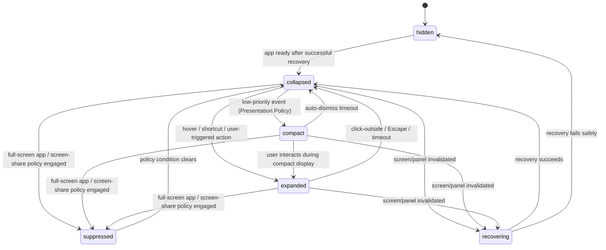

# Notch Surface
## NotchHub — Component Architecture

**Status:** Draft v0.1  
**Owner:** Architecture  
**Last updated:** 2026-09-13  
**Related documents:** [Architecture Overview](overview.md), [C4 Container](c4-container.md), [Module System](module-system.md), [Performance](performance.md), [Requirements §5.2](../product/requirements.md#52-notch-surface-and-windowing), [Roadmap Phase F2](../product/roadmap.md#f2--notch-surface-shell), [Boring Notch Reference](../references/boring-notch.md)

---

## 1. Purpose

This document defines the **Notch Surface**: the native `NSPanel`-based window rendered around the MacBook's notch, its interaction state machine, geometry rules, and lifecycle behavior across macOS environment changes.

`NotchSurface` is the single most architecturally sensitive container in NotchHub, because it directly manipulates AppKit window APIs and must behave correctly across sleep/wake, display changes, Spaces, and full-screen applications — areas where subtle bugs are easy to introduce and hard to detect without deliberate testing.

This document must be implemented and its acceptance criteria verified during **Phase F2** before any module (including `DemoModule`) contributes real UI content.

---

## 2. Design goals

1. **Single ownership** — exactly one component, `NotchPanelController`, creates, frames, shows, hides, and destroys the native panel.
2. **Predictable state machine** — every visual state and transition is explicit, tested, and does not depend on incidental timing.
3. **Non-intrusive by default** — the collapsed/hidden state must never block interaction with other applications or the menu bar.
4. **Resilience** — the surface must recover safely from screen configuration changes, sleep/wake, and full-screen/Space transitions without crashing or becoming permanently stuck.
5. **Content discipline** — the surface enforces size/complexity constraints per state so that modules cannot turn the Notch into a large, distracting window.
6. **No protocol coupling** — `NotchSurface` renders presentation snapshots; it has no knowledge of Xiaozhi, media APIs, clipboard internals, or any other module-specific protocol.

---

## 3. Ownership model

```text
NotchPanelController
 ├── Owns: NSPanel instance lifecycle (create/destroy)
 ├── Owns: panel frame, screen assignment, window level, collection behavior
 ├── Owns: show/hide/order-front/order-out calls
 └── Delegates to: SurfaceStateMachine (state), SurfaceCoordinator (policy → intent translation)

Application scenes are outside NotchSurface and own their own lifecycle.
```

**Rule:** No other type in the codebase — not `NotchCore`, not a module, not the App Shell — may call AppKit window APIs (`makeKeyAndOrderFront`, `orderOut`, `setFrame`, `.level =`, etc.) on the Notch panel. All such calls are private implementation details of `NotchPanelController`. Application scenes are owned outside `NotchSurface`.

Everything else — `NotchCore`'s `PresentationPolicy`, modules via `SurfaceContribution` (see [`module-system.md` §5](module-system.md#5-ui-contribution-model)), and user interaction — communicates with the surface only through:

- **Intents** flowing in: `SurfaceIntent` values for expansion, collapse, suppression, and recovery.
- **Snapshots** flowing out: read-only `SurfacePresentationSnapshot` values consumed by SwiftUI views.

---

## 4. Component structure

```text
NotchSurface/
├── Windowing/
│   ├── NotchPanelController.swift      # Sole NSPanel owner
│   ├── ScreenTopology.swift            # Enumerates/tracks available screens
│   ├── NotchGeometry.swift             # Computes frame for notch/no-notch layouts
│   ├── ScreenObserver.swift            # Observes NSApplication.didChangeScreenParametersNotification
│   └── SpaceFullscreenObserver.swift   # Observes Space/full-screen transitions
├── Interaction/
│   ├── SurfaceStateMachine.swift       # The state machine defined in §5
│   ├── SurfaceCoordinator.swift        # Translates intents/policy into state-machine events
│   ├── SurfacePointerMonitor.swift     # Native shape hit-testing and hover detection
│   ├── ClickOutsideMonitor.swift       # Detects clicks outside the expanded panel
│   ├── AutoCollapseController.swift    # Timeout-driven auto-collapse
│   └── GlobalHotkeyService.swift       # Maps registered shortcuts to surface intents
└── Views/
    ├── NotchRootView.swift             # SwiftUI root, switches on presentation state
    ├── CollapsedNotchView.swift
    ├── CompactStatusView.swift
    ├── ExpandedNotchView.swift
    └── application scene root.swift
```

---

## 5. Interaction state machine

### 5.1 States

| State | Meaning | Typical size |
|---|---|---|
| `hidden` | No panel visible at all | 0×0 |
| `collapsed` | Minimal/no visible content around the notch | Small, near-notch size |
| `compact` | Brief 1–3 line status, auto-dismissing | Small width, short height |
| `expanded` | User-triggered quick interaction | Fixed 640 × 190 pt visible surface in a 640 × 210 pt host |
| `suppressed` | Temporarily forced non-visible due to policy (e.g., full-screen app, screen sharing) | 0×0 or collapsed-equivalent |
| `recovering` | Transient state after an invalidated panel/screen change, converging back to a stable state | N/A (transitional only) |

Long-form content is not a surface state. It belongs in a dedicated application scene; the Notch panel remains governed independently by presentation policy.

### 5.2 Transition diagram



### 5.3 Transition rules

- **Only forward-declared transitions are valid.** An attempt to perform an undeclared transition must be rejected or normalized by the state machine, not silently allowed.
- **User interaction takes priority over auto-collapse.** If the user is actively hovering/interacting with an `expanded` panel, the `AutoCollapseController`'s timeout must not fire until interaction stops.
- **`suppressed` is policy-driven, not module-driven.** Only `SurfaceCoordinator`, informed by system-level signals (full-screen app detection, screen-sharing detection if available, or explicit user setting), may trigger `suppressed`. A module cannot request suppression or force visibility during suppression.
- **`recovering` must converge.** The state machine must not remain in `recovering` indefinitely; it has a bounded number of recovery attempts before falling back to `hidden` and reporting a diagnostics warning.
- **Expanded admission is capability, not recovery.** A valid topology that cannot contain the fixed expanded host rejects expansion without entering `recovering`; only invalid topology or native panel failure begins recovery.
- **Application scenes require explicit navigation.** No automatic event or module contribution may open an application scene from the Surface. Long-form content is routed by the owning application scene and does not mutate `SurfaceState`.

### 5.4 State machine interface

```swift
public enum SurfaceState: String, Codable, Sendable {
    case hidden, collapsed, compact, expanded, suppressed, recovering
}

public enum SurfaceEvent: Sendable {
    case appReady
    case lowPriorityEventReceived
    case autoCollapseTimeoutFired
    case userTriggeredExpand(reason: SurfaceExpandReason)
    case clickOutside
    case escapeKeyPressed
    case fullScreenPolicyEngaged
    case fullScreenPolicyCleared
    case screenOrPanelInvalidated
    case recoverySucceeded
    case recoveryFailedPermanently
}

public protocol SurfaceStateMachine: Sendable {
    var currentState: SurfaceState { get async }
    func send(_ event: SurfaceEvent) async
    var stateStream: AsyncStream<SurfaceState> { get }
}
```

This interface is deliberately free of AppKit types, so the state machine itself is fully unit-testable without creating a real `NSPanel` (see §11).

---

## 6. Content constraints per state

| State | Allowed content | Forbidden content |
|---|---|---|
| `hidden` | None | Any rendered content |
| `collapsed` | Optional tiny indicator (single glyph/dot) | Text, multi-element layouts |
| `compact` | 1–3 short lines of status text or a single-line progress indicator | Scrollable lists, forms, multi-section layouts |
| `expanded` | A small grid of quick actions, a short summary (roughly 2–4 lines or ~250–350 characters), simple controls | Long-form text, full transcripts, dense multi-column tables, embedded scroll views with large content |
| `suppressed` / `recovering` | None (transitional/hidden) | Any rendered content |

These constraints are enforced at the `SurfaceContribution` validation layer (see [`module-system.md` §5.2](module-system.md#52-surface-contribution-descriptor)): a module's contribution for `compactStatus` that exceeds the line/character budget should be truncated or rejected with a diagnostics warning, not silently allowed to grow the panel.

Full transcripts, logs, history, and settings-adjacent content belong to a separate application scene. Detail content has its own bounded-data, privacy, accessibility, and lifecycle policies and is never resized into the Notch panel.

---

## 7. Geometry and display policy

### 7.1 Built-in display first

- The foundation architecture targets the **built-in MacBook display only** (per ADR-0010).
- `ScreenTopology` identifies the built-in display using its known characteristics (main display with a notch-capable model, or a configured preference) rather than assuming it is always `NSScreen.main`.
- If the built-in display is unavailable (for example, the lid is closed and an external display is in use, a scenario sometimes called "clamshell mode"), the surface should transition toward `hidden` or `suppressed` rather than attempting to render on an arbitrary external screen, until multi-display support is explicitly designed (Phase M6+ candidate, per the "Could have later" backlog).

### 7.2 Notch geometry

```swift
public struct NotchGeometry: Sendable {
    public let hasPhysicalNotch: Bool
    public let notchFrame: CGRect?       // In screen coordinates, if hasPhysicalNotch
    public let safeAreaInsets: EdgeInsets
    public let fallbackTopCenterFrame: CGRect
}
```

- On a MacBook with a physical notch, the panel is anchored to align with `notchFrame`, with `collapsed`/`compact`/`expanded` sizes computed relative to it.
- On a MacBook without a physical notch (or in the no-notch fallback case), `fallbackTopCenterFrame` provides a safe, centered position near the top of the screen, sized similarly to the notch-anchored layout for visual consistency.
- Geometry recalculation must occur on every relevant `NSApplication.didChangeScreenParametersNotification` and must never leave the panel positioned off-screen or overlapping the menu bar's own content.
- Expanded admission validates that the built-in display or top-center fallback can contain a `640 × 210 pt` host. The `640 × 190 pt` visible surface is not scaled or cropped to fit; unavailable capacity remains a collapsed/compact capability result.

### 7.3 Window level and collection behavior

- The panel uses a window level appropriate for a persistent utility overlay (for example, at or above the status-bar level) so it remains visible over most application windows without behaving like a system-critical alert.
- Collection behavior should allow the panel to:
  - Join all Spaces (so it remains reachable regardless of the active Space), unless the `suppressed` policy for full-screen apps determines otherwise.
  - Avoid appearing in the Dock/Cmd+Tab application switcher, consistent with the menu-bar-utility nature of the app (see [Architecture Overview §7.1](overview.md#71-app-shell)).
- Exact window-level and collection-behavior constants are an implementation detail to be finalized in Phase F2, but must be documented in code comments and covered by the debug overlay (§10).

---

## 8. Interaction handling

### 8.1 Hover

- `SurfacePointerMonitor` observes local and global mouse movement against the visible shape in screen coordinates; it does not rely solely on SwiftUI hover callbacks.
- F2 uses a 300 ms hover delay and an 8 pt trigger margin around the visible collapsed surface. Both values are dependency-injected test defaults, not persisted settings.
- A hover-origin expansion gets a 100 ms close grace only after the pointer exits and no Surface interaction hold is active. Keyboard focus, popovers, drag/control tracking, confirmation, and assistive interaction all hold the surface open; ending the final hold restarts the grace if the pointer remains outside.
- F3/F4 may expose validated hover settings; until then, the menu-bar toggle remains available.

### 8.2 Click

- A click on the `collapsed` panel is ignored; collapsed pointer expansion requires the bounded hover dwell.
- A click on the `compact` panel triggers `.userTriggeredExpand(reason: .click)`.
- F2 Surface content sends only local Surface intents. Application scenes are opened by their owning app-shell route; registered actions arrive in F6.

### 8.3 Click-outside and Escape

- `ClickOutsideMonitor` uses a local or global event monitor (scoped as narrowly as possible) to detect clicks outside the current visible `NotchSurfaceShape` while in `expanded`, sending `.clickOutside`; a click inside that shape is never classified as outside.
- The Escape key, while the panel has focus or is the active interaction target, sends `.escapeKeyPressed`, collapsing from `expanded` toward `collapsed`. A application scene handles its own close/back behavior independently.

### 8.4 Auto-collapse timeout

- `AutoCollapseController` starts a 3-second, dependency-injected timer when entering `expanded` or `compact`; F3/F4 may later make this a validated setting.
- Any user interaction with the panel resets the timer; the timer fires `.autoCollapseTimeoutFired` only after a period of true inactivity.

### 8.5 Menu control and future shortcut

- F6 may map a user-configured shortcut through `NotchActions` to the same intent. The input source does not decide how to expand; `SurfaceCoordinator` decides the placeholder content in F2 and `PresentationPolicy` decides later module content.

### 8.6 Click-through when collapsed

- `NotchPanelController` owns native click-through. It sets `NSPanel.ignoresMouseEvents` whenever the pointer lies outside the visible `NotchSurfaceShape`, including transparent corners and shadow envelope, except during an active native mouse-capture lease. It recalculates synchronously after geometry, state, or capture changes.
- While `collapsed` (and especially `hidden`), the panel's hit-testable region must be as small as the visible indicator itself (or zero, if nothing is rendered).
- The panel must never install a full-screen-sized transparent click-catching layer merely to detect hover; hover/hit-testing must be scoped to the actual visible/trigger bounds, per [Requirements FR-SUR-007](../product/requirements.md#52-notch-surface-and-windowing).

---

## 9. Lifecycle resilience

### 9.1 Screen and display changes

| Event | Required behavior |
|---|---|
| External display attached/detached | Recompute geometry; if the built-in display remains available and is the active target, no visible disruption should occur |
| Display resolution/scale change | Recompute geometry using updated `NSScreen` metrics; panel must not remain sized/positioned for the old configuration |
| Built-in display becomes unavailable (e.g., clamshell mode) | Transition toward `hidden`/`suppressed`; do not attempt to render on an unconfigured external display in the foundation phase |

### 9.2 Spaces and full-screen

| Event | Required behavior |
|---|---|
| User switches to a different Space | Panel remains reachable (per collection-behavior policy in §7.3) or is consistently suppressed, according to a single documented policy — not inconsistent behavior across Spaces |
| Another app enters full-screen | F2 sends `.fullScreenPolicyEngaged` and suppresses by default. F3/F4 may add a validated user preference. |
| Full-screen app exits | Sends `.fullScreenPolicyCleared`, returning to `collapsed` |

### 9.3 Sleep/wake and lock/unlock

- On sleep, the panel should not attempt further animation or interaction handling; on wake, `ScreenObserver` should re-validate geometry before resuming normal state transitions.
- Lock/unlock should not, by itself, force a state transition beyond what the current `suppressed`/`collapsed` policy already dictates, but must be verified not to cause a crash or a stuck `recovering` state.

### 9.4 Panel invalidation and recovery

```mermaid
sequenceDiagram
    participant OS as macOS (screen/session change)
    participant Observer as ScreenObserver / SpaceFullscreenObserver
    participant Coordinator as SurfaceCoordinator
    participant SM as SurfaceStateMachine
    participant Controller as NotchPanelController

    OS->>Observer: Notification (screen change / space change / wake)
    Observer->>Coordinator: Report topology/context change
    Coordinator->>SM: send(.screenOrPanelInvalidated)
    SM->>Controller: Enter recovering; attempt panel re-creation/re-frame
    alt Recovery succeeds
        Controller-->>SM: send(.recoverySucceeded)
        SM-->>Coordinator: New stable state (collapsed/suppressed)
    else Recovery fails after bounded attempts
        Controller-->>SM: send(.recoveryFailedPermanently)
        SM-->>Coordinator: hidden
        Coordinator->>Coordinator: Log diagnostics warning
    end
```

- Recovery makes at most **two attempts** with a **250 ms backoff**. It then sends `.recoveryFailedPermanently`, hides the surface, and records a diagnostics warning.
- A permanently failed recovery must leave the app otherwise functional — the user can still reach Settings and use Restart App Shell even if the Notch panel cannot be restored. A ModuleRuntime-specific restart is only available after F7.

---

## 10. Diagnostics and debug overlay

`NotchSurface` must expose, via `DiagnosticsReporter`:

- Current `SurfaceState` and the `SurfaceEvent` history (bounded, sanitized).
- Currently targeted screen identifier and computed frame.
- Window level and collection-behavior flags in effect.
- Last suppression reason, if `suppressed`.
- Count and outcome of recovery attempts.


---

## 11. Testing requirements

### 11.1 Unit tests (pure state machine, no AppKit)

Using the AppKit-free `SurfaceStateMachine` interface (§5.4):

- Every declared transition in §5.2 produces the expected resulting state.
- Undeclared/invalid transitions are rejected or safely ignored (not silently accepted as a different, unintended transition).
- `.autoCollapseTimeoutFired` while actively interacting does not collapse the panel (interaction must reset/suppress the timer at the coordinator level, verified via a test double).
- `.screenOrPanelInvalidated` always routes through `recovering` and resolves to either `collapsed` or `hidden`, never leaving the machine stuck.
- `.fullScreenPolicyEngaged` from any visible state results in `suppressed`; `.fullScreenPolicyCleared` returns to `collapsed`.

### 11.2 Geometry tests

- Built-in display with a physical notch computes a frame anchored correctly to `notchFrame`.
- No-notch fallback computes `fallbackTopCenterFrame` safely within screen bounds.
- Simulated resolution/scale changes produce updated, on-screen frames (no off-screen or menu-bar-overlapping results).

### 11.3 Detail-window tests

- A application scene opens only from an explicit typed user-navigation request.
- Opening or closing detail leaves the Notch `SurfaceStateMachine` in a valid non-detail state.
- Repeated requests reuse/focus the intended application scene instead of creating unbounded duplicate windows.
- Closing detail does not destroy module state or the Notch panel.
- Sensitive detail content defaults to closed after lock/sleep restoration unless an approved privacy policy says otherwise.

### 11.4 Manual QA (see also [Requirements §10.2](../product/requirements.md#102-manual-qa))

- Launch/relaunch with the panel visible.
- Sleep/wake while `expanded`.
- Switch Spaces while `collapsed` and while `expanded`.
- Enter/exit full-screen on another app and verify F2's default suppression behavior.
- Attach/detach an external display; close/open the MacBook lid.
- Change display resolution/scale while the panel is visible.
- Open the F2 placeholder application scene from `expanded`, verify it is a separate window, then close it without changing the Notch panel into a detail state.
- Trigger rapid open/close (1,000 cycles per the performance stress scenario in [`performance.md`](performance.md)) and confirm no window/allocation leak and no animation hitching.

---

## 12. Relationship to Boring Notch

Per [`references/boring-notch.md`](../references/boring-notch.md), `NotchSurface` is the layer where studying Boring Notch's implementation is most directly relevant — specifically its handling of:

- Panel positioning relative to physical notch geometry across different MacBook models.
- Full-screen and Space transition edge cases.
- Animation timing for expand/collapse.

However, NotchHub's `NotchSurface` must remain **protocol-agnostic and module-agnostic** by design (§1, §5), which is an explicit architectural difference from a feature-first notch utility: Boring Notch's window-management code is coupled to its specific built-in features, whereas `NotchSurface` here only understands `SurfaceState`, `SurfaceEvent`, and `SurfaceContribution` — never a specific module's business logic.

---

## 13. Summary

`NotchSurface` provides a single, well-tested owner for the most fragile part of NotchHub: native window behavior around the notch across the many ways macOS can change context underneath a running app. By exposing only a state machine, intents, and presentation snapshots — and by strictly forbidding modules or other containers from touching `NSPanel` directly — the platform can add Xiaozhi, Media, Clipboard, and other future modules without ever having to re-litigate window management correctness.
