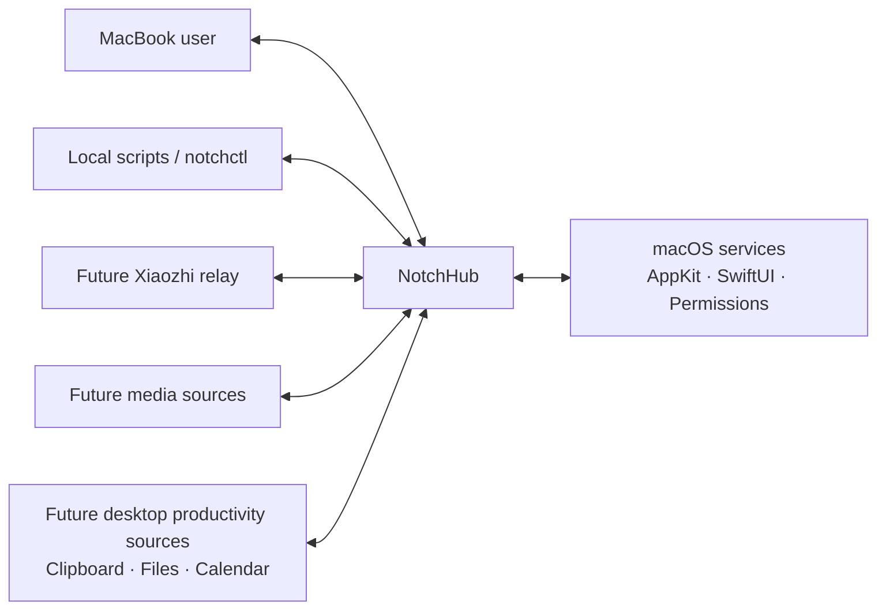
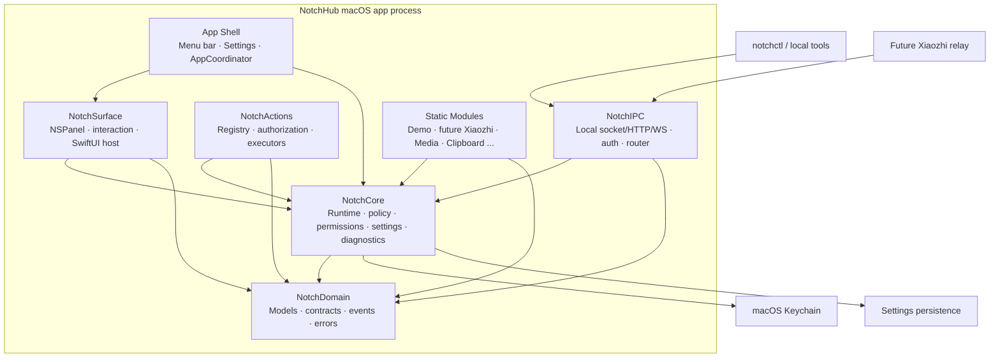
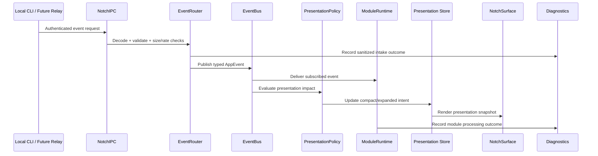
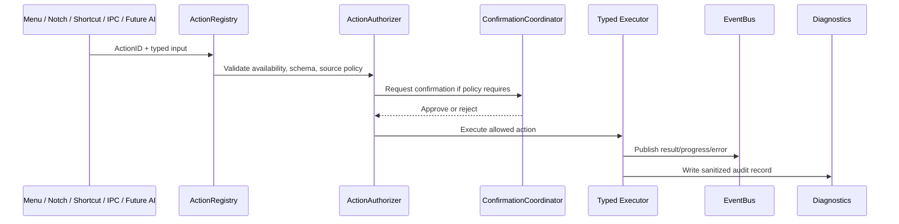

# Architecture Overview
## NotchHub — Modular macOS Notch Platform

**Status:** Draft v0.1  
**Owner:** Architecture  
**Last updated:** 2026-09-14
**Related documents:** [README](../../README.md), [Vision](../product/vision.md), [Roadmap](../product/roadmap.md), [Requirements](../product/requirements.md), [Notch Surface](notch-surface.md), [Module System](module-system.md), [Event Protocol](event-protocol.md), [Action Platform](action-platform.md), [IPC](ipc.md), [Performance](performance.md), [Threat Model](../security/threat-model.md), [Boring Notch Reference](../references/boring-notch.md)

---

## 1. Purpose

This document defines the high-level architecture of **NotchHub**, a modular, local-first macOS application that uses the MacBook notch area as a compact surface for short-lived status and quick actions.

The architecture is intentionally **foundation-first**. Before the project adds real modules—such as Xiaozhi Display Companion, Media, Clipboard, Files, Calendar, Reminders, or selected System Controls—it must establish a stable platform for:

- Menu-bar lifecycle and recovery.
- Native panel/window behavior around the notch.
- Settings and migration.
- Permission coordination.
- Action registration and shortcuts.
- Module lifecycle and fault isolation.
- Versioned event flow and local IPC.
- Diagnostics, performance budgets, and tests.

This document is the architectural map. It explains the boundaries, dependency rules, data flow, ownership model, and decisions that must remain stable while features evolve.

---

## 2. Architecture goals

### 2.1 Primary goals

1. **Reliable Notch interaction**
   - Provide predictable collapsed, compact, expanded, suppressed, and recovery behavior, with long-form detail presented in a separate window.
   - Survive common macOS lifecycle events: sleep/wake, Space changes, full-screen applications, display changes, lock/unlock, and relaunch.

2. **Modular growth without core rewrites**
   - Add modules through explicit contracts rather than allowing every feature to modify windowing, permissions, shortcuts, settings, and IPC independently.

3. **Local-first integration**
   - Support safe local event/action integrations before any remote service is considered.
   - Keep Xiaozhi and other external protocol details outside the presentation core.

4. **Safe actions**
   - Every action is registered, typed, validated, authorized, and optionally confirmed.
   - External integrations cannot invoke arbitrary shell commands or configure arbitrary executors.

5. **All-day efficiency**
   - Keep idle CPU, memory, wakeups, and visual work small.
   - Bound data streams, caches, logs, and output buffers.
   - Make module resource use visible and controllable.

6. **Diagnosability**
   - Provide structured logs and a diagnostics surface that explains app, panel, module, permission, IPC, event, action, and performance behavior.

### 2.2 Non-goals

The architecture is not designed to support the following product domains:

- Arbitrary scripting received through external input.
- Dynamic executable third-party plugin loading in the early architecture.
- Private macOS APIs as a required core dependency.

---

## 3. Architectural principles

### 3.1 One owner per critical resource

Every resource with lifecycle complexity has one explicit owner:

| Resource | Owner | Rule |
|---|---|---|
| App-shell lifecycle | `AppCoordinator` | Starts F1-owned dependencies idempotently and stops them in reverse order; it does not own a Notch panel or module runtime in F1 |
| Native `NSPanel` | `NotchPanelController` | Only this component creates, frames, orders, shows, hides, or destroys the panel |
| Surface transition state | `SurfaceStateMachine` / `SurfaceCoordinator` | Modules request intent or publish events; they do not mutate native panel state |
| Module lifecycle | `ModuleRuntime` | Modules do not self-register or self-restart outside runtime policy |
| System permission requests | `PermissionCoordinator` | Modules declare capability needs but never prompt directly |
| Settings persistence | `SettingsStore` | UI does not manipulate raw preference keys |
| Action execution | `ActionRegistry` + `ActionExecutor` | Entry points do not duplicate business logic |
| External event intake | `EventRouter` | Untrusted data is validated before it enters internal event flow |
| Local IPC listener | `IPCServer` | Binding, auth, limits, and lifecycle are centrally controlled |
| Diagnostics retention | `DiagnosticsStore` | Logs/events/action history are sanitized and bounded |

This rule prevents duplicated observers, inconsistent window calls, multiple permission prompts, hidden resource leaks, and competing feature behavior.

### 3.2 Core is stable; edges are replaceable

`NotchDomain` and `NotchCore` should change slowly. Modules, protocol adapters, views, integrations, and executors at the edges can change more often.

```text
Stable core: models, contracts, lifecycle, policy, security boundaries
       ↓
Replaceable edges: modules, views, adapters, IPC clients, settings pages
```

### 3.3 Modules declare capability; platform provides policy

A module declares what it needs:

- UI contribution slots.
- Permissions.
- Settings namespace.
- Actions.
- Event input/output.
- Resource/performance policy.
- Privacy/data retention behavior.

The platform decides how and when that need is fulfilled:

- Whether the surface expands.
- Whether permission should be requested.
- Whether an action needs confirmation.
- Whether a module can run given settings/permissions/thermal state.
- Whether an event is accepted, coalesced, or dropped.

### 3.4 UI is a projection, not a source of truth

SwiftUI views render small presentation snapshots. They do not parse protocols, perform heavy work, decide security, own timers, or contain module business logic.

### 3.5 External input is untrusted

IPC, future relays, scripts, WebSocket clients, imported configuration, and AI/voice requests must be decoded, authenticated where applicable, size-limited, schema-validated, and routed through typed contracts before they can affect the app.

### 3.6 Attention is a limited resource

Events do not automatically deserve a visible interruption. `PresentationPolicy` controls which events remain silent, show compact status, expand the surface, or only appear in diagnostics.

---

## 4. System context



### Context boundaries

- The user interacts with NotchHub through the Notch surface, menu bar, Settings, shortcuts, and detail windows.
- macOS provides windows, events, permissions, notifications, media/session APIs, and system services.
- Local scripts interact through controlled local IPC and `notchctl`.
- Future integrations, including a Xiaozhi relay, provide normalized event/action input through defined adapters.

---

## 5. Container architecture



### Containers

| Container | Responsibility | Must not do |
|---|---|---|
| `NotchHubApp` | Composition root, `AppCoordinator`, menu bar, placeholder Settings/Diagnostics scenes in F1, and process lifecycle | Contain module business logic, persistence policy, or raw protocol parsing |
| `NotchDomain` | Pure Swift types, identifiers, event/action/module contracts, errors | Import SwiftUI/AppKit or perform I/O |
| `NotchCore` | Module runtime, settings, permissions, event bus, presentation policy, lifecycle coordination, diagnostics | Directly manipulate `NSPanel` or render feature UI |
| `NotchSurface` | Native Notch `NSPanel`, separate detail-window coordination, screen geometry, state transitions, hit-testing, hotkey interaction, SwiftUI hosts | Parse external data or execute module business work |
| `NotchUI` | Reusable design system and presentation components | Own external side effects, timers, raw state, or permissions |
| `NotchActions` | Action definitions, validation, authorization, confirmation, executor routing, cancellation/timeouts | Receive unvalidated raw IPC commands directly |
| `NotchIPC` | Local listener, request auth, decoding, validation, rate limiting, event/action routes | Decide panel layout or bypass Action Registry |
| `Modules` | Domain-specific capabilities and UI contributions through contracts | Directly control panel/permission prompts or bypass platform policy |
| `Tools/notchctl` | Local developer/client utility for health, status, test events, and registered actions | Access app internals directly |

### F1 container boundary

F1 implements only `NotchHubApp` ownership: menu-bar reachability, coordinator lifecycle,
placeholder windows, and a launch-at-login adapter. It must not create a `NotchSurface`, a module
runtime, persistent Settings store, Diagnostics store, or IPC listener. Menu intents for those
future containers remain observable unavailable-state outcomes until their owning phase.

---

## 6. Package dependency model

### 6.1 Direction of dependency

```text
Apps / Tools / Static Modules
            ↓
NotchSurface + NotchUI + NotchActions + NotchIPC
            ↓
        NotchCore
            ↓
       NotchDomain
```

The dependency graph must remain acyclic.

### 6.2 Package responsibilities

| Package | Imports allowed | Responsibility |
|---|---|---|
| `NotchDomain` | Foundation only where possible | IDs, models, contracts, errors, serialized envelopes |
| `NotchCore` | `NotchDomain`, Foundation, Observation/Security as needed | Runtime, stores, policy, persistence interfaces, permission interfaces, diagnostics interfaces |
| `NotchSurface` | `NotchDomain`, `NotchCore`, AppKit, SwiftUI | Panel ownership, geometry, interaction, root surface views |
| `NotchUI` | SwiftUI, `NotchDomain` | Design system, shared components, accessibility helpers |
| `NotchActions` | `NotchDomain`, `NotchCore`, Foundation | Registry, execution policy, confirmation, executor adapters |
| `NotchIPC` | `NotchDomain`, `NotchCore`, Foundation/Network | Local server, auth, event/action routing |
| `Modules/*` | Domain + required platform contracts | Feature-specific state, adapter, settings, actions, UI slot contribution |
| `Apps/NotchHubApp` | All composition dependencies | Wiring, app scenes, registration, launch configuration |

### 6.3 Prohibited dependencies

- `NotchDomain` → SwiftUI/AppKit/Network implementation.
- `NotchCore` → feature-specific module implementation.
- `NotchSurface` → future Xiaozhi protocol, media APIs, calendar API, clipboard internals, or raw IPC request types.
- Module → `NotchPanelController` or direct `NSPanel` APIs.
- Module → another module concrete implementation.
- `NotchIPC` → `NSPanel` or direct UI mutation.
- UI view → raw `UserDefaults`, Keychain, `Process`, WebSocket, or permission request call.

---

## 7. Component architecture

### 7.1 App shell

```text
NotchHubApp
 ├── AppDelegate
 ├── AppCoordinator
 ├── CompositionRoot
 ├── MenuBarController
 ├── SettingsScene
 └── DiagnosticsScene
```

`AppCoordinator` owns startup and shutdown ordering:

```text
load settings
  → initialize diagnostics
  → initialize permission status
  → initialize action registry
  → initialize EventBus and policy
  → create NotchPanelController
  → initialize/start ModuleRuntime
  → start local IPC
  → publish app.ready
```

Shutdown reverses that order:

```text
stop IPC
  → stop modules
  → cancel runtime tasks
  → persist pending safe settings
  → hide/destroy panel
  → flush bounded diagnostics
  → terminate
```

### 7.2 Notch surface

```text
NotchSurface
 ├── NotchPanelController
 ├── DetailWindowCoordinator
 ├── SurfaceCoordinator
 ├── SurfaceStateMachine
 ├── ScreenTopology
 ├── NotchGeometry
 ├── PointerMonitor
 ├── ClickOutsideMonitor
 ├── GlobalHotkeyService
 ├── AutoCollapseController
 └── SwiftUI root views
```

`NotchPanelController` is the only owner of the native Notch panel. `DetailWindowCoordinator` separately owns explicitly requested long-form windows. Each receives typed presentation/navigation input and neither infers feature priority nor parses external event payloads.

### 7.3 Core runtime

```text
NotchCore
 ├── AppStore / presentation stores
 ├── ModuleRuntime
 ├── EventBus
 ├── EventRouter interface
 ├── PresentationPolicy
 ├── SettingsStore
 ├── PermissionCoordinator
 ├── LifecycleCoordinator
 ├── DiagnosticsStore
 ├── ResourcePolicyEvaluator
 └── SecureStorage interface
```

The core turns typed events and user intents into presentation/action/module decisions. It is intentionally free of concrete feature protocol logic.

### 7.4 Action platform

```text
NotchActions
 ├── ActionRegistry
 ├── ActionAuthorizer
 ├── ConfirmationCoordinator
 ├── ActionExecutor protocol
 ├── InternalActionExecutor
 ├── URLActionExecutor
 ├── AppLaunchActionExecutor
 ├── ActionTaskManager
 └── ActionAuditReporter
```

Foundation does not include a general shell command executor. If a future desktop module needs a legitimate process integration, it requires a dedicated requirements/security/ADR review and must not accept executable text from external input.

### 7.5 IPC platform

```text
NotchIPC
 ├── LocalSocketServer
 ├── LoopbackHTTPServer
 ├── LocalWebSocketServer
 ├── RequestAuthenticator
 ├── RequestRateLimiter
 ├── PayloadValidator
 ├── EventRouter
 ├── ActionRoute
 └── HealthRoute
```

IPC exists to support local status/events, `notchctl`, and future desktop/assistant adapters. It is loopback or local-socket only by default.

---

## 8. State and event flow

### 8.1 State domains

Separate state domains avoid broad UI invalidation and competing feature behavior.

```text
AppStore
├── SurfaceStore
├── SettingsStore
├── RuntimeStore
├── PermissionStore
├── ActionStore
├── DiagnosticsStore
└── ModulePresentationStores
    ├── DemoPresentationStore
    ├── XiaozhiPresentationStore        # future
    ├── MediaPresentationStore          # future
    ├── ClipboardPresentationStore      # future
    └── CalendarPresentationStore       # future
```

- `SurfaceStore` holds surface state and presentation snapshot.
- `SettingsStore` holds typed current settings and validation state.
- `RuntimeStore` holds module health/lifecycle.
- `PermissionStore` holds capability status; it does not itself issue prompts.
- `ActionStore` holds action availability and recent result states.
- `DiagnosticsStore` holds bounded/sanitized operational records.
- Individual modules expose focused presentation state, preventing an update in one module from invalidating unrelated SwiftUI views.

### 8.2 External event flow



No external event can directly call `NSPanel`, SwiftUI view methods, `Process`, or a module concrete implementation.

### 8.3 Action flow



### 8.4 Surface presentation flow

```text
User interaction / event / action result
                 ↓
         PresentationPolicy
                 ↓
          SurfaceIntent
                 ↓
        SurfaceCoordinator
                 ↓
        SurfaceStateMachine
                 ↓
       NotchPanelController
                 ↓
       SwiftUI presentation view
```

Modules can provide a `SurfaceContribution` or publish a status event. They cannot bypass the policy by directly expanding the panel.

---

## 9. Module architecture

### 9.1 Initial module model

Modules are static, compile-time components. They are registered in the application composition root.

```swift
public protocol NotchModule: Sendable {
    var id: ModuleID { get }
    var metadata: ModuleMetadata { get }

    func start(context: ModuleContext) async throws
    func stop() async
    func handle(_ command: ModuleCommand) async throws -> ModuleCommandResult
}
```

### 9.2 Module declaration

Each module must declare:

```text
Identity
├── ModuleID
├── version
└── display metadata

Capabilities
├── supported UI slots
├── required/optional permissions
├── settings namespace
├── action definitions
└── event subscriptions/publications

Operational policy
├── idle/hidden/visible refresh rate
├── maximum event rate
├── memory/cache budget
├── task/timer/observer ownership
└── stop/cleanup behavior

Trust and quality
├── data sources and trust boundary
├── privacy/retention behavior
├── error/degraded mode
├── diagnostics fields
└── test plan
```

### 9.3 Module lifecycle

```text
registered
  → starting
  → running
  → suspended
  → stopping
  → stopped
  → failed
```

Rules:

- The runtime owns transition authorization.
- Start and stop must be idempotent or guarded by the runtime.
- Failure is contained; the core app stays usable.
- Disabling a module unregisters/marks actions unavailable and releases tasks, timers, observers, sockets, subscriptions, and caches.
- Module health is visible through Diagnostics.

### 9.4 UI contribution model

Initial UI slots:

```swift
public enum SurfaceSlot: String, Codable, Sendable {
    case indicator
    case compactStatus
    case expandedPrimary
    case expandedSecondary
    case detail // Separate DetailWindowCoordinator target; never rendered in the Notch panel
    case menuBar
}
```

The platform controls slot placement, priority, collision resolution, and visibility. A module provides a small view-model/contribution descriptor rather than a direct panel reference. The `detail` slot is routed to a separate detail window after explicit user navigation and does not enter `SurfaceStateMachine`.

---

## 10. Settings and permissions architecture

### 10.1 Settings

```text
AppSettings
├── schemaVersion
├── general
├── appearance
├── notchBehavior
├── shortcuts
├── diagnostics
└── modules[ModuleID]
```

Rules:

- Settings are typed, validated, versioned, and migrated.
- UI binds to a settings-facing store/service; it does not use scattered raw preference keys.
- Non-secret settings may be imported/exported in sanitized form.
- Secrets are never stored in normal settings.
- Corrupt settings must fail safely to defaults and generate a diagnostic warning.

### 10.2 Permissions

```text
Module metadata
      ↓ declares required capability
PermissionCoordinator
      ↓ checks status / provides explanation
User explicitly enables or invokes feature
      ↓
System permission request
      ↓
PermissionStore + module availability update
```

Permission rules:

- Only `PermissionCoordinator` issues a request.
- No prompt appears at launch solely for future functionality.
- Denial is a first-class state; UI offers explanation and System Settings recovery path.
- The platform refreshes permission status when app activation resumes.

---

## 11. Security architecture

### 11.1 Trust zones

```text
Trusted application core
  ├── typed domain contracts
  ├── Action Registry policy
  ├── Settings and Keychain boundary
  └── surface/window owner

Conditionally trusted local clients
  ├── notchctl
  ├── local scripts
  └── future Xiaozhi relay

Untrusted until validated
  ├── IPC payload
  ├── imported settings
  ├── external text/event data
  └── future AI/voice action request
```

### 11.2 Mandatory boundaries

| Boundary | Required control |
|---|---|
| IPC request → internal event | Loopback/local binding, authentication where applicable, schema validation, size limit, rate limit, sanitized audit |
| AI/voice request → action | Registered ActionID, typed input schema, source policy, user confirmation for side effects |
| Module → permissions | Capability declaration only; centralized request flow |
| Module → panel | Surface contribution/intent only; no direct native-window access |
| Settings → persistence | Typed validation, migrations, sanitized import/export |
| Secret → storage | Keychain; redaction in logs/diagnostics |

### 11.3 Action safety rule

```text
External request ≠ executable command
External request = ActionID + validated structured input
```

No endpoint accepts arbitrary executable command strings, shell code, file paths intended for execution, or executor configuration from outside the trusted app configuration path.

---

## 12. Performance architecture

### 12.1 Budgets

| Scenario | CPU target | Memory target | Interaction target |
|---|---:|---:|---|
| Idle / collapsed | < 0.3% average | 40–80 MB | No continuous animation or fast polling |
| Expanded / no stream | < 1–2% | 60–120 MB | Open under 150 ms |
| Local compact event | Brief spike < 5% | No unbounded growth | Event → UI under 100 ms |
| Future text stream | 1–5% average | < 150 MB | Delta → UI under 100–150 ms |

### 12.2 Concurrency boundaries

```text
I/O / parsing / storage / audio / network / file work
                       ↓
             actor or background task
                       ↓
       small immutable presentation snapshot
                       ↓
              @MainActor UI store
                       ↓
                  SwiftUI view
```

- `@MainActor` is reserved for user-visible presentation state.
- High-rate inputs are coalesced before UI store updates.
- EventBus buffers are bounded.
- Logs, event history, future transcripts, and caches use count/byte budgets.
- Disabled modules have no active background work.

### 12.3 Resource policy per module

Every module declares:

```swift
public struct ModuleRuntimePolicy: Sendable {
    public let idleMode: IdleMode
    public let hiddenRefreshInterval: Duration?
    public let visibleRefreshInterval: Duration?
    public let maximumEventRate: Int
    public let memoryBudgetBytes: Int
}
```

The runtime can suspend or reduce non-critical work based on visibility, settings, thermal state, low-power policy, or module disablement.

### 12.4 Observability

Diagnostics must expose at least:

- Event intake/accepted/rejected/coalesced/dropped counts.
- UI flush/update rate where tracked.
- Active tasks/timers/subscriptions by module where practical.
- Bounded-buffer utilization.
- Recent action duration/timeout/cancel results.
- Surface state and panel geometry.

---

## 13. Boring Notch study boundary

Boring Notch is relevant primarily at the **NotchSurface** layer:

| Problem | What to study | NotchHub decision |
|---|---|---|
| Floating panel | AppKit panel lifecycle, positioning, ordering | One `NotchPanelController` owner |
| Notch layout | Geometry around physical/not-physical notch | Built-in display first, safe fallback |
| Interaction | Hover, expand/collapse, animation | Explicit state machine + policy |
| Lifecycle | Full-screen/Spaces/display changes | Testable surface coordinator/recovery |
| Feature growth | Settings and feature organization | Static modular runtime and contracts |
| Advanced integrations | Helper/window techniques | Public API-first; review before adding privileged helper |

NotchHub must not inherit Boring Notch’s internal feature coupling simply because the visual problem is similar. The architecture favors platform boundaries over direct feature reuse.

---

## 14. Architecture decision records

The following ADRs are foundational:

| ADR | Decision |
|---|---|
| 0001 | Support macOS 14+ |
| 0002 | Use SwiftUI for UI and AppKit for native panel/window/input behavior |
| 0003 | Use static modules before dynamic plugins |
| 0004 | Use the menu bar as an independent recovery/control surface |
| 0005 | Use local IPC before any LAN API |
| 0006 | Use versioned event envelopes for external inputs |
| 0007 | Use typed action allow-lists and confirmation policies |
| 0008 | Centralize permissions in a Permission Coordinator |
| 0009 | Enforce performance budgets and bounded streams |
| 0010 | Support the built-in display first |
| 0011 | Use public macOS APIs first; isolate any future privileged helper |
| 0012 | Keep documentation as code in the repository |
| 0013 | Admit the fixed expanded surface and own native shaped hit-testing |

Any change to the package graph, panel ownership, module model, action safety model, IPC trust boundary, permission model, performance budget, or permanently excluded scope requires an ADR review.

---

## 15. Foundation completion architecture gate

Architecture is considered ready for the first real module only when:

1. `NotchPanelController` is the sole native panel owner.
2. Surface state transitions and geometry behavior are test-covered.
3. Menu bar, Settings, and Diagnostics remain usable if the panel is hidden or suppressed.
4. Settings are typed, versioned, migration-safe, and corrupt-data-safe.
5. Permission requests are centralized and contextual.
6. Menu bar, Notch UI, shortcuts, and IPC use the same Action Registry.
7. DemoModule proves module lifecycle, isolation, actions, settings, events, and cleanup without panel access.
8. External events are validated, versioned, bounded, local-only by default, and visible in diagnostics.
9. No arbitrary external shell/script execution path exists.
10. Resource budgets, coalescing, buffer limits, and disabled-module cleanup are verified.
11. Diagnostics can explain panel location/state, module failures, permission state, IPC rejections, and resource pressure.
12. Required lifecycle/manual QA and Instruments profiling scenarios pass.

At that point, a Xiaozhi adapter/module can be added as an edge integration without altering the core architecture.

---

## 16. Architecture decision backlog

### Decisions already established by the current contracts

1. Local IPC starts with a Unix domain socket in F8; loopback HTTP/WebSocket remains an optional later adapter.
2. Module UI contributions use declarative, testable descriptors/snapshots rather than raw module-owned window references.
3. Long-form `detail` content opens through a separate `DetailWindowCoordinator`; `detail` is not a Notch `SurfaceState`.

These decisions are captured by ADR-0005, ADR-0003, and ADR-0002 respectively.

### Decisions still open

1. Should NotchHub target sandboxed distribution, direct notarized distribution, or both?
2. What is the best global shortcut implementation given permission expectations and macOS compatibility?
3. What exact policy should suppress the surface during screen sharing/full-screen apps?
4. Which settings storage implementation best balances migration, reliability, and inspectability?
5. When should multi-display support be introduced, and what is the minimum reliable behavior?
6. What data retention policy should apply to future assistant transcripts, clipboard history, and file history?
7. Under what constraints would a privileged helper be acceptable?
8. What must be true before considering dynamic external plugins?

Each open item must receive an owner, target phase, and ADR or explicit deferral before the phase that depends on it exits.

---

## 17. Summary

NotchHub is structured as a stable macOS platform, not a collection of notch widgets. The architecture centralizes native window ownership, permissions, settings, actions, IPC, policy, resource management, and diagnostics. Modules remain at the edge and communicate through declared capabilities, typed events, and registered actions.

This design lets the project build a dependable foundation first, then add Xiaozhi and other desktop productivity modules without coupling the MacBook notch UI to one protocol, one service, one device ecosystem, or one category of feature.
