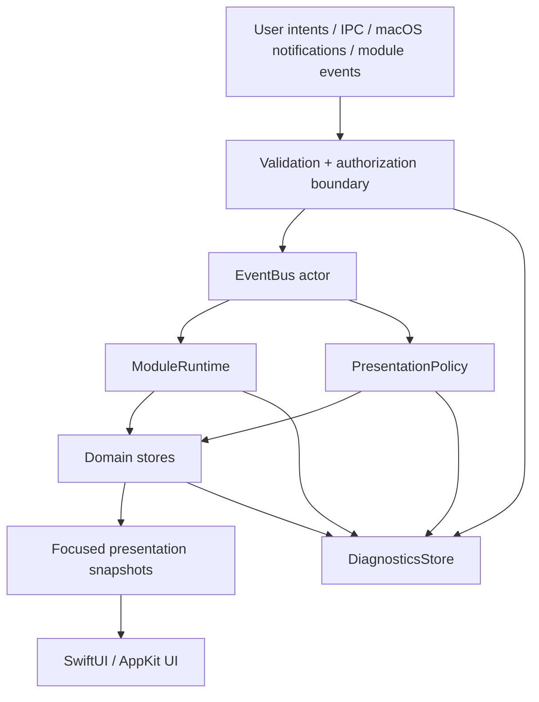

# State Management
## NotchHub — Component Architecture

**Status:** Draft v0.1  
**Owner:** Architecture  
**Last updated:** 2026-09-13  
**Related documents:** [Architecture Overview](overview.md), [Module System](module-system.md), [Notch Surface](notch-surface.md), [Event Protocol](event-protocol.md), [Action Platform](action-platform.md), [Performance](performance.md), [Requirements](../product/requirements.md)

---

## 1. Purpose

This document defines how NotchHub stores, transforms, observes, and presents application state.

The main objective is to prevent a common class of macOS/SwiftUI problems: one oversized observable object receives every event, every view observes it, and a small update—such as a status badge or future transcript delta—causes the entire Notch, Settings, Diagnostics, and module UI to recompute.

NotchHub uses **domain-separated state stores**, a single-direction data flow, typed events, explicit presentation policy, and strict actor boundaries:

```text
External input / user intent
          ↓
Validated command or AppEvent
          ↓
Core state transition / module state
          ↓
Focused presentation snapshot
          ↓
SwiftUI / AppKit UI
```

---

## 2. State management goals

1. **Single source of truth per domain** — surface state, settings, permissions, actions, runtime health, diagnostics, and module presentation state each have a clear owner.
2. **Narrow observation** — a view observes only the state needed to render itself.
3. **Predictable mutation** — state changes occur through commands, event handlers, or store methods, not arbitrary view-side mutation.
4. **Concurrency safety** — I/O and event processing happen in actors/background tasks; UI state is updated on `@MainActor`.
5. **Bounded memory** — histories, logs, event queues, and future transcripts have explicit limits.
6. **Recoverability** — invalid data or failed modules result in explicit degraded state, not corrupted global state.
7. **Testability** — stores and reducers can be tested without launching a real `NSPanel` or SwiftUI scene.

---

## 3. Architectural state model



The UI is the final consumer. It is not the event router, permission owner, process runner, or source of truth for feature state.

---

## 4. State domains and owners

### 4.1 State store catalogue

| Store | Owner/concurrency | Holds | Does not hold |
|---|---|---|---|
| `SurfaceStore` | `@MainActor` or surface coordinator | `SurfaceState`, selected presentation, suppression reason, transition metadata, current expanded-admission capability | Raw events, module protocol state, window API implementation |
| `SettingsStore` | Storage actor/service | Typed `AppSettings`, schema/migration state, validation errors | Secrets, live UI animation state |
| `RuntimeStore` | `ModuleRuntime` actor | Module lifecycle/health/enabled status | Module-specific view details |
| `PermissionStore` | Permission coordinator actor/main-facing projection | Current capability statuses and last refresh | Permission request implementation details in views |
| `ActionStore` | Action runtime/core | Registered actions, availability, running action summaries, recent results | Raw executor internals or arbitrary commands |
| `DiagnosticsStore` | Diagnostics actor | Bounded sanitized logs/events/action/resource records | Unredacted secrets or infinite history |
| `ModulePresentationStore` | Individual module actor + main-facing projection | Minimal UI snapshot for that module | Global surface transition state |

### 4.2 Domain state vs. presentation state

**Domain state** represents what is true in a module or subsystem:

```text
Module is running
Permission is denied
Action is executing
Assistant session is thinking (future)
```

**Presentation state** represents what the UI should currently show:

```text
Compact Notch shows “Module unavailable”
Expanded panel shows Settings action
Detail window displays a selected history item
```

The two must not be conflated. For example, an assistant module may be `thinking` while the surface remains collapsed because the user is in a full-screen app and presentation policy suppresses expansion.

---

## 5. Observation strategy

### 5.1 Focused observation

Use Observation (`@Observable`) or equivalent focused observable projections for presentation-facing state. Avoid one global object that every view observes.

```swift
@MainActor
@Observable
final class SurfacePresentationStore {
    private(set) var state: SurfaceState = .collapsed
    private(set) var compactContent: CompactContentSnapshot?
    private(set) var suppressionReason: SuppressionReason?

    func apply(_ snapshot: SurfacePresentationSnapshot) {
        state = snapshot.state
        compactContent = snapshot.compactContent
        suppressionReason = snapshot.suppressionReason
    }
}
```

A `CompactStatusView` should observe only `SurfacePresentationStore` or an even narrower `CompactStatusSnapshot`, not `AppStore` containing Settings, event history, and module runtime internals.

### 5.2 View observation rules

- `NotchRootView` observes only surface presentation state and selected slot snapshots.
- `SettingsView` observes a settings-facing view model/projection, not the storage actor.
- `PermissionsView` observes permission status projections.
- `ModulesView` observes runtime health projections.
- `DiagnosticsView` observes bounded diagnostic snapshots with explicit refresh policy.
- A module view observes only its module presentation snapshot.
- Views cannot directly call `UserDefaults`, Keychain, `Process`, IPC, or system permission APIs.

### 5.3 Snapshot over stream

High-rate internal data must be reduced to presentation snapshots:

```text
Raw event/audio/log stream
          ↓
Actor-owned assembler/aggregator
          ↓ coalesce/throttle
Small immutable snapshot
          ↓
Main-actor presentation store
          ↓
SwiftUI view
```

For a future streamed assistant transcript, the UI might receive at most 20–30 text snapshots per second, not every raw token/delta.

---

## 6. Concurrency and actor boundaries

### 6.1 Boundary table

| Component | Recommended boundary | Reason |
|---|---|---|
| Surface presentation store | `@MainActor` | Directly drives SwiftUI/AppKit presentation |
| Settings storage/migration | `actor` or serialized storage service | Prevent concurrent writes and blocking main actor |
| EventBus | `actor` | Serializes publish/subscribe and backpressure state |
| ModuleRuntime | `actor` | Serializes lifecycle and health transitions |
| Event adapters | `actor` | Owns connection, decode, retry, and cancellation |
| Transcript/log assembler | `actor` | Coalesces and bounds high-rate data |
| Action execution manager | `actor` | Tracks running action, timeout, cancellation, result |
| IPC server/router | `actor` or serial executor | Protects client/auth/rate-limit state |
| Permission coordinator | actor/service + main-facing projection | Keeps system request orchestration out of views |
| Diagnostics store | `actor` | Serializes bounded append/redaction/export |

### 6.2 Main actor rules

The main actor may:

- Apply a small presentation snapshot.
- Update `@Observable` UI-facing state.
- Animate or reframe the panel through its designated controller.
- Respond to user interaction.

The main actor must not:

- Parse large JSON payloads or logs.
- Decode audio or process raw high-rate streams.
- Run external processes.
- Perform blocking file/network/IPC I/O.
- Scan directories, calculate thumbnails, or run Git-like repository scans.
- Perform migration/import of large data synchronously.
- Write a file/log entry for every event without batching.

### 6.3 Cancellation ownership

Every long-lived `Task`, timer, observer, subscription, socket, and stream has an owner:

```text
ModuleRuntime owns module task group
Module owns its module subscriptions/tasks
Event adapter owns connection/retry tasks
SurfaceCoordinator owns the authoritative surface snapshot, interaction-session holds, hover/auto-collapse tasks, and expanded-admission capability
DiagnosticsStore owns retention/flush tasks
```

When the owner stops, all owned resources are cancelled or invalidated. No module or service may create an untracked detached task for normal operation.

---

## 7. State transition patterns

### 7.1 Command → reducer/store

Commands represent an explicit intent:

```swift
public enum SurfaceCommand: Sendable {
    case toggle
    case expand(reason: SurfaceExpandReason)
    case collapse
    case showDetail(route: DetailRoute)
    case suppress(reason: SuppressionReason)
    case recover
}
```

The surface coordinator validates the command against current state and policy, then applies a deterministic transition.

### 7.2 Event → state projection

Events describe something that happened:

```swift
public enum AppEvent: Sendable {
    case app(AppLifecycleEvent)
    case surface(SurfaceEvent)
    case module(ModuleEvent)
    case permission(PermissionEvent)
    case action(ActionEvent)
    case system(SystemEvent)
    case external(ExternalEvent)
}
```

A store may handle an event and update its own projection, but the event itself must not directly manipulate arbitrary UI objects.

### 7.3 Presentation policy

`PresentationPolicy` transforms domain events into a surface intent or no presentation:

```text
Event + Current Context + User Settings
                    ↓
          PresentationPolicy decision
                    ↓
       none / badge / compact / expanded / detail-navigation
```

Examples:

| Situation | Default result |
|---|---|
| Informational event while user is working | Store status; do not interrupt |
| User-triggered action result | Compact or expanded result |
| Important error | Badge/compact + Diagnostics route; do not forcibly cover full-screen work |
| Future assistant state while full-screen suppression is active | Store state; keep surface suppressed |
| User explicitly opens module detail | Detail window |

`detail-navigation` is a user-authorized routing decision to a separate `DetailWindowCoordinator`. It is not a `SurfaceState`; the Notch panel remains independently collapsed or expanded according to surface policy.

---

## 8. Settings state management

### 8.1 Settings flow

```text
Settings UI intent
       ↓
Settings view model validates input
       ↓
SettingsStore actor applies typed mutation
       ↓
Migration/validation/persistence
       ↓
SettingsChanged event
       ↓
Affected coordinator/module updates runtime behavior
       ↓
Focused UI projection refreshes
```

### 8.2 Rules

- Settings mutations are typed and validated before persistence.
- A failed write does not replace the last known-good in-memory settings with invalid data.
- Updates that affect surface behavior are applied through a coordinator, not by views reaching into `NSPanel`.
- Settings writes are debounced where user typing/sliders could otherwise cause disk churn.
- Schema migrations run before the app exposes settings to modules.
- Module settings are isolated by `ModuleID`.

---

## 9. Runtime and module state

### 9.1 Runtime projection

`RuntimeStore` exposes a read-only projection for UI:

```swift
public struct ModuleHealthSnapshot: Codable, Sendable, Identifiable {
    public let id: ModuleID
    public let displayName: String
    public let state: ModuleLifecycleState
    public let isEnabled: Bool
    public let requiredPermissions: [PermissionKind]
    public let lastStartedAt: Date?
    public let lastError: String?
    public let restartCount: Int
}
```

The UI never calls `module.start()` or `module.stop()` directly. It dispatches an action such as `module.enable` or `module.disable`; the runtime performs the transition and publishes the result.

### 9.2 Failed/degraded states

Use distinct states for different causes:

- `failed`: module implementation/start/handler error.
- `suspended`: intentionally not running due to policy, disabled dependency, low-power state, or denied required permission.
- `stopped`: explicitly disabled or not started.
- `unavailable`: platform/API/dependency unavailable.

This distinction is important for user messaging and automatic retry policy.

---

## 10. Bounded state and history

Every state collection must specify its retention boundary:

| State/history | Initial policy |
|---|---|
| Recent event diagnostics | 500–2,000 sanitized events |
| Recent action results | 100–500 records |
| Module errors | Last error + bounded recent error list |
| Future transcript | 50–200 messages or 1–5 MB in memory |
| Future clipboard history | Explicit count/byte cap and privacy setting |
| Future file thumbnails | LRU byte budget |
| Log tail | 2–8 MB or configured line cap |

When a limit is reached, the store must rotate, drop, or coalesce data and update a metric. Silent unbounded growth is prohibited.

---

## 11. Performance implications

### 11.1 Avoid broad invalidation

A change in `DiagnosticsStore` must not cause `NotchRootView` or Settings views to recompute. A change in future audio level must not invalidate module list or settings.

### 11.2 Update cadence

| Data | Suggested presentation cadence |
|---|---:|
| Surface animation | Native animation frame rate while active only |
| Future transcript text | 20–30 updates/s maximum |
| Future audio meter | 15–30 updates/s while active |
| System metrics | 0.5–2 updates/s while visible; slower/suspended while hidden |
| Diagnostics counters | 1–2 updates/s or on demand |
| Settings typing/sliders | Debounced persistence, immediate local preview where safe |

### 11.3 Instrumentation

Diagnostics should record enough metadata to identify:

- Store update frequency.
- Event-to-presentation latency where measurable.
- Coalesced/dropped event count.
- Buffer utilization.
- Active subscriptions/tasks by owner.
- Main-actor long work warnings.

Use SwiftUI Instrument, Time Profiler, Allocations, Leaks, Energy Log, Hangs/Hitches, and Activity Monitor during F10 profiling.

---

## 12. Testing state management

### 12.1 Store tests

- Initial/default state.
- Valid command/event transitions.
- Invalid transition rejection.
- Duplicate event/idempotency behavior where applicable.
- Bounded history rotation.
- Coalescing/throttling behavior.
- Settings validation/migration/error fallback.
- Permission denied/suspended projection.
- Module failure/disable projection.

### 12.2 Concurrency tests

- Concurrent event publication preserves documented ordering guarantees.
- Cancellation stops adapter/store work.
- Module stop removes all owned subscriptions/tasks.
- Settings writes serialize and do not lose the last valid mutation.
- Diagnostics remains bounded under event flood.

### 12.3 Snapshot tests

Where appropriate, test focused presentation snapshots rather than entire application state. A `CompactStatusSnapshot` test should not require creating a real `NSPanel` or running all modules.

---

## 13. Anti-patterns

Do not introduce:

- A single `GlobalAppState` observed by every view.
- Views that call `UserDefaults`, Keychain, `Process`, permission APIs, or WebSocket methods directly.
- A module that mutates `SurfaceState` or calls `NotchPanelController` directly.
- A detached task with no cancellation owner.
- An unbounded `[Event]`, log `String`, transcript array, image cache, or clipboard history.
- Every raw incoming token/event updating SwiftUI immediately.
- Settings changes that bypass schema validation/migration.
- A module that keeps running after it is disabled.
- Diagnostics that retain secrets or raw sensitive payloads.

---

## 14. Summary

NotchHub state management is deliberately split by domain and driven by validated commands/events. Core actors own lifecycle, data flow, and policy; main-actor stores expose only focused presentation snapshots; SwiftUI renders those snapshots without performing side effects.

This approach keeps the Notch responsive and low-overhead, prevents unrelated views from re-rendering, makes modules independently testable, and gives future integrations such as Xiaozhi a clean path to stream status/text without coupling raw protocol or high-rate data to the UI.
