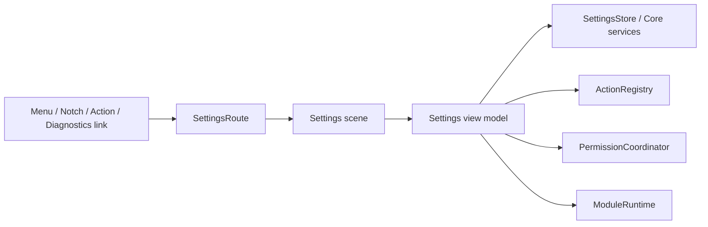

# Settings Information Architecture
## NotchHub — Settings Navigation, Content Model, and Interaction Rules

**Status:** Draft v0.1  
**Owner:** Product / UX / Architecture  
**Last updated:** 2026-09-14  
**Location:** `docs/design/settings-information-architecture.md`  
**Related documents:** [Vision](../product/vision.md), [Requirements](../product/requirements.md), [Roadmap](../product/roadmap.md), [Architecture Overview](../architecture/overview.md), [State Management](../architecture/state-management.md), [Data Persistence](../architecture/data-persistence.md), [Permissions](../platform/permissions.md), [Action Platform](../architecture/action-platform.md), [Module System](../architecture/module-system.md), Diagnostics (F9, not yet implemented), [Accessibility](accessibility.md)

---

## 1. Purpose

This document defines the Settings information architecture (IA) for NotchHub: navigation structure, page responsibilities, content grouping, interaction rules, state ownership, error handling, accessibility, and future module integration.

Settings is not a collection of unrelated toggles. It is the primary **control, explanation, recovery, and trust surface** for a long-running macOS utility. The user must be able to understand:

- What NotchHub does and does not do.
- How the Notch surface behaves.
- Which shortcuts and actions are active.
- Which modules are enabled or unavailable.
- Which permissions are needed and why.
- What data is stored and how to clear or export it.
- How to inspect diagnostics and recover from problems.

The foundation Settings app must be complete before real modules are introduced. Future modules may add their own settings only through the Module System contract and must follow this IA.

---

## 2. Design objectives

1. **Discoverability** — common tasks are easy to find without exposing every advanced option at first glance.
2. **Progressive disclosure** — simple settings appear first; risks, diagnostics, and advanced controls appear only when needed.
3. **Trust** — permissions, local IPC, data retention, and potentially side-effecting actions are explained in clear language.
4. **Consistency** — every setting follows a common row structure, validation behavior, persistence lifecycle, and disabled-state design.
5. **Recoverability** — errors, denied permissions, unavailable modules, and bad configuration have a clear next action.
6. **Modularity** — modules can register settings pages without fragmenting navigation or bypassing shared patterns.
7. **Accessibility** — settings work with keyboard navigation, VoiceOver, sufficient contrast, and Reduced Motion.
8. **Performance** — Settings must not trigger expensive scans, module startup, permission prompts, network connections, or continuous background work merely by being opened.

---

## 3. Settings entry points

The user can open Settings through:

| Entry point | Behavior |
|---|---|
| Menu bar → Settings | Primary entry point; always available even if Notch surface fails |
| Registered action `app.openSettings` | Invoked by menu, Notch UI, shortcut, or approved local IPC source |
| Notch expanded panel | Opens the relevant root settings page or a specific route |
| Diagnostics recovery link | Opens the precise page needed to resolve a failure, such as Permissions or Modules |
| Module unavailable/error UI | Opens that module's settings route, if registered |

Settings must open as a standard accessible macOS window/scene, not inside the small compact Notch surface.

---

## 4. Navigation model

### 4.1 Primary navigation

```text
Settings
├── General
├── Appearance
├── Notch Behavior
├── Shortcuts
├── Permissions
├── Actions
├── Modules
├── Diagnostics
└── About
```

This order follows user intent:

1. General application behavior.
2. Visual preferences.
3. Notch-specific interaction behavior.
4. Fast access through shortcuts.
5. Privacy/system access.
6. Actions the user can trigger.
7. Optional capabilities/modules.
8. Troubleshooting and diagnostics.
9. Version, licenses, privacy, and credits.

### 4.2 Future module navigation

Modules do not add arbitrary top-level pages. They appear under:

```text
Settings → Modules → <Module Name>
```

A module may provide a deep link/route from a relevant UI error or Notch item, but the breadcrumb/navigation context remains visible:

```text
Settings → Modules → Xiaozhi Display Companion
Settings → Modules → Media
Settings → Modules → Clipboard
```

This prevents top-level navigation from growing unbounded as modules are added.

### 4.3 Search

Settings search is a **Should Have** feature, not required for F3. When added, it must:

- Search titles, subtitles, action labels, module names, and help text.
- Return a route and highlight/scroll to the matching setting.
- Avoid indexing secrets, hidden diagnostics values, transcript/clipboard content, or raw logs.
- Work with disabled/unavailable settings, showing why the item is unavailable.

---

## 5. Page catalogue

## 5.1 General

### Purpose

General application-level controls that do not change visual design, shortcut bindings, permissions, module-specific behavior, or diagnostics policy.

### Content groups

| Group | Settings | Notes |
|---|---|---|
| Startup | Launch at login | Disabled/hidden until implementation is production-ready; user-controlled |
| Application | Start NotchHub when launched, restore last safe surface state | Never restore an intrusive expanded/detail state automatically |
| Configuration | Export settings, import settings, reset non-secret settings | Export/import are sanitized; reset explains scope |
| Recovery | Restart runtime | Uses registered action; confirmation policy applies if needed |

### Rules

- Do not put module-specific toggles here.
- “Reset all settings” is visually separated as a destructive action.
- A reset must distinguish normal non-secret reset from explicit credential removal.
- Import should validate configuration before changing active state.

### Initial foundation state

- Launch at login may be shown as “Coming soon” or hidden until ServiceManagement implementation exists.
- Export/import can be delayed to F4 but reserve the section structure in F3.

---

## 5.2 Appearance

### Purpose

Controls visual presentation without changing functional security, permissions, or module behavior.

### Content groups

| Group | Settings | Default direction |
|---|---|---|
| Theme | System, Light, Dark | System default |
| Notch style | Material/opacity within supported design system | Conservative dark/translucent default |
| Layout | Compact/expanded size preset, spacing density if supported | Standard preset |
| Motion | Reduced Motion, animation intensity if supported | Respect system reduced-motion preference; user override possible |
| Visibility | Optional indicator style when collapsed | Minimal/quiet default |

### Rules

- Appearance changes should preview immediately when safe.
- Persist visual sliders/toggles with debounce; avoid disk write on every animation frame.
- Do not expose arbitrary panel width/height fields in the foundation; use validated presets to protect geometry and interaction quality.
- Do not use contrast/opacity options that make permission/action/error state unreadable.
- Reduced Motion affects Notch transitions and any future module animation, but does not disable essential status changes.

### Disabled/unavailable state

If a visual feature depends on an unavailable OS API or future module, show it as unavailable with a concise explanation; do not show a nonfunctional toggle.

---

## 5.3 Notch Behavior

### Purpose

Controls when and how the Notch surface appears and responds to interaction.

### Content groups

| Group | Settings | Default direction |
|---|---|---|
| Surface | Enable Notch surface, default start state | Enabled; safe collapsed state |
| Pointer interaction | Hover-to-expand, hover delay | Enabled with conservative delay; user can disable |
| Collapse behavior | Auto-collapse, timeout duration | Enabled; validated preset/range |
| Keyboard/interaction | Escape/click-outside behavior | Collapse to safe state |
| Context policy | Show during full-screen, suppression behavior | Conservative/minimal default |
| Display policy | Built-in display first, no-notch fallback explanation | Built-in display only in foundation |
| Debug | Surface debug overlay | Visible only in development/debug mode |

### Required explanations

- Explain that foundation supports the built-in MacBook display first.
- Explain that full-screen behavior is a preference and may be constrained by macOS/system context.
- Explain that disabling hover does not disable menu-bar or shortcut access.
- Explain that auto-collapse improves privacy and reduces obstruction.

### Rules

- Do not expose window-level or collection-behavior raw flags in normal Settings.
- Do not let user input create off-screen/unsafe panel geometry.
- Changes that require panel recreation must show a short non-disruptive “Applying layout…” state and fall back safely if recreate fails.
- A module must not add surface-global settings outside this page without an architecture review.

---

## 5.4 Shortcuts

### Purpose

Lets the user view, assign, enable, disable, and resolve conflicts for registered actions with keyboard shortcuts.

### Content groups

| Group | Content |
|---|---|
| Global controls | Enable/disable global shortcut support if applicable |
| Core actions | Toggle Notch, Open Settings, Open Diagnostics, show demo state |
| Module actions | Actions contributed by enabled modules, grouped by module/category |
| Conflict/help | Reserved shortcut guidance, conflict state, permission/accessibility explanation |

### Shortcut row structure

Every shortcut-capable action row shows:

```text
Action icon + title
Short explanation
Current shortcut recorder/button
Enabled/disabled availability state
Reason if unavailable
Clear/reset option
```

### Rules

- A shortcut binds to an `ActionID`, not a view callback or module method.
- The shortcut recorder validates input and reports conflicts before saving.
- Reserved/system-conflicting combinations must be rejected or clearly warned.
- If a selected implementation requires Accessibility, show the permission requirement before enabling capture/registration.
- A shortcut for an unavailable action remains visible but disabled, with the reason (e.g., module disabled, permission denied).
- Clearing a shortcut does not remove the action; it removes only that input route.

### Default bindings

Initial suggestion, subject to conflict check:

```text
⌥⌘Space → app.toggleSurface
```

Do not assume this binding is available for every user/system configuration.

---

## 5.5 Permissions

### Purpose

Explains system capabilities, shows current authorization state, and gives the user a safe recovery path. This page is the UI projection of `PermissionCoordinator`, not a place for modules to call privacy APIs directly.

### Page groups

```text
Required by enabled modules
Optional capabilities
Not currently used
Privacy information
```

### Permission row structure

| Element | Requirement |
|---|---|
| Capability name | Friendly label, not only API name |
| Status | Not used, Not enabled, Enabled, Denied, Restricted, Unavailable |
| Feature/module | Identify why it is relevant |
| Explanation | What is accessed, why, when it is active, what happens if declined |
| Primary action | Enable/Request/Open System Settings/View details as appropriate |
| Secondary action | Learn more/privacy route where applicable |

### Foundation behavior

- No sensitive permission is requested at app launch.
- Foundation may test Notifications or Accessibility only when an explicitly selected feature needs it.
- Microphone, Camera, Calendar, Reminders, Screen Recording, and Automation remain informational until an in-scope module actively needs them.
- If no enabled module needs a capability, label it “Not used by enabled features,” not “Missing permission.”

### Rules

- Permission system prompt is shown only after pre-permission explanation and explicit user confirmation.
- Denied/restricted states provide a clear System Settings recovery action.
- Do not endlessly display a primary “Enable” button after macOS reports a hard denial; switch to “Open System Settings.”
- Do not collect or display sensitive raw data merely to prove a permission works.

See [`permissions.md`](../platform/permissions.md) for capability-level behavior.

---

## 5.6 Actions

### Purpose

Provides a user-visible catalogue of registered actions and their availability, source/confirmation behavior, and recent result summary.

### Content groups

| Group | Content |
|---|---|
| Core actions | App, surface, settings, diagnostics actions |
| Module actions | Grouped by enabled module |
| Confirmation | User-configurable confirmation preferences only where action policy permits |
| Recent activity | Short bounded list of recent action result/status with link to Diagnostics |

### Action row structure

```text
Icon + action title
Subtitle: what it does
Availability status
Shortcut, if assigned
Confirmation behavior
Run button, where safe
Reason/details link when unavailable
```

### Rules

- This page displays `ActionRegistry` metadata; it must not implement duplicate action logic.
- “Run” calls the same registered ActionID as menu/Notch/shortcut/IPC.
- A confirmation-required action must never silently run from Settings.
- Never show raw executor implementation details, shell text, token, or internal process configuration.
- Do not add a generic “run command” field.
- If the app supports opening a known URL/app, show user-friendly destination information rather than an editable arbitrary command input.

### Foundation action catalogue

| Action | Category | Settings behavior |
|---|---|---|
| `app.toggleSurface` | App | Show current shortcut and run button |
| `app.openSettings` | App | Informational; current page already open |
| `app.openDiagnostics` | App | Open diagnostics route |
| `app.restartRuntime` | Runtime | Run with policy-driven confirmation |
| `surface.showDemoStatus` | Surface | Run in development/foundation testing context |
| `surface.toggleDebugOverlay` | Development | Development/debug builds only |
| `settings.reset` | Settings | Destructive/explicit confirmation |
| `demo.ping` | Demo | Visible only while DemoModule is enabled |

---

## 5.7 Modules

### Purpose

Shows installed static modules, their health, enablement state, required capabilities, and module-specific configuration routes.

### Module list row

| Element | Requirement |
|---|---|
| Icon/name | From `ModuleMetadata` |
| Enable switch | Available when module can be toggled safely |
| Status | Running, stopped, suspended, failed, unavailable |
| Summary | Short user-facing capability description |
| Requirement badge | Permission/configuration requirement if relevant |
| Error detail | Sanitized last error and recovery action |
| Settings route | Opens `Settings → Modules → <Module>` when provided |

### Module detail page layout

```text
<Module Name>
├── Overview
├── Enablement and health
├── Feature settings
├── Permissions
├── Actions and shortcuts
├── Data and privacy
├── Performance/resource behavior
├── Diagnostics
└── Reset/clear module data
```

### Foundation state

Only `DemoModule` is expected before the Foundation Completion Gate. Its page must demonstrate the complete module setting lifecycle without pretending to be a production feature.

Suggested DemoModule controls:

- Enable/disable module.
- Show demo status.
- Run `demo.ping`.
- Simulate failure (debug build only).
- Display health, resource counts, last event/action, and reset module settings.

### Rules

- Modules cannot add arbitrary top-level Settings pages.
- Module detail page must use common `NotchUI` design-system components.
- Module disabled state must not start hidden background work just to populate Settings.
- Module detail views must not expose tokens, raw payloads, or unbounded diagnostics.
- A failed module must not prevent Modules page, Settings, or Diagnostics from opening.

---

## 5.8 Diagnostics

### Purpose

Provides a user-accessible, privacy-safe view of app health and a recovery path for environment/configuration issues.

Diagnostics is not an end-user dashboard. It should lead with a concise health summary and hide advanced/raw details behind progressive disclosure.

### Content groups

| Group | Content |
|---|---|
| Health summary | App version, uptime, core/runtime/surface/IPC state |
| Notch surface | Surface state, target display, calculated frame, suppression/recovery reason |
| Modules | Health, last error, start/restart state, resource summary |
| Permissions | Current capability status and last refresh |
| Actions | Recent bounded action results, cancellation/timeout count |
| Events/IPC | Accepted/rejected/coalesced/dropped counts, listener status, client count summary |
| Performance | CPU/memory snapshot, UI update/event rate, buffer utilization, active task summary |
| Logs | Filtered sanitized log tail, copy/export report |
| Recovery | Restart runtime, reset selected settings, open permission/module route |

### Rules

- Do not display raw secret values, bearer tokens, authorization headers, full transcript, clipboard, file, calendar, camera, screen, or audio data.
- Logs are bounded and sanitized.
- “Copy diagnostics” and “Export diagnostics” must show what will be included or link to privacy details.
- Development-only controls (debug overlay, event injector) are clearly labelled and excluded/disabled for normal release users unless deliberately exposed.
- Diagnostics must remain usable even when one module is failed or Notch panel is unavailable.

---

## 5.9 About

### Purpose

Provides product identity, version, support/reference/legal information, and high-level privacy statement.

### Content

- App name, icon, version, build number.
- Supported macOS baseline.
- License.
- Third-party notices.
- Boring Notch reference acknowledgement, if legally/appropriately required; do not imply a fork or affiliation.
- Privacy summary and link to privacy documentation.
- Security reporting route from `SECURITY.md`.
- Documentation/repository link if the project is public.
- Check for updates policy/status when implemented.

### Rules

- Do not expose internal debug tokens, raw build paths, or secret environment data.
- Keep legal claims accurate to actual license/distribution state.
- Update third-party notices whenever dependencies or approved code reuse changes.

---

## 6. Settings data model and routing

### 6.1 Root route model

```swift
public enum SettingsRoute: Hashable, Sendable {
    case general
    case appearance
    case notchBehavior
    case shortcuts
    case permissions(permission: PermissionKind?)
    case actions(actionID: ActionID?)
    case modules(moduleID: ModuleID?)
    case diagnostics(section: DiagnosticsSection?)
    case about
}
```

A route is a navigation target, not an authorization bypass. Deep-linking to `permissions(permission: .microphone)` does not request microphone access; it only opens the explanatory Settings page.

### 6.2 Settings intent flow



### 6.3 Ownership rules

| Concern | Owner | Settings UI behavior |
|---|---|---|
| Durable preferences | `SettingsStore` | Reads/writes typed settings through view model |
| Secrets | `SecretStore`/Keychain | Shows credential presence/revoke action only; never raw secret |
| Permission status/request | `PermissionCoordinator` | Displays status; invokes contextual request through coordinator |
| Action execution | `ActionRegistry` | Shows metadata/status; invokes registered ActionID |
| Module lifecycle | `ModuleRuntime` | Shows health/enable state; dispatches module enable/disable action/command |
| Surface changes | `SurfaceCoordinator` | Applies validated settings; UI never manipulates `NSPanel` |
| Diagnostics | `DiagnosticsStore` | Reads bounded sanitized snapshots |

---

## 7. Setting row patterns

### 7.1 Standard toggle

Use for simple boolean preferences with immediate, reversible behavior.

```text
Title
Short explanation
[Toggle]
Optional status/error/helper text
```

Requirements:

- State updates immediately in UI where safe.
- Persistence is debounced if rapid toggling is possible.
- Failed persistence restores/indicates last known-good state.
- Toggle disabled state explains why.

### 7.2 Selection/preset row

Use for bounded values such as theme, hover delay, auto-collapse timeout, or size preset.

Requirements:

- Use an explicit set of safe values or validated range.
- Show current value and consequences.
- Avoid arbitrary raw numeric inputs for panel geometry/system behavior in foundation.

### 7.3 Action row

Use for an operation that has immediate result or side effect.

Requirements:

- Route through `ActionRegistry`.
- Show confirmation policy when relevant.
- Display progress/result through action state, not local button-only state.
- Disable during execution as policy requires.

### 7.4 Permission row

Use for macOS privacy capability.

Requirements:

- Status, reason, source module, data implication, and recovery action.
- Request only after user confirms pre-permission explanation.
- Show `Open System Settings` after denial.

### 7.5 Destructive row

Use for reset, credential deletion, cache/history clear, or module data deletion.

Requirements:

- Visually separate from ordinary controls.
- Explain exact scope.
- Require confirmation.
- Never combine non-secret reset with secret deletion by default.
- Show outcome and recovery path.

### 7.6 Status-only row

Use for immutable/system-managed information.

Examples:

- App build/version.
- Permission status.
- Module health.
- IPC listener status.
- Current selected display.

Requirements:

- Offer refresh/details where useful.
- Avoid making status look like a user-editable preference.

---

## 8. Validation, error, and recovery behavior

### 8.1 Validation levels

| Level | Example | Behavior |
|---|---|---|
| Inline validation | Invalid shortcut/conflicting key combination | Prevent save; show concise error next to control |
| Deferred validation | Imported settings file | Validate before apply; show report/preview |
| System validation | Permission/launch-at-login state | Show actual status and recovery instruction |
| Runtime validation | Panel layout setting needs safe recreate | Apply or revert safely; record diagnostics |
| Security validation | Action/IPC setting alters trust behavior | Require explicit confirmation and policy check |

### 8.2 Error message pattern

```text
What happened
Why it matters
What the user can do next
Optional technical detail / Diagnostics link
```

Example:

```text
NotchHub could not apply the new display layout.
The built-in display is currently unavailable.
Keep the previous layout or open Diagnostics to inspect display status.
```

### 8.3 Recovery links

Use direct routes, not vague advice:

- `SettingsRoute.permissions(permission: .microphone)`.
- `SettingsRoute.modules(moduleID: "xiaozhi.display")`.
- `SettingsRoute.diagnostics(section: .surface)`.
- `SettingsRoute.shortcuts`.

---

## 9. Accessibility requirements

Settings must satisfy the project accessibility requirements:

- Every control has a clear VoiceOver label and value/state.
- Keyboard focus order follows visual reading order.
- All settings are reachable without mouse/hover.
- Shortcut recorder explains capture state to VoiceOver.
- Permission and error rows announce status changes.
- Disabled controls include a textual reason and, where available, a recovery button.
- Color is never the only signal for running/failed/denied/unavailable state.
- Reduced Motion applies to navigation/panel previews without hiding state changes.
- Text scales in Settings/detail views within macOS accessibility expectations.

See `docs/design/accessibility.md` when it is created; until then, treat this section and [Requirements §6.6](../product/requirements.md#66-accessibility-and-usability) as authoritative.

---

## 10. Performance requirements

Opening Settings must not:

- Start disabled modules.
- Request system permissions automatically.
- Connect to a remote service or future relay merely to populate a row.
- Scan full file systems, media libraries, calendars, or clipboard history.
- Load unbounded log/event/transcript history.
- Trigger panel recreation unless a setting is changed.
- Write settings on every SwiftUI view recomputation.

### Refresh policy

| Page | Refresh behavior |
|---|---|
| General/Appearance/Notch Behavior | Event-driven from settings changes |
| Shortcuts | Refresh on registry/binding changes |
| Permissions | On entry, app activation, or explicit refresh; never aggressive polling |
| Actions | Registry/status events; bounded recent results |
| Modules | Runtime health events; no forced module start |
| Diagnostics | 1–2 Hz while visible or explicit refresh; bounded snapshots |
| About | Static on open/version change |

All Settings pages must use focused state projections, not a single global observable object. See [`state-management.md`](../architecture/state-management.md) and [`performance.md`](../architecture/performance.md).

---

## 11. Privacy and security requirements

### Settings must never expose

- IPC tokens, API keys, passwords, or credentials.
- Raw authorization headers.
- Full future assistant transcript by default.
- Clipboard/file/calendar/reminder contents in generic configuration pages.
- Camera frames, microphone audio, screen content, or raw external payloads.
- Arbitrary command/script/executable fields.
- LAN device-control settings, IoT connections, ESP-IDF/ESP32 configuration, or hardware targets.

### Sensitive controls

Settings may expose safe management controls:

- “Credential configured” / “Remove credential.”
- “Clear history/cache” with scope explanation and confirmation.
- “Export sanitized settings.”
- “Open System Settings.”
- “Revoke local IPC clients” or rotate token through a secure, documented future flow.

### Scope consistency

No Settings section, placeholder, enum, label, help text, or hidden feature flag may reintroduce excluded ESP-IDF, ESP32, IoT, MQTT, BLE gateway, or LAN device-control functionality.

---

## 12. Module settings contract

Every future module that adds Settings content must provide:

```text
Module name/ID/version
Purpose and non-goals
Root route: Settings → Modules → <Module>
Settings schema/default values/migrations
Permission requirements and request timing
Action IDs and confirmation behavior
Data stored/retained/cleared/exported
Resource/refresh policy while settings page is open
Disabled/degraded/failed states
Accessibility labels and keyboard interactions
Diagnostics fields/recovery links
Unit/integration/manual test plan
```

### Module settings implementation rules

- Module settings are namespaced by `ModuleID`.
- Module page is unavailable or read-only if the module is not installed/compatible, with a clear reason.
- Module may provide a Settings view descriptor but must use `NotchUI` components and common row patterns.
- Module cannot request permissions merely when its Settings page opens; it must wait for explicit enable/request interaction.
- Module cannot expose its raw backend protocol/token/command fields as normal settings.
- Module cannot add a top-level Settings section.

---

## 13. Future module examples

### Xiaozhi Display Companion (M1)

Settings route:

```text
Settings → Modules → Xiaozhi Display Companion
```

Potential groups after M1 begins:

- Connection status and reconnect action.
- Display behavior: show state, transcript tail length, auto-collapse policy.
- Privacy: transcript retention (off by default), clear transcript history.
- Actions: reconnect/stop/mute if registered and supported.
- Diagnostics: relay status, last event, sanitized error.

Must not include:

- Microphone input control in display-only M1.
- Raw WebSocket URL/token in ordinary UI without secure credential flow.
- Raw audio logs/frames.
- Arbitrary tool, shell, device, or LAN-control command fields.

### Media or Clipboard (M2)

Potential groups:

- Enablement/availability.
- Display preference.
- Privacy/retention and clear history.
- Shortcut/action bindings.
- Resource policy summary.

Clipboard-specific warning: clipboard history is user-content-sensitive. History must be bounded and disabled/cleared explicitly according to the module privacy policy.

### Calendar or Reminders (M4)

Potential groups:

- Enable/permission status.
- Calendar/reminder selection scope where API permits.
- Display timing and summary preference.
- Data/refresh policy.
- Open System Settings/recovery.

Must avoid showing/storing full event content unless necessary and documented.

---

## 14. Foundation acceptance criteria

The Settings IA is ready before real modules when:

1. All nine top-level pages exist or have a deliberate, non-misleading foundation placeholder where implementation phase has not started.
2. Settings opens from menu bar even if the Notch panel is hidden/suppressed/unavailable.
3. General, Appearance, and Notch Behavior use typed settings and apply safe changes at runtime.
4. Shortcuts lists foundation actions and uses action IDs, not direct callbacks.
5. Permissions page shows statuses without prompting at launch/open.
6. Actions page reflects ActionRegistry metadata and confirmation/availability state.
7. Modules page displays DemoModule lifecycle/health and safe enable/disable controls.
8. Diagnostics page can route users to the relevant recovery page.
9. No page reads/writes secrets directly or displays sensitive raw data.
10. Settings works with keyboard navigation, VoiceOver labels, contrast, and Reduced Motion.
11. Opening Settings does not start disabled modules, cause high-rate polling, or create notable idle resource regression.
12. Validation/error/recovery behavior is test-covered.
13. Settings scope remains local macOS productivity/AI-focused and excludes ESP-IDF, ESP32, IoT, MQTT, BLE gateway, and LAN device control.

---

## 15. Testing requirements

### Unit tests

- Route encode/decode and deep-link selection.
- Settings page registry ordering.
- Settings visibility/availability based on phase/module/capability.
- Standard row validation rules.
- Shortcut conflict/clear/disabled state.
- Permission row mapping and denied recovery route.
- Action row availability/confirmation projection.
- Module page lifecycle/health projection.
- Sensitive-field redaction/absence in view models.
- Settings search result routing when implemented.

### Integration tests

- Menu action opens Settings.
- Diagnostic recovery link opens the correct route.
- Setting mutation persists through `SettingsStore` and updates runtime safely.
- Module enable/disable updates Modules and Actions pages.
- Permission status change updates Permissions and module availability.
- Action execution result updates Actions/Diagnostics without duplicate logic.
- Corrupt settings fallback displays safe recovery message.

### UI/accessibility/manual tests

- Keyboard-only navigation through all pages.
- VoiceOver labels for controls/status/errors.
- Reduced Motion behavior.
- Light/dark/system appearance and contrast.
- Narrow/wide Settings window layout.
- First launch: no sensitive permission prompt on opening Settings.
- Denied permission: Open System Settings route and refresh after return.
- Surface unavailable: Settings and Diagnostics still open from menu bar.
- Repeated open/close: no state leak or performance regression.

---

## 16. Change control

Update this document when:

- A top-level Settings section is added, renamed, reordered, or removed.
- A module is allowed to contribute a new settings route/group.
- A setting changes default value, validation, persistence, reset scope, or privacy behavior.
- A new permission, ActionID, data category, secret management flow, or IPC control is surfaced in Settings.
- A Settings feature affects panel lifecycle, performance budget, or macOS distribution/entitlements.
- Search, import/export, launch-at-login, updates, or account/credential flow is implemented.

A new top-level page, arbitrary command setting, LAN/hardware configuration, private API toggle, or change to permanent product exclusions requires architecture/security/product review and likely an ADR.

---

## 17. Summary

Settings is NotchHub’s trust and control center. It must make the app understandable and recoverable before real modules arrive: how the Notch behaves, which actions/shortcuts are active, what permissions are used, what modules are enabled, what data is retained, and how the user can diagnose or reset the app.

The navigation remains intentionally stable: General, Appearance, Notch Behavior, Shortcuts, Permissions, Actions, Modules, Diagnostics, and About. Future modules live under Modules, use common components, request permissions only after explicit user action, follow data/security/performance policy, and never bypass the platform’s core boundaries.
