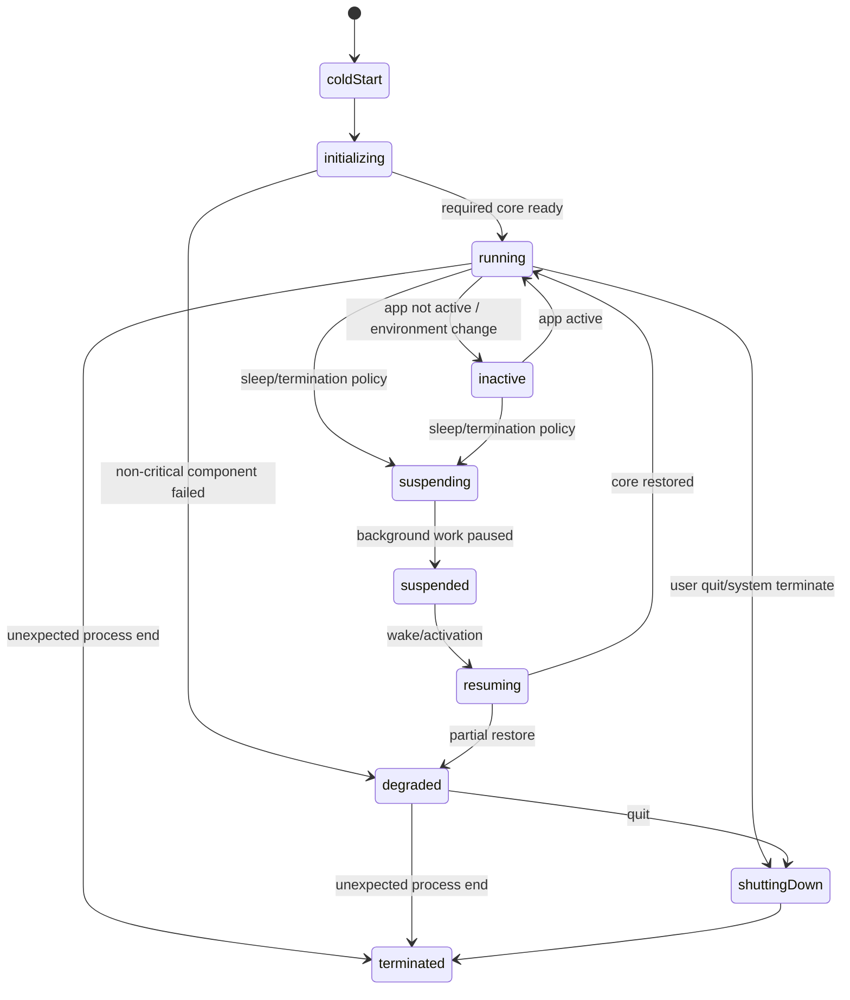
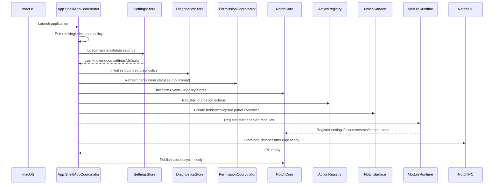
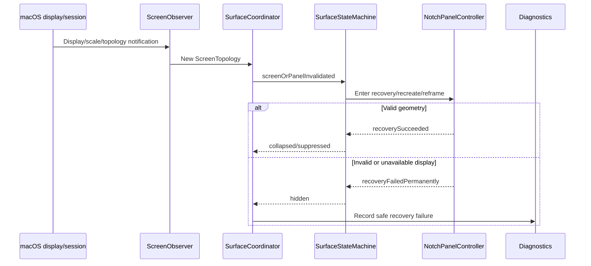

# macOS Lifecycle
## NotchHub — Application, Window, Display, Session, and Permission Resilience

**Status:** Draft v0.1  
**Owner:** Platform / Architecture / Quality  
**Last updated:** 2026-09-13  
**Location:** `docs/platform/macos-lifecycle.md`  
**Related documents:** [Architecture Overview](../architecture/overview.md), [Notch Surface](../architecture/notch-surface.md), [State Management](../architecture/state-management.md), [Module System](../architecture/module-system.md), [Permissions](permissions.md), [Testing Strategy](../quality/testing-strategy.md), [Performance](../architecture/performance.md), [Apple APIs](../references/apple-apis.md)

---

## 1. Purpose

This document defines how NotchHub responds to the macOS lifecycle and environment changes that can occur while the app runs as a long-lived menu-bar utility.

NotchHub must remain safe and diagnosable through:

- Cold launch and first initialization.
- Relaunch and duplicate-instance prevention.
- App activation/deactivation.
- Menu-bar utility behavior.
- Notch panel creation/recovery.
- Space changes and full-screen applications.
- Display attach/detach and resolution/scale changes.
- Sleep/wake.
- Lock/unlock and permission changes.
- Module start/stop/suspend/failure.
- IPC startup/shutdown and client disconnect.
- Graceful termination and forced termination limitations.

The lifecycle architecture must keep the menu bar, Settings, and Diagnostics usable even when the Notch surface is hidden, suppressed, or unable to recover.

---

## 2. Lifecycle principles

1. **Menu bar is the recovery path** — the app remains controllable without the Notch panel.
2. **Explicit startup/shutdown ordering** — components start after their dependencies and stop in reverse order.
3. **Panel lifecycle is isolated** — `NotchPanelController` owns native window lifecycle; modules do not.
4. **Transient OS events are normal** — display/sleep/Space/permission changes must not be treated as exceptional crashes.
5. **Recovery converges** — retry is bounded; failure ends in a stable hidden/degraded state with diagnostics.
6. **Pause instead of destroy when appropriate** — modules can suspend background work while preserving configuration.
7. **Permission changes are lifecycle events** — app refreshes capability status after activation and system-setting changes.
8. **Cancellation is explicit** — every task/observer/timer/socket has an owner and shutdown path.
9. **No blocking main actor** — lifecycle handlers do small state transitions; heavy recovery work runs outside presentation.
10. **Measure the edge cases** — manual lifecycle and performance scenarios are release requirements.

---

## 3. Lifecycle state model

### 3.1 App lifecycle



### 3.2 Surface lifecycle

The surface has its own state machine; app lifecycle state does not directly equal surface state.

```text
App running + surface state:
  hidden | collapsed | compact | expanded | suppressed | recovering

Separate user-facing windows:
  Settings | Diagnostics | module detail

App suspended:
  surface should be hidden/suppressed; native interaction paused

App degraded:
  surface may be collapsed or hidden; menu bar/Diagnostics remain available
```

### 3.3 Module lifecycle

```text
registered → starting → running
running → suspended → running
running → stopping → stopped
starting/running → failed
failed → bounded retry or stopped
```

See [`module-system.md`](../architecture/module-system.md).

---

## 4. Startup architecture

### 4.1 Startup sequence



### 4.2 Startup ordering rules

1. Establish process/single-instance policy.
2. Load settings and migrations before exposing module settings or behavior.
3. Initialize diagnostics early enough to capture startup failures, but do not expose unredacted data.
4. Refresh permission status without requesting permissions.
5. Initialize core stores, EventBus, and Presentation Policy.
6. Register foundation actions.
7. Create/configure the panel in a hidden or safe collapsed state.
8. Register/start enabled modules.
9. Start local IPC only after event/action/policy dependencies are ready.
10. Publish `app.lifecycle.ready` only after the app can respond safely through menu bar and diagnostics.

### 4.3 Startup failure classes

| Failure | Required behavior |
|---|---|
| Settings decode/migration failure | Use safe defaults, record diagnostics, continue if possible |
| Diagnostics initialization failure | Use in-memory bounded diagnostics, continue with warning |
| Permission status adapter failure | Mark status unavailable/unknown-safe, do not prompt automatically |
| Panel creation failure | Keep menu bar/Settings/Diagnostics; mark surface recovering/hidden |
| Module start failure | Isolate module as failed; core remains running |
| IPC start failure | Keep UI/core running; show IPC unavailable in Diagnostics |
| Foundation core failure | Enter degraded mode or terminate safely with actionable log |

---

## 5. Single-instance and launch behavior

### Requirements

- Only one active NotchHub instance may own the Notch panel and local IPC endpoint.
- A second launch should focus/notify the existing instance or exit safely.
- A second instance must not delete or replace a live IPC socket.
- Duplicate launch diagnostics must not reveal secrets or internal paths unnecessarily.
- Launch-at-login, if implemented, must be user-controlled and use the app’s documented signing/entitlement configuration.

### Single-instance flow

```text
New process starts
      ↓
Acquire app instance lock/identity
      ↓
If existing instance:
   send safe “activate/open” request
   exit new process
Else:
   become owner
   initialize app
```

The exact mechanism is an implementation decision, but it must be tested with rapid double-launch and stale-process scenarios.

---

## 6. App activation and deactivation

### 6.1 Becoming active

When the app becomes active:

- Refresh permission status.
- Re-check screen topology/panel validity.
- Refresh Settings/Diagnostics projections if needed.
- Resume UI-only interactions if not suppressed.
- Do not automatically re-request denied permission.
- Do not restart disabled modules.

### 6.2 Resigning active

When the app is inactive:

- Do not destroy all state merely because another app is active.
- Keep menu-bar utility state and required local event paths according to module policy.
- Reduce optional refresh/prefetch work.
- Let `ClickOutsideMonitor`/auto-collapse logic use a clear policy.
- Do not let an invisible panel retain a large hit-test region.

### 6.3 Focus policy

- Passive compact status should not steal keyboard focus unnecessarily.
- Expanded Notch interaction or a separate detail window may become the active target.
- Settings/Diagnostics are separate user-facing windows/scenes.
- Returning focus to the previous app is preferred after the Notch interaction ends where practical.

---

## 7. Notch panel lifecycle

### 7.1 Panel ownership

`NotchPanelController` is the only component allowed to:

- Create/destroy `NSPanel`.
- Configure style, level, collection behavior, appearance, and content host.
- Set frame/order/show/hide.
- Configure hit-test/click-through.
- Recreate/reframe the panel after display/session changes.

See [`notch-surface.md`](../architecture/notch-surface.md).

### 7.2 Panel states by app condition

| App/environment condition | Surface policy |
|---|---|
| Initializing | Hidden or safe non-interactive placeholder |
| Running, idle | Collapsed/hidden per Settings |
| Running, user interaction | Expanded Notch panel or a separately requested detail window |
| Full-screen suppression | Suppressed or hidden per policy |
| Sleep | Hidden/suspended interaction |
| Built-in display unavailable | Hidden/suppressed in foundation |
| Panel invalidated | Recovering, then collapsed/hidden |
| App degraded | Menu bar/Diagnostics remain; surface may be hidden |
| Shutting down | Stop interaction, hide/order out, release panel |

### 7.3 Panel recreation

Panel recreation must:

- Preserve the desired logical `SurfaceState` separately from the native object.
- Avoid restoring `expanded` automatically after a disruptive display/sleep event unless explicitly safe. Detail windows follow their own privacy-aware restoration policy and default to closed for sensitive content.
- Return to `collapsed` or `suppressed` after successful recovery.
- Use bounded retry/backoff.
- Publish recovery start/completion/failure events.

---

## 8. Spaces and full-screen

### 8.1 Spaces

NotchHub must choose and document one consistent policy:

- Join all Spaces and remain available, or
- Follow the active Space/visibility rules and suppress under defined conditions.

The foundation target is predictable reachability without unexpected focus stealing.

### 8.2 Full-screen applications

When another app enters full-screen:

1. Observe the environment change.
2. Read the “show on full-screen” setting.
3. Evaluate screen-sharing/privacy and user suppression policy where available.
4. Send a surface policy event.
5. Suppress/minimize or keep a carefully constrained surface.
6. Do not allow a low-priority module event to override suppression.

When full-screen exits:

- Recheck screen/panel geometry.
- Clear suppression only if the user setting permits.
- Return to `collapsed`, not automatically `expanded`, unless the user explicitly triggered the interaction.

### 8.3 No module bypass

A module cannot force the panel visible during suppression by publishing a high-priority event. Priority is interpreted by `PresentationPolicy` within user/system policy.

---

## 9. Display topology and geometry lifecycle

### 9.1 Events to handle

- Display attached.
- Display detached.
- Display resolution changed.
- Display scale changed.
- Built-in display unavailable/available.
- Main display changes.
- Lid close/open.
- Screen parameter notification.

### 9.2 Display policy

Foundation supports the built-in MacBook display first:

- Prefer a documented built-in-display selection strategy over blindly using `NSScreen.main`.
- If the built-in display is unavailable, hide/suppress rather than render on an arbitrary external monitor.
- External displays may be used for Settings/Diagnostics but are not required to host the Notch surface in the foundation.
- Multi-display surface placement requires a later design/ADR.

### 9.3 Geometry recovery flow



### 9.4 Required invariants

- Final panel frame is within valid screen bounds.
- No stale frame from the previous scale/resolution remains.
- No full-screen invisible hit-test area is left behind.
- A missing built-in display cannot create an infinite recovery loop.
- Settings/Diagnostics remain accessible from menu bar.

---

## 10. Sleep, wake, lock, and unlock

### 10.1 Sleep

Before or during system sleep:

- Stop optional animation and high-frequency updates.
- Pause/cancel module work according to runtime policy.
- Stop or pause IPC streams that cannot survive sleep.
- Hide/suppress panel interaction.
- Avoid synchronous persistence work during an uncertain sleep transition.
- Record a low-volume lifecycle event.

### 10.2 Wake

After wake:

1. Revalidate app/runtime state.
2. Refresh permission status when active.
3. Re-enumerate screen topology.
4. Recompute geometry.
5. Reconnect eligible local adapters with bounded backoff.
6. Resume modules that were running before sleep and are still enabled/authorized.
7. Keep disabled/failed modules disabled until policy/user retry.
8. Return surface to collapsed/suppressed safe state.

### 10.3 Lock/unlock

- Locking must not expose a separate detail window containing private content unexpectedly.
- Consider suppressing user-content-sensitive detail views while the session is locked.
- Do not treat lock as permission grant/revocation.
- On unlock/activation, refresh permission and screen state.
- Do not replay a stale assistant/transcript/clipboard surface automatically without user interaction.

### 10.4 Sleep/wake acceptance criteria

- No crash while expanded/compact.
- No stuck `recovering` state.
- No duplicate timers/subscriptions after wake.
- No panel off-screen after scale/topology change.
- No unauthorized sensitive capture resumes after wake.
- Diagnostics records lifecycle recovery outcome.

---

## 11. Permissions and lifecycle

Permission status can change while the app is not active. Lifecycle coordination must connect app activation with `PermissionCoordinator`.

```text
App becomes active
      ↓
PermissionCoordinator.refresh()
      ↓
PermissionStore changes
      ↓
ModuleRuntime evaluates required/optional capability
      ↓
Module resumes/suspends/degrades
      ↓
UI/Diagnostics snapshot updates
```

Rules:

- Do not request a permission merely because app became active.
- Do not restart a disabled module because permission was granted.
- Stop permission-dependent work after revocation/error.
- Keep the rest of the app usable when a capability is denied.
- Test permission changes after sleep/wake and System Settings navigation.

---

## 12. Module lifecycle coordination

### 12.1 Startup

ModuleRuntime starts enabled modules only after:

- Settings migration/validation.
- Permission statuses are known.
- EventBus/core policy is ready.
- Diagnostics is available.

A module can start in `running`, `suspended`, `stopped`, or `failed` depending on enabled state, permission, configuration, and dependency status.

### 12.2 Suspension triggers

- User disables module.
- Required permission denied/revoked.
- Low-power/thermal policy.
- App sleep.
- Required local adapter disconnected.
- System capability temporarily unavailable.

### 12.3 Resume triggers

- User explicitly enables module.
- Permission becomes authorized.
- App wakes/activates.
- Dependency reconnects.
- User invokes a bounded retry action.

### 12.4 Failure isolation

Module failure must update health/Diagnostics and keep the following working:

- Menu bar.
- Settings.
- Diagnostics.
- Notch core/window recovery.
- Other modules.
- Local IPC health/status.

---

## 13. IPC lifecycle

### 13.1 Startup

IPC starts after core EventBus, ActionRegistry, EventRouter, settings, permissions, and diagnostics are ready.

```text
Load secure IPC credential/policy
      ↓
Validate/remove stale socket safely
      ↓
Create listener with restrictive local permissions
      ↓
Start accept loop
      ↓
Publish ipc.ready
```

### 13.2 Sleep/wake

- A Unix socket may remain present while clients disconnect/reconnect; the server must validate client sessions.
- Loopback WebSocket clients may be disconnected or marked stale on sleep; reconnect is client/adapter-owned with backoff.
- Do not duplicate event subscriptions after reconnect.
- Deduplicate/reject replayed events according to Event Protocol.

### 13.3 Shutdown

```text
Stop accepting clients
      ↓
Send bounded close responses where possible
      ↓
Cancel streams/tasks
      ↓
Stop modules/actions safely
      ↓
Remove socket safely
      ↓
Flush bounded diagnostics
      ↓
Hide/destroy panel
      ↓
Terminate
```

No client may block app termination indefinitely.

---

## 14. App termination

### 14.1 User quit

On user quit:

1. Disable new actions/IPC requests.
2. Mark app state as `shuttingDown`.
3. Stop accepting new client connections.
4. Cancel/finish safe in-flight actions with bounded timeout.
5. Stop modules in reverse dependency order.
6. Stop IPC and remove socket.
7. Persist pending safe settings changes.
8. Write bounded sanitized shutdown diagnostics.
9. Hide/order out and destroy Notch panel.
10. Terminate process.

### 14.2 Forced termination/crash

A forced termination may prevent cleanup. Therefore:

- Startup must handle stale sockets, stale locks, incomplete settings writes, and abandoned caches safely.
- Settings writes should be atomic.
- Secrets should not depend on graceful cleanup to remain safe.
- Crash diagnostics must be privacy-aware.
- App recovery should not blindly replay side-effecting actions.

### 14.3 Action behavior during shutdown

- New actions are rejected with `app.shutting_down`.
- Destructive/side-effecting actions cannot be queued for after restart without explicit design.
- Running actions receive cancellation where possible.
- Results are sanitized and bounded.

---

## 15. Launch at login

If implemented:

- User-controlled setting.
- No hidden helper/background process.
- Use documented ServiceManagement/login-item APIs.
- App launch must remain safe if Settings, panel, IPC, or optional modules fail.
- Do not auto-enable sensitive modules solely because the app launched at login.
- Test uninstall/update/disable behavior.

See [`apple-apis.md`](../references/apple-apis.md) and release documentation for signing/entitlement implications.

---

## 16. Lifecycle diagnostics

Diagnostics must expose enough information to explain environment recovery:

```text
App lifecycle state
Last activation/deactivation
Last sleep/wake
Last lock/unlock
Current screen topology summary
Selected built-in display status
Surface state
Suppression reason
Recovery attempt count/result
Module suspended/failed reason
Permission refresh timestamp/status
IPC ready/client/reconnect state
Shutdown/restart outcome
```

Do not record private screen content, raw event streams, tokens, or sensitive user data. Use IDs, statuses, reason codes, timestamps, and bounded summaries.

---

## 17. Lifecycle testing matrix

### Automated/unit tests

- App startup ordering with fake dependencies.
- Duplicate launch/single-instance behavior.
- Panel recovery state machine.
- Screen topology changes with fake screens.
- Sleep/wake state transitions.
- Permission refresh projection.
- Module suspend/resume/failure.
- IPC start/stop/reconnect.
- Shutdown cancellation and bounded timeouts.
- Stale socket/lock recovery.

### Manual macOS tests

| Scenario | Required verification |
|---|---|
| First launch | Menu bar/Settings/Diagnostics work; no sensitive prompt storm |
| Relaunch | One instance, settings restore, no duplicate panel/IPC |
| Sleep/wake while expanded | Safe hide/recover, no crash/stuck state |
| Lock/unlock | No private surface leak; status refresh correct |
| Space switch | Documented collection/suppression behavior |
| Full-screen entry/exit | Suppression policy consistent; no forced expansion |
| External display attach/detach | Built-in display policy remains safe |
| Resolution/scale change | Geometry re-computes and stays on-screen |
| Lid close/open | Surface hides/reappears only under safe policy |
| Permission revoke | Module suspends/stops capability work |
| IPC client connected during sleep | Reconnect/deduplication/bounded state |
| Quit with active module/client/action | Clean bounded shutdown |

### Performance/lifecycle tests

- 8-hour idle soak with normal sleep/wake cycles where practical.
- 1,000 panel open/close cycles.
- 100 module enable/disable cycles.
- Repeated display topology changes.
- Event flood before/after sleep/wake.
- App restart after interrupted settings write/stale socket.

---

## 18. Troubleshooting guide

### Surface never appears

1. Use menu-bar Diagnostics.
2. Check app lifecycle state.
3. Check selected built-in display/topology.
4. Check suppression reason.
5. Check recovery attempt count/error.
6. Toggle debug overlay.
7. Use `app.restartRuntime`.
8. If still unavailable, preserve sanitized diagnostics; do not expose panel code to arbitrary modules as a workaround.

### Surface appears on wrong screen

- Check built-in-display policy and `NSScreen` topology.
- Capture frame/scale/screen identifiers in diagnostics.
- Reproduce with external display attach/detach and resolution changes.
- Add a geometry test before changing positioning logic.

### App consumes CPU after wake

- Inspect active module tasks/timers.
- Check duplicate observers/subscriptions.
- Check IPC reconnect/backoff.
- Check surface animation/recovery loop.
- Use Time Profiler/Energy Log.
- Disable modules one by one through Settings, not by editing production state.

### Permission-dependent feature remains unavailable

- Open Settings → Permissions.
- Check normalized status and last refresh.
- Verify feature/module is enabled.
- Open System Settings and return to app.
- Inspect module suspended reason.
- Do not repeatedly request permission.

### App cannot quit

- Inspect Diagnostics for active actions/modules/IPC clients.
- Verify shutdown timeout/cancellation path.
- Ensure no observer/task uses an unbounded wait.
- Force quit only for diagnosis; fix the owned-resource/shutdown path afterward.

---

## 19. Summary

NotchHub treats macOS lifecycle events as normal operating conditions. App Shell, `NotchPanelController`, `SurfaceCoordinator`, `ModuleRuntime`, `PermissionCoordinator`, `IPCServer`, and persistence services each own a defined part of startup, suspension, recovery, and shutdown.

The most important guarantee is that the app remains useful even when the Notch surface cannot be shown: menu bar, Settings, Diagnostics, and safe recovery actions remain available. Bounded retries, explicit cancellation, screen/permission revalidation, and real macOS lifecycle testing keep the utility reliable during long-running daily use.
