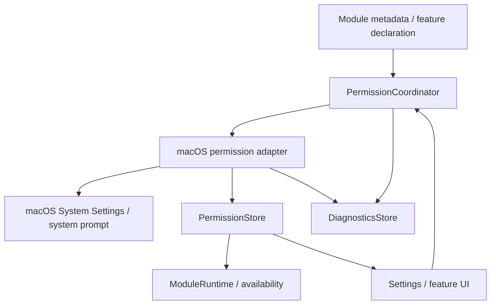
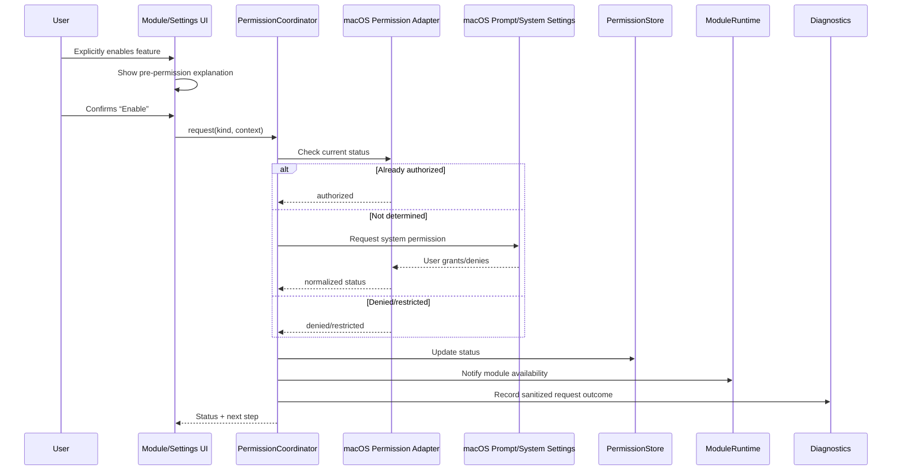

# macOS Permissions
## NotchHub — Permission Center, Capability Policy, and Privacy UX

**Status:** Draft v0.1  
**Owner:** Platform / Security / UX  
**Last updated:** 2026-09-13  
**Location:** `docs/platform/permissions.md`  
**Related documents:** [Architecture Overview](../architecture/overview.md), [Module System](../architecture/module-system.md), [Data Persistence](../architecture/data-persistence.md), [Action Platform](../architecture/action-platform.md), [Requirements §5.4](../product/requirements.md#54-permissions), [Vision](../product/vision.md), [Threat Model](../security/threat-model.md)

---

## 1. Purpose

This document defines how NotchHub discovers, explains, requests, observes, stores, and responds to macOS privacy permissions.

Permissions are part of the product architecture, not implementation details scattered across modules. The platform centralizes permission behavior through a `PermissionCoordinator`; modules declare capabilities, while the coordinator owns status checks, contextual explanations, system requests, recovery navigation, and diagnostics.

The central policy is:

> **Do not ask for a permission until the user explicitly enables or invokes a feature that needs it.**

The foundation app must be usable without requesting Microphone, Camera, Calendar, Reminders, Screen Recording, Automation, or Accessibility access merely because a future module might use it.

---

## 2. Scope

### 2.1 Foundation scope

The foundation must provide:

- A typed permission/capability model.
- A centralized `PermissionCoordinator`.
- A read-only permission status projection for UI and modules.
- Settings → Permissions screen.
- Pre-permission explanation flow.
- System Settings recovery links after denial.
- Permission status refresh when app becomes active.
- Diagnostics and redaction rules.
- Tests for authorized, denied, restricted, unavailable, and not-determined states.

### 2.2 Future capability scope

Potential capabilities for future in-scope macOS modules:

- Accessibility for selected global shortcut/automation approaches.
- Notifications for alerts and background status.
- Microphone for optional native Xiaozhi Voice.
- Calendar for a future Calendar module.
- Reminders for a future Reminders module.
- Camera for a future camera utility, if ever approved.
- Screen Recording for screenshot/OCR/screen-context features, if ever approved.
- Automation for explicitly user-approved control of other macOS applications.

### 2.3 Permanent exclusions

NotchHub does not request or implement permissions for:

- ESP-IDF workflows.
- ESP32 gateway/BLE telemetry.
- IoT/smart-home control.
- LAN device control.
- Hardware command routing.

Those product domains are permanently outside scope; the permission architecture must not grow around them.

---

## 3. Permission principles

1. **On-demand request** — prompt only after a clear user action.
2. **Explain before prompting** — state what the feature does, why access is needed, and what happens if access is denied.
3. **Central ownership** — only `PermissionCoordinator` calls system request APIs.
4. **No startup prompt storm** — first launch must not request every possible capability.
5. **Denied is a valid state** — the app remains usable in degraded mode.
6. **No retry loops** — denial does not trigger repeated prompts or polling.
7. **Module-scoped declaration** — modules declare required/optional capabilities in metadata.
8. **Least privilege** — request the narrowest capability needed for the feature.
9. **Visible status** — users can inspect status in Settings and Diagnostics.
10. **Recheck after settings return** — refresh status when the app becomes active after System Settings.
11. **Privacy by default** — avoid collecting/storing data merely because a permission was granted.
12. **Document behavior** — every module explains permission use, data flow, retention, and deletion.

---

## 4. Permission model

### 4.1 Permission kinds

```swift
public enum PermissionKind: String, Codable, CaseIterable, Sendable {
    case accessibility
    case notifications
    case microphone
    case calendar
    case reminders
    case camera
    case screenRecording
    case automation
}
```

### 4.2 Status

```swift
public enum PermissionStatus: String, Codable, Sendable {
    case notDetermined
    case authorized
    case denied
    case restricted
    case unavailable
}
```

Some macOS capabilities do not map perfectly to the same authorization API/status vocabulary. The coordinator must normalize platform-specific results into this product-level model and retain the raw platform status only in an internal adapter if diagnostics truly needs it.

### 4.3 Metadata

```swift
public struct PermissionMetadata: Codable, Sendable {
    public let kind: PermissionKind
    public let displayName: String
    public let shortReason: String
    public let detailedReason: String
    public let settingsDestination: SettingsDestination?
    public let requestingFeatureIDs: [String]
    public let dataCategories: [DataCategory]
    public let isSensitive: Bool
}
```

Metadata must be written for a user, not copied from an API name. “Microphone permission” is less useful than “Use your Mac microphone to speak directly with the optional Xiaozhi Voice module.”

---

## 5. Permission architecture



### Component responsibilities

| Component | Responsibility | Must not do |
|---|---|---|
| Module metadata | Declare required/optional capability | Request system permission |
| Module UI | Explain module-specific value and initiate a user intent | Call privacy APIs directly |
| `PermissionCoordinator` | Check, explain, request, refresh, open System Settings, publish status | Store raw secrets or contain module business logic |
| macOS permission adapter | Translate product capability to platform APIs | Decide product UX or module availability alone |
| `PermissionStore` | Hold current normalized status projection | Display UI or show prompts |
| `ModuleRuntime` | Start/suspend/degrade module based on permission state | Request permission automatically |
| Diagnostics | Record sanitized status/request outcomes | Store sensitive content or permission secrets |

---

## 6. Permission coordinator contract

```swift
public protocol PermissionCoordinator: Sendable {
    func status(for kind: PermissionKind) async -> PermissionStatus
    func statuses(for kinds: Set<PermissionKind>) async -> [PermissionKind: PermissionStatus]
    func request(_ kind: PermissionKind, context: PermissionRequestContext) async throws -> PermissionStatus
    func refresh() async
    func openSystemSettings(for kind: PermissionKind) async throws
}
```

### Request context

```swift
public struct PermissionRequestContext: Sendable {
    public let featureID: String
    public let moduleID: ModuleID?
    public let reason: String
    public let initiatedByUser: Bool
    public let source: PermissionRequestSource
}

public enum PermissionRequestSource: String, Codable, Sendable {
    case settings
    case featureInteraction
    case onboarding
    case recovery
}
```

### Coordinator invariants

A request must be rejected before reaching macOS when:

- `initiatedByUser == false` for a capability that requires explicit interaction.
- The feature/module did not declare the capability.
- The request context has no user-readable reason.
- A request is already in progress for the same capability.
- The app is in a state where prompting would be misleading or unsafe.

The coordinator must deduplicate concurrent requests for the same permission and return one consistent result to awaiting callers.

---

## 7. Permission request flow



### First launch policy

First launch may show the Permissions section as an informational overview, but it must not display system prompts for all capabilities. It may request Notifications only if the user explicitly enables notifications during onboarding or Settings.

### Denied flow

```text
Permission denied
      ↓
Show feature unavailable/degraded state
      ↓
Explain what is missing and why
      ↓
Offer “Open System Settings”
      ↓
User changes status
      ↓
App becomes active
      ↓
Coordinator refreshes
      ↓
Module resumes or remains suspended
```

Do not automatically re-request on every app activation.

---

## 8. Capability matrix

The exact API behavior may vary by macOS version and distribution mode. The module must verify actual requirements during implementation and update this table before release.

| Capability | Potential feature | Foundation request? | Data/access implication | Default policy |
|---|---|---:|---|---|
| Accessibility | Selected global shortcuts or automation | No, unless the chosen shortcut implementation requires it | May observe/control selected user interactions | Request only when enabling dependent feature |
| Notifications | Action errors, background status, permission result | No | Allows user-visible notifications | User opt-in |
| Microphone | Native Xiaozhi Voice | No | Captures microphone audio while active | Request when user enables Mac voice |
| Calendar | Upcoming event module | No | Reads selected calendar/event data | Request when Calendar module is enabled/opened |
| Reminders | Reminder module | No | Reads selected reminders | Request when Reminders module is enabled/opened |
| Camera | Future camera utility | No | Captures camera frames while active | Request immediately before preview |
| Screen Recording | Future screenshot/OCR/context | No | Captures screen content/audio depending on feature | Request immediately before feature use |
| Automation | Explicit control of another macOS app | No | May send Apple Events/control app | Request per user action/app target |

---

## 9. Capability-specific UX requirements

## 9.1 Accessibility

### Use cases

Accessibility may be needed for selected global hotkey or automation implementations. Do not assume all shortcut approaches require it; validate the technical implementation first.

### UX copy template

```text
Why NotchHub needs Accessibility

This permission lets NotchHub detect the configured keyboard shortcut or perform the specific automation feature you enabled. NotchHub does not use it to record everything you type or inspect unrelated applications.

You can change this permission later in System Settings → Privacy & Security → Accessibility.
```

### Rules

- Request only when a selected feature cannot function without it.
- Do not label the entire app as “broken” if only one shortcut mode is unavailable.
- Provide a fallback click/menu action if practical.
- Do not claim that the app observes no input if the actual implementation does; copy must match behavior.

## 9.2 Notifications

### Use cases

- Action completion/error when the user chooses background notifications.
- Module failure or permission recovery message when enabled.

### Rules

- Notifications are opt-in.
- Do not use notifications for every compact event.
- Notification content must be concise and avoid sensitive transcript/clipboard/file content by default.
- Provide a Settings toggle and clear notification policy.

## 9.3 Microphone

### Use cases

- Optional Native Xiaozhi Voice module M5.

### Rules

- M1 Display Companion must not request microphone permission if it only displays relay events.
- Show active listening/recording state clearly in UI.
- Stop capture immediately when the voice session ends, user presses stop/mute, or module disables.
- Do not persist raw audio by default.
- Explain whether audio is processed locally, sent to a relay/backend, or both before requesting permission.
- If the input device changes or is unavailable, show a recoverable state rather than silent capture failure.

## 9.4 Calendar and Reminders

### Rules

- Request only when the user opens/enables the relevant module.
- Allow choosing a scope/filter where API capabilities support it.
- Do not copy full event/reminder bodies into generic diagnostics.
- Cache only necessary summaries with a short TTL and explicit retention policy.
- If access is denied, the rest of NotchHub remains fully usable.

## 9.5 Camera

### Rules

- Camera is not part of the foundation.
- Request immediately before preview/use, not at app launch.
- Clearly show camera active state.
- Stop capture when the view closes/module stops.
- Do not persist frames unless a separate feature explicitly documents it.

## 9.6 Screen Recording

### Rules

- Screen Recording is not part of the foundation.
- Request only before screenshot/OCR/screen-context feature use.
- Explain exactly what is captured and whether content leaves the Mac.
- Do not retain captured screen content in standard diagnostics.
- Provide a clear disabled state when access is denied.

## 9.7 Automation

### Rules

- Automation must be target-specific and user initiated.
- Explain which application will be controlled and what action will be sent.
- Never request broad automation access for a future possibility.
- Use Action Registry confirmation and audit for side-effecting app control.
- Do not use automation as a path to embedded/LAN/hardware control.

---

## 10. Module permission declaration

A module metadata declaration must include:

```swift
public struct ModulePermissionDeclaration: Codable, Sendable {
    public let required: Set<PermissionKind>
    public let optional: Set<PermissionKind>
    public let requestReasons: [PermissionKind: String]
    public let dataUsage: [PermissionKind: [DataUsage]]
}
```

Example for a future Xiaozhi Display Companion:

```text
required: none
optional: none for display-only relay mode
microphone: declared only by the separate Native Xiaozhi Voice module
```

Example for a future Calendar module:

```text
required: none at registration
optional: calendar
request reason: “Show upcoming calendar events in NotchHub.”
degraded behavior: show setup/permission state; do not fail the app
```

The module must not declare a capability it does not currently use. A declaration is not a way to pre-authorize future features.

---

## 11. Runtime behavior after permission changes

### 11.1 Grant

```text
Status → authorized
      ↓
PermissionStore updates
      ↓
ModuleRuntime notified
      ↓
Module resumes/starts capability-specific work
      ↓
Presentation snapshot updates
```

### 11.2 Revocation

```text
Status → denied/restricted
      ↓
Stop capability-specific work
      ↓
Release data/observers where possible
      ↓
Module → suspended/degraded
      ↓
Show explanation/recovery route
      ↓
Diagnostics records sanitized status change
```

Revocation must not crash the module or the app. A module must not continue capturing/reading after the relevant capability is revoked.

### 11.3 Unavailable

If a capability is unavailable due to OS/version/distribution restrictions:

- Mark `unavailable`.
- Explain that changing System Settings may not resolve it.
- Offer an alternative feature path where available.
- Do not retry or show a repeated prompt.

---

## 12. Settings → Permissions UI

### 12.1 Page layout

```text
Permissions
├── Required by enabled modules
├── Optional capabilities
├── Not currently used
└── Privacy information
```

Each row should show:

- Friendly capability name.
- Current status.
- Which module/feature requests it.
- Short reason.
- Enable/Request/Open System Settings action as appropriate.
- Last checked time, if useful.
- Link to privacy/data-use explanation.

### 12.2 Status labels

| Status | Suggested user-facing label | Available action |
|---|---|---|
| Not required | Not used by enabled features | View details |
| Not determined | Not enabled | View explanation / Enable |
| Authorized | Enabled | View details / Disable in System Settings |
| Denied | Not allowed | Open System Settings |
| Restricted | Restricted by macOS or policy | View explanation |
| Unavailable | Not available on this system/configuration | View alternative |

The UI must not imply that a permission is required when it is only a possible future capability.

---

## 13. Diagnostics and logging

### Record

- Permission kind.
- Normalized before/after status.
- Request source/feature ID.
- Request result code.
- Timestamp and app version.
- Whether the user was shown an explanation.

### Do not record

- Permission prompt screenshots.
- Microphone audio.
- Camera frames.
- Screen content.
- Calendar/reminder body text.
- Clipboard/file content.
- Tokens, credentials, or raw system permission payloads.

Example sanitized event:

```json
{
  "type": "permission.status.changed",
  "source": "permission.coordinator",
  "payload": {
    "kind": "microphone",
    "oldStatus": "notDetermined",
    "newStatus": "denied",
    "featureID": "xiaozhi.nativeVoice",
    "requestSource": "featureInteraction"
  }
}
```

---

## 14. Distribution and entitlements

Permission behavior can depend on app distribution, signing, entitlements, and macOS version. Before release, document:

- Direct/notarized distribution versus Mac App Store distribution.
- Required usage-description strings in `Info.plist` for capabilities that need them.
- Required entitlements and sandbox implications.
- Whether a capability behaves differently in sandboxed/non-sandboxed builds.
- How the app handles unavailable APIs or denied entitlements.
- Release/manual QA on every supported macOS version.

Do not claim support for a permission-dependent feature until a signed build has been tested in the intended distribution mode.

---

## 15. Testing requirements

### 15.1 Unit tests

- Capability metadata completeness.
- Required/optional declaration validation.
- Permission status normalization.
- Request context requires user initiation/reason.
- Concurrent request deduplication.
- Denied/restricted/unavailable behavior.
- Permission-to-module availability projection.
- Redaction of permission diagnostics.
- No prompt for future/unenabled modules.

### 15.2 Integration tests

Use a permission adapter test double to simulate:

```text
notDetermined → authorized
notDetermined → denied
authorized → denied/revoked
notDetermined → restricted
unavailable
```

Verify:

- Settings UI updates.
- Module starts/suspends/degrades correctly.
- Core app remains usable.
- No request loop occurs.
- Diagnostics contains only sanitized metadata.

### 15.3 Manual tests

On a signed development/release-like build:

- First launch with all permissions not determined.
- Enable a feature that needs Notifications.
- Deny permission, close/reopen Settings, use “Open System Settings.”
- Grant permission externally, return to app, verify refresh.
- Revoke a permission while module is active.
- Sleep/wake and lock/unlock after permission changes.
- Verify microphone/camera/screen recording indicators and capture termination when relevant future module exists.
- Test both intended distribution modes before release.

---

## 16. Privacy copy guidelines

Every permission explanation must answer four questions:

1. **What** will NotchHub access?
2. **Why** does the enabled feature need it?
3. **When** is the access active?
4. **What happens** if the user declines?

### Example

```text
Use your Mac microphone for Native Xiaozhi Voice?

NotchHub will use the selected microphone only while you hold the voice control or an active voice session is running. Audio handling follows the Native Xiaozhi Voice module's configured processing path. NotchHub does not store raw audio by default.

If you decline, the display-only Xiaozhi mode and other NotchHub features remain available.
```

Copy must be reviewed whenever data flow or retention behavior changes.

---

## 17. Explicit scope boundary

The Permission Center is designed for in-scope macOS desktop capabilities and future Xiaozhi/media/clipboard/files/calendar modules. It must not be expanded to authorize:

- ESP-IDF command execution.
- ESP32 gateway/BLE telemetry.
- IoT/MQTT/smart-home control.
- LAN device control or hardware command routing.

A local-network or hardware feature is not made acceptable merely by adding a new permission enum. Those domains are permanently excluded from NotchHub.

---

## 18. Summary

NotchHub treats privacy permissions as explicit user decisions governed by a central, testable coordinator. Modules declare their needs; the platform explains and requests access only when the user activates a relevant feature; denied permissions produce graceful degraded states; and diagnostics retain only sanitized metadata.

This design lets the foundation remain permission-light, keeps first launch calm, and provides a safe path for future Xiaozhi voice, media, clipboard, files, calendar, or system-control modules without turning the app into a broad, opaque permissions consumer.
