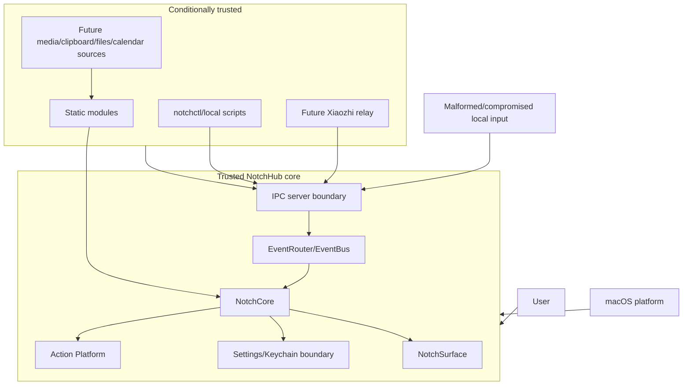

# Security Threat Model
## NotchHub — Trust Boundaries, Threats, and Mitigations

**Status:** Draft v0.1  
**Owner:** Security / Architecture  
**Last updated:** 2026-09-15
**Location:** `docs/security/threat-model.md`  
**Related documents:** [Architecture Overview](../architecture/overview.md), [C4 Context](../architecture/c4-context.md), [C4 Container](../architecture/c4-container.md), [Action Platform](../architecture/action-platform.md), [IPC](../architecture/ipc.md), [Event Protocol](../architecture/event-protocol.md), [Permissions](../platform/permissions.md), [Data Persistence](../architecture/data-persistence.md), [Testing Strategy](../quality/testing-strategy.md), [Boring Notch Reference](../references/boring-notch.md)

---

## 1. Purpose

This document models security and privacy threats for NotchHub, a single-user, local-first macOS application that renders a Notch surface and provides typed quick actions, local IPC, permissions, settings, diagnostics, and future desktop productivity/AI modules.

The threat model exists to answer:

- What assets must be protected?
- Who or what can interact with the app?
- Which boundaries are trusted or untrusted?
- What can go wrong if an attacker or buggy integration supplies malicious input?
- Which mitigations are mandatory in architecture, code, tests, and release operations?

This document covers the foundation and future in-scope modules such as Xiaozhi Display Companion, Media, Clipboard, Files, Calendar/Reminders, and selected System Controls.


---

## 2. Security objectives

1. **Prevent arbitrary side effects** — untrusted input must not become arbitrary shell code or app automation.
2. **Protect secrets** — IPC tokens, future relay credentials, and API keys must remain in secure storage and out of logs/exports.
3. **Protect user content** — future transcripts, clipboard data, files, calendar/reminder data, screen content, audio, and camera frames must not leak through diagnostics or IPC.
4. **Maintain local trust boundaries** — local IPC is not automatically trusted; authentication and source policy remain required.
5. **Preserve availability** — malformed/flooded input or a failed module must not crash, hang, or permanently disable the core app.
6. **Enforce least privilege** — permission and capability access is requested only for an enabled feature and only when needed.
7. **Maintain auditability without oversharing** — actions, permission changes, and security failures are traceable through sanitized records.
8. **Protect integrity of platform policy** — modules cannot bypass `ActionRegistry`, `PermissionCoordinator`, `EventRouter`, `SettingsStore`, or `NotchPanelController`.
9. **Make failure recoverable** — denial, revocation, corrupted settings, stale sockets, invalid display state, and client failures produce controlled degraded states.

---

## 3. System description

NotchHub is deployed as one macOS app process:

```text
NotchHub.app
├── App Shell / Menu Bar / Settings / Diagnostics
├── NotchSurface (NSPanel + SwiftUI)
├── NotchCore (runtime, state, policy, permissions, persistence)
├── NotchActions (registry, auth, confirmation, executors)
├── NotchIPC (authenticated loopback HTTP server)
├── NotchDomain (typed contracts)
└── Static Modules (Demo; future Xiaozhi/Media/etc.)
```

Separate local clients may include:

- `notchctl`.
- User-authored local scripts.
- A future Xiaozhi relay/adapter.

There is no required cloud backend, remote administrator, or multi-user account system.

---

## 4. Assets

| Asset | Security/privacy value | Threat if compromised | Required protection |
|---|---|---|---|
| IPC authentication token | High | Unauthorized local event/action requests | Keychain/protected store, redaction, rotation/revocation |
| Future relay/API credentials | High | Account/service compromise | Keychain, least privilege, no diagnostics export |
| User settings | Medium | Privacy/configuration manipulation | Typed validation, atomic writes, migration, safe reset |
| Shortcut/action definitions | Medium/high | Unintended side effects or takeover of user workflow | Typed schema, source policy, confirmation policy |
| Module enablement/health state | Medium | Persistence of malicious/failed module state | Validation, runtime isolation, diagnostics |
| Event integrity | Medium/high | Spoofed status, malicious action triggers, UI deception | Authentication, source allow-list, schema validation, correlation |
| Future assistant transcript | High | Sensitive conversation disclosure | Opt-in retention, bounded storage, redaction, access control |
| Clipboard data | High | Secrets and personal text disclosure | Opt-in module, bounded history, explicit clear, no generic logs |
| File/calendar/reminder metadata | Medium/high | Personal/work information disclosure | Permission, minimal data, short retention, redaction |
| Microphone/audio | High | Surveillance/privacy breach | Explicit permission, active-state UI, no raw persistence by default |
| Camera frames | High | Visual privacy breach | Explicit permission, active-state UI, no default persistence |
| Screen content | High | Sensitive screen disclosure | Explicit permission, per-feature explanation, no diagnostics retention |
| Diagnostics/logs | Medium/high | Secret or personal-data leakage | Sanitization, redaction, bounded retention, export review |
| Notch presentation integrity | Medium | Phishing/deceptive status, user confusion | Trusted internal policy, module UI constraints, source labels |
| App bundle/signing identity | High | Malicious replacement/update | Code signing, notarization, verified release process |

---

## 5. Actors and trust levels

### 5.1 MacBook user — trusted operator

The device owner configures settings, approves permissions, triggers actions, and decides which modules are enabled. The user may still accidentally configure an unsafe option, so the app must provide clear confirmation and preview behavior.

### 5.2 NotchHub core — trusted platform boundary

`NotchCore`, `NotchActions`, `PermissionCoordinator`, `SettingsStore`, `EventRouter`, and `NotchPanelController` are trusted architectural components. They are responsible for enforcing policy rather than relying on module goodwill.

### 5.3 Static module — conditionally trusted code

Modules are reviewed and signed as part of the app, but module code can contain bugs. It must be restricted by capability-scoped handles and isolated lifecycle/resource management.

### 5.4 `notchctl` and local scripts — conditionally trusted clients

These processes run as the local user but may be buggy, compromised, or accidentally called with malformed input. Authentication, source allow-list, schema validation, rate limits, and action policy still apply.

### 5.5 Future Xiaozhi relay — conditionally trusted external adapter

A future relay may parse a remote/third-party assistant protocol and send normalized events to NotchHub. It must be treated as untrusted at the IPC boundary even if it runs locally. NotchHub must not trust raw relay claims, arbitrary event types, or arbitrary action requests.

### 5.6 Other local desktop sources — permissioned external data

Future media, clipboard, files, calendar, reminders, camera, screen, or audio sources are governed by macOS permissions and module policy. A granted OS permission does not authorize unrestricted retention, diagnostics logging, or other module access.

### 5.7 Remote attacker

The foundation has no LAN-facing service by default. A remote network attacker should not be able to reach the app through the intended architecture. If a future network-facing capability is proposed, it requires a new threat model, security design, authentication/TLS, and ADR.

---

## 6. Trust boundaries



### Boundary rules

| Boundary | Threat | Mandatory control |
|---|---|---|
| Local client → IPC | Spoofed/flooded/malformed requests | Local binding, authentication, source allow-list, schema/size/rate validation |
| IPC → EventBus | Raw payload becomes trusted event | Decode/validate/version/type policy before publish |
| IPC → ActionRegistry | External caller triggers side effect | Action ID allow-list, typed input, source policy, confirmation |
| Module → Core | Buggy module bypasses platform | Capability-scoped context, no direct panel/permission/IPC access |
| Module → UI | Malicious/overlarge content affects surface | Surface slots, content limits, presentation policy, sanitized snapshots |
| UI → Settings/Actions | User input causes invalid/malicious config | Typed view models, validation, confirmation, migration |
| App → macOS permission | Overbroad access request | On-demand coordinator, contextual explanation, module declaration |
| Diagnostics → storage/export | Sensitive data leakage | Redaction, classification, bounded retention, export tests |
| App bundle → user system | Malicious distribution/update | Signing, notarization, release verification, secure update process |

---

## 7. Threat assessment method

Use a lightweight STRIDE-inspired review for each boundary:

- **Spoofing:** Can a client/module pretend to be an allowed source?
- **Tampering:** Can settings/events/actions be altered without validation?
- **Repudiation:** Can a security-relevant action be traced safely?
- **Information disclosure:** Can secrets or user content leak?
- **Denial of service:** Can flood/bug/crash block the app or consume resources?
- **Elevation of privilege:** Can a module/client bypass permission, confirmation, or action policy?

Risk levels:

| Level | Meaning |
|---|---|
| Critical | Could execute arbitrary code/side effects, leak high-value secrets, or compromise the host/user; blocks release |
| High | Could crash core, expose sensitive content, bypass permission/confirmation, or cause severe resource exhaustion |
| Medium | Limited privacy/integrity/availability impact; requires mitigation and tracked residual risk |
| Low | Minor usability/diagnostic issue with limited security impact |

---

## 8. Threat catalogue

## T-001 — Unauthorized local IPC client

**Threat:** A local process sends events or invokes actions while pretending to be `notchctl` or an allowed relay.

**Impact:** Spoofed UI status, unauthorized action, settings manipulation, denial of service.

**Mitigations:**

- Token authentication for every loopback HTTP route, with immediate invalidation of the prior
  token after explicit rotation.
- Client/source allow-list enforced server-side.
- Never trust a self-declared `clientID`.
- Action source policy and confirmation still apply after authentication.
- Authentication failure counters, bounded backoff, and diagnostics.

**Tests:** Invalid token, unknown client ID, source/action mismatch, stale socket, replay/duplicate request.

**Risk after mitigation:** Medium for a fully compromised local user process; this is outside the ability of a single-user app to completely prevent, but policy limits accidental/unauthorized behavior.

## T-002 — Raw shell or arbitrary executor injection

**Threat:** An IPC/AI/module request supplies `command`, `script`, `executablePath`, arbitrary URL, or executor configuration to cause unintended execution.

**Impact:** Critical arbitrary code execution, data destruction, credential theft, or unauthorized side effect.

**Mitigations:**

- Only registered `ActionID` values are accepted.
- Typed input schemas contain no raw shell/script fields.
- Executor kind is fixed by trusted action definition, never request input.
- No general shell executor in foundation.
- URL/app-launch actions validate scheme/host or bundle ID.
- Destructive actions require explicit confirmation.
- Security tests reject prohibited fields and unknown executor kinds.

**Tests:** Raw command payload, path injection, shell metacharacters in structured fields, unknown action/executor, assistant source request.

**Risk after mitigation:** Low for the designed boundary; critical if any bypass is introduced.

## T-003 — Event spoofing or tampering

**Threat:** A client publishes fake `module.failed`, `assistant.state`, action, or diagnostic events.

**Impact:** UI deception, false status, user confusion, action flow manipulation.

**Mitigations:**

- Authenticate client/source.
- Event type allow-list by source.
- Versioned schema validation.
- Core-owned lifecycle/surface events cannot be externally asserted directly.
- Source labels and correlation IDs.
- Presentation Policy ignores unauthorized priority/escalation hints.

**Tests:** Relay publishes foundation-only event, client publishes core event, invalid source/type combination, priority abuse.

## T-004 — Event flood / resource exhaustion

**Threat:** A client or buggy module sends high-rate, oversized, duplicate, or slow-consumer event streams.

**Impact:** CPU/RAM growth, main-actor lag, disk growth, battery drain, app hang/crash.

**Mitigations:**

- Frame/body/depth/string limits.
- Per-client/source/type rate limits.
- Bounded queues and ring buffers.
- Coalescing/drop policy by event priority.
- F8 has no stream route; a future WebSocket must define bounded backpressure and slow-consumer disconnect before release.
- High-rate processing outside main actor.
- Diagnostics counters.
- Module resource budgets.

**Tests:** Event flood, oversized payload, deep JSON, slow client, module toggle loop, 8-hour idle/run profile.

## T-005 — Replay/duplicate action request

**Threat:** A captured or retried IPC action is executed more than intended.

**Impact:** Repeated side effects, repeated notifications, confusing state.

**Mitigations:**

- UUID request IDs and `ActionInvocationID` correlation.
- Five-minute bounded idempotency window for `system.testMessage` and `app.openSettings` retries.
- Explicitly document that this retry protection is not an exactly-once execution guarantee.
- Destructive actions require current user confirmation rather than trusting an old approval.
- Rate limits by source/action.

**Tests:** Duplicate request ID, retry after response loss, repeated destructive request, stale confirmation.

## T-006 — Permission overreach

**Threat:** A module requests a broad permission at launch or requests a capability it did not declare.

**Impact:** User trust loss, unnecessary data access, policy violation, privacy exposure.

**Mitigations:**

- Central `PermissionCoordinator` only.
- Module required/optional declaration.
- Request context must include user initiation and reason.
- First-launch no-prompt policy.
- F5 only permits the explicit Settings recovery-notification opt-in for its declared
  Notifications requirement; denied, restricted, and unavailable states never retry the prompt.
- Permission test doubles and request audit.
- Code review forbids direct permission API usage in modules/views.

**Tests:** Automatic start request, undeclared capability request, non-Settings request,
concurrent prompt loop, denied/revoked/no-retry behavior.

## T-007 — Sensitive data in diagnostics/logs

**Threat:** Tokens, transcript, clipboard, file, calendar, audio, camera, or screen content is written to logs/export.

**Impact:** Information disclosure through local files, support bundles, or user sharing.

**Mitigations:**

- Data classification before storage.
- Structured sanitized diagnostics only.
- Redaction of authorization headers, tokens, secrets, raw payloads.
- User-content-sensitive data is memory-only by default.
- Export tests and secret scanning.
- Bounded retention.

**Tests:** Synthetic secret/transcript/clipboard/camera/screen payloads through all logging/export paths.

## T-008 — Secrets stored insecurely

**Threat:** IPC token or future relay credential is stored in UserDefaults, source code, logs, or exported settings.

**Impact:** Unauthorized local IPC or external service compromise.

**Mitigations:**

- Keychain-backed `SecretStore`.
- Separate secret reset/delete flow.
- Export excludes secrets.
- Diagnostics reports presence only.
- No secret in command-line arguments or normal shell output.
- Release secret scan.

**Tests:** Secret store access, export, diagnostics, reset non-secrets, log redaction.

## T-009 — Settings tampering/corruption

**Threat:** Imported or corrupted settings enable unsafe behavior, crash startup, or change action/module policy.

**Impact:** Startup failure, privacy/security policy bypass, unexpected actions.

**Mitigations:**

- Typed schema and validation.
- Versioned migration.
- Safe defaults and last-known-good state.
- Corrupt-settings quarantine (three 1 MiB files, 3 MiB total) before safe defaults replace active bytes.
- Sanitized import with preview/rollback.
- Do not import secrets automatically.
- Restrict dangerous settings and require confirmation.

**Tests:** Malformed JSON, unknown fields/versions, invalid action policy, atomic-write failure, malicious import.

## T-010 — Module privilege bypass

**Threat:** A module directly manipulates `NSPanel`, requests permissions, reads another module's settings, invokes another module's handler, or opens an IPC listener.

**Impact:** Platform policy bypass, privacy exposure, crash/resource leak, unauthorized action.

**Mitigations:**

- Capability-scoped `ModuleContext`.
- Static module review and package dependency rules.
- No direct AppKit panel access in module packages.
- Module-specific settings namespace/action namespace.
- Central permission/action/IPC owners.
- Architecture tests/lint/review checklist.

**Tests:** Compile dependency checks, module contract tests, runtime capability spy, action/permission namespace tests.

## T-011 — Module failure/crash/cleanup leak

**Threat:** A module hangs during start, throws in event handling, leaves tasks/timers/observers active, or consumes resources after disable.

**Impact:** App crash/hang, battery drain, duplicate events/actions, memory leak.

**Mitigations:**

- `ModuleRuntime` catches errors and enforces start timeout.
- Lifecycle state isolation.
- Bounded retry/backoff.
- Explicit cancellation ownership and `ResourceTracker` tests.
- Disable unregisters/marks actions unavailable.
- Diagnostics health and active resource counters.

**Tests:** Start throw/timeout, handler throw, 100 enable/disable loop, resource baseline, shutdown with active module.

## T-012 — Notch UI spoofing/deceptive content

**Threat:** A malicious or buggy module displays misleading system/assistant/action state in a trusted-looking Notch surface.

**Impact:** User makes unsafe decision or grants permission based on false information.

**Mitigations:**

- Module identity/source label for important statuses.
- Presentation slots and content constraints.
- Core-owned permission/action confirmation UI for sensitive operations.
- Modules cannot claim core lifecycle/security state through external events.
- Content validation/truncation and no arbitrary system alert impersonation.

**Tests:** Oversized/misleading module contribution, unauthorized core event, confirmation source display.

## T-013 — Clickjacking/interaction interception

**Threat:** An invisible or oversized panel intercepts clicks/keyboard input when collapsed or hidden.

**Impact:** User cannot interact normally, accidental action, phishing-like behavior.

**Mitigations:**

- Collapsed hit-test region limited to visible/trigger area.
- Hidden panel has no active input region.
- No full-screen transparent overlay for hover detection.
- Debug overlay shows frame/hit-test state.
- Lifecycle/manual tests across Spaces/full-screen.

**Tests:** Click through menu bar/apps with collapsed/hidden states; frame and hit-test assertions.

## T-014 — IPC token leakage/replay

**Threat:** Token appears in logs, shell history, diagnostic export, crash report, or is used indefinitely after compromise.

**Impact:** Unauthorized local action/event access.

**Mitigations:**

- Keychain storage.
- No token in error strings or command output.
- Token rotation/revocation action.
- Bearer token redaction middleware.
- Short-lived/handshake protections where appropriate for streaming clients.
- User-visible “revoke local clients” control.

**Tests:** Redaction across every route/error/log/export; revoked token rejection.

## T-015 — Stale socket/path attack

**Threat:** A stale or symlinked Unix socket path is replaced or points to an attacker-controlled endpoint.

**Impact:** Requests sent to wrong process, credential confusion, local spoofing.

**Mitigations:**

- User-specific runtime path with restrictive directory permissions.
- Safe stale socket detection/removal.
- Ownership/type validation where possible.
- Do not follow unsafe symlinks.
- Confirm listener identity through handshake/nonce.

**Tests:** Stale socket, invalid path type, symlink path, permissions failure, startup recovery.

## T-016 — Permission revocation while active

**Threat:** A user revokes Microphone/Calendar/Screen Recording/Automation access while a module is running, but the module continues access or crashes.

**Impact:** Privacy violation, inconsistent state, crash.

**Mitigations:**

- Permission status refresh on app activation and relevant API errors.
- Module transitions to suspended/degraded.
- Stop capability-specific work immediately.
- No retry/prompt loop.
- Clear UI and System Settings recovery path.
- For F5 Notifications, activation refresh updates the Permission Center projection; F5 owns no
  delivery path, so external revocation cannot continue a recovery notification delivery.

**Tests:** Simulated and manual revoke while active, sleep/wake, app activation, module resume after regrant.

## T-017 — Malicious or unsafe update/distribution

**Threat:** A tampered app bundle, dependency, release artifact, or update is installed.

**Impact:** Full user compromise; all in-process mitigations can be bypassed.

**Mitigations:**

- Code signing and notarization for release artifacts.
- Verified release workflow and checksums/signatures where applicable.
- Pin/review dependencies.
- Avoid unsigned helper downloads.
- Document trusted download/update channels.
- Release smoke/security tests.

**Residual risk:** Supply-chain security requires repository, CI, developer account, signing key, and distribution controls beyond runtime code.

## T-018 — Privacy leakage through future Xiaozhi relay

**Threat:** Relay forwards raw audio, transcript, authorization data, or backend protocol dumps into NotchHub/diagnostics.

**Impact:** Sensitive conversation/API credential disclosure.

**Mitigations:**

- Relay accepts/produces only normalized `EventEnvelope` types.
- Local IPC source allow-list and payload limits.
- Transcript classified user-content-sensitive.
- No raw audio/binary frames in event history.
- Explicit retention settings.
- UI displays a short tail; full transcripts remain in dedicated application scenes only.
- Tool events map to registered actions only.

**Tests:** Fixture relay, raw-dump rejection, Unicode transcript, sequence/deduplication, redaction, memory cap.

---

## 9. Threat-to-control matrix

| Threat | Primary controls | Verification |
|---|---|---|
| T-001 unauthorized IPC | Local binding, auth, source policy | IPC auth/source tests |
| T-002 arbitrary execution | ActionID/schema/typed executors | Security tests + code review |
| T-003 event spoofing | Source/type allow-list, validation | Event protocol tests |
| T-004 DoS/flood | Limits, backpressure, coalescing | Performance/flood tests |
| T-005 replay | Request/invocation IDs, idempotency, confirmation | Replay tests |
| T-006 permission overreach | Coordinator, declaration, on-demand flow | Permission tests/manual QA |
| T-007 data leakage | Classification/redaction/bounded diagnostics | Redaction tests/secret scan |
| T-008 insecure secrets | Keychain, export/log exclusion | Secret-store tests |
| T-009 settings tamper | Validation/migration/rollback | Persistence security tests |
| T-010 module bypass | Scoped context/dependency rules | Module contract/review |
| T-011 module failure | Runtime isolation/cleanup | Lifecycle/resource tests |
| T-012 deceptive UI | Slot/content/source/confirmation policy | UI/security tests |
| T-013 click interception | Hit-test bounds/panel policy | Manual/UI lifecycle tests |
| T-014 token replay/leak | Keychain/redaction/revocation | IPC/redaction tests |
| T-015 stale socket | Safe path/ownership/handshake | Socket startup tests |
| T-016 permission revoke | Refresh/suspend/stop work | Permission lifecycle tests |
| T-017 supply chain | Signing/notarization/release verification | Release process |
| T-018 relay privacy leak | Normalized schema/limits/retention | Relay fixture/security tests |

---

## 10. Security requirements by component

### App Shell

- Use a signed/release-appropriate bundle configuration.
- Do not log secrets during startup.
- Keep menu/Settings/Diagnostics usable when other components fail.

### NotchSurface

- Do not render unvalidated external content directly.
- Enforce slot size/content constraints.
- Keep collapsed hit-test area minimal.
- Core owns sensitive confirmation visuals.

### NotchCore

- Enforce lifecycle, permission, settings, presentation, and diagnostics policy.
- Keep trusted policy independent from module content.

### NotchActions

- Validate action ID/source/input.
- Enforce confirmation/timeout/cancellation.
- Never accept arbitrary executor configuration.
- Redact audit data.

### NotchIPC

- Local-only bind.
- Authenticate and source-authorize.
- Enforce framing, size, rate, schema, and backpressure.
- Never pass raw input to an executor.

### Modules

- Declare permissions/resources/data policy.
- Use scoped context.
- Clean up on stop.
- Do not read/write other modules' state.

### Persistence/Keychain

- Typed settings/migration.
- Secure secrets.
- Atomic writes.
- Sanitized export.
- Bounded logs/cache/history.

---

## 11. Secure development requirements

### Code review checklist

Every change affecting security-sensitive behavior must answer:

- Does it add a new external input source?
- Does it add a permission or data category?
- Does it add a new ActionID or executor?
- Does it change IPC binding/authentication/serialization?
- Does it persist new data or change retention?
- Can it cause high-rate events, unbounded storage, or background work?
- Does a module bypass a core owner?
- Does it alter a threat, mitigation, permission, or product boundary?
- Are tests and docs updated?

### Dependency controls

- Review every new package/dependency and its license/security posture.
- Prefer system frameworks and minimal dependencies.
- Pin or constrain versions according to repository policy.
- Avoid runtime downloads or unsigned executable helpers.
- Track dependency updates through PRs and release notes.

### Secret handling

- Use synthetic secrets in tests.
- Do not paste tokens in issues/PRs/logs.
- Scan changed files for likely credentials.
- Rotate/revoke any secret accidentally exposed.
- Keep local development credentials separate from release credentials.

---

## 12. Security testing plan

### Unit tests

- Auth/token comparison and revocation.
- Source/action/event allow-list.
- Input schema and prohibited field rejection.
- URL/app identifier validation.
- Permission request context.
- Redaction and sanitization.
- Settings import/migration validation.
- Bounded buffers and rate limits.

### Integration tests

- IPC request → auth → validation → event/action route.
- Module → scoped context → action/event/permission boundaries.
- Permission state → runtime suspension/resume.
- Secret store → diagnostics/export exclusion.
- Client flood → backpressure/resource stability.

### Release/manual tests

- Signed build behavior.
- Keychain access in intended distribution mode.
- Permission prompts/copy on supported macOS versions.
- Stale socket and app restart.
- Sleep/wake/lock/unlock while IPC client/module active.
- Diagnostics export review.
- Dependency/license/release artifact verification.

---

## 13. Incident response

If a security issue is suspected:

1. Stop distributing affected builds if applicable.
2. Classify impact: secret, arbitrary action, user content, availability, supply chain.
3. Revoke/rotate affected IPC or external credentials.
4. Preserve sanitized diagnostics and reproduction information without collecting unnecessary user content.
5. Add a regression test before closing the issue.
6. Update this threat model and relevant ADR/requirements.
7. Publish a user-facing advisory when the issue affects released users.

A public vulnerability reporting process belongs in `SECURITY.md` before public release.

---

## 14. Residual risks

Some risks cannot be fully solved by an in-process local app:

- A fully compromised user account can usually read or interact with user-owned local processes and files.
- A malicious signed/released app update can bypass runtime architecture.
- macOS API/permission behavior can change across releases.
- A user may intentionally approve a harmful action.
- A future external backend/relay may process data outside NotchHub's local boundary.

Residual risks must be documented, not hidden. The app reduces them through least privilege, clear UI, confirmation, local defaults, minimal retention, signing, tests, and release review.

---

## 15. Explicit product boundary

## 15. Change control

Update this threat model and create/review an ADR when any of the following changes:

- A new external process, backend, relay, or network endpoint is introduced.
- IPC moves beyond loopback/local socket.
- A new permission or sensitive data category is added.
- An executor can perform a new class of side effect.
- A module stores user-content-sensitive data.
- A privileged helper/private API is added.
- Dynamic plugin loading is proposed.
- Authentication/token/Keychain behavior changes.

Threat review is required before implementation for any change that creates a new trust boundary, persistent sensitive data, permission, high-rate stream, hardware effect, or external network exposure.

---

## 16. Summary

NotchHub's security model is built around narrow, explicit trust boundaries: local IPC is authenticated and validated; events are versioned; actions are registered and typed; permissions are centralized and on demand; secrets use Keychain; diagnostics are sanitized and bounded; modules cannot bypass core policy; and high-rate/failure behavior is controlled.

The architecture is deliberately macOS desktop/productivity-focused, keeping the platform's trust model narrow enough to understand, test, and maintain while leaving a clean future path for Xiaozhi and other in-scope macOS modules.
